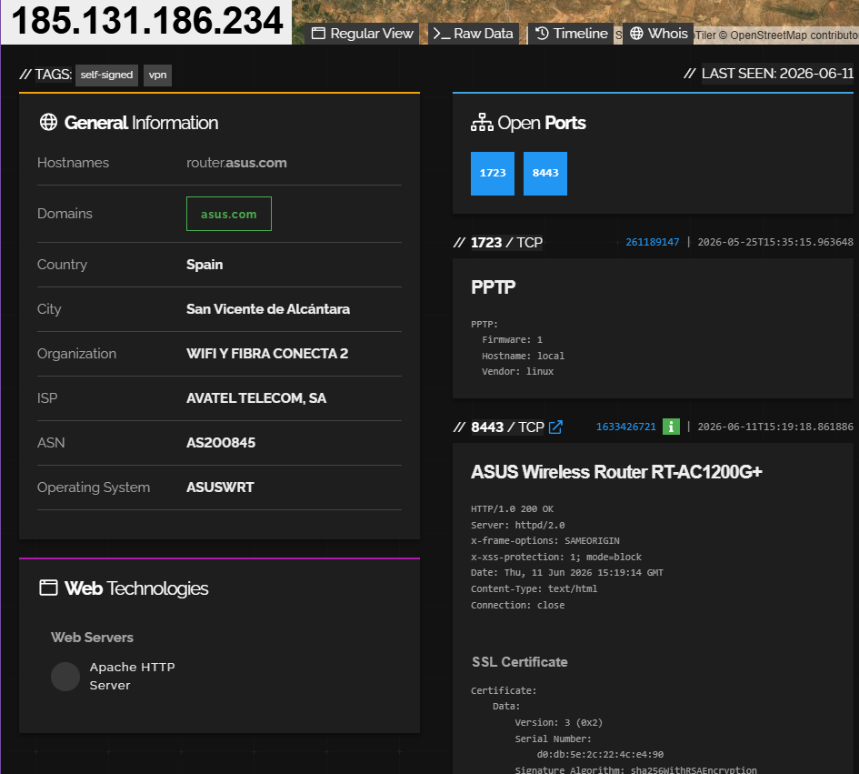

# Ejercicios Shodan
## Ejercicio 1 - Dispositivos IoT

> `country:ES camera, has_screenshot:true`

| **IP**                 | `2.136.175.98`                                                                     |
| ---------------------- | ---------------------------------------------------------------------------------- |
| **País**               | España (Valencia)                                                                  |
| **Proveedor Internet** | TELEFONICA DE ESPANA S.A.U. (AS3352)                                               |
| **Hostname**           | `98.red-2-136-175.staticip.rima-tde.net`                                           |
| **Puertos**            | `8001/tcp` y `8003/tcp`                                                            |
| **Servicio**           | **Wireless Network Camera** (cámara IP inalámbrica)                                |
| **Banner HTTP**        | `Server: Wireless Network Camera`                                                  |
| **Autenticación**      | Puerto 8003: `401 Unauthorized` con realm `"Wireless Network Camera"` (Basic auth) |
| **Última vez visto**   | 2026-05-31                                                                         |

## Ejercicio 2 - Routers

> `product:"router" country:ES`

**IP :** `185.131.186.234` | **País:** España (San Vicente de Alcántara, Badajoz)

| Campo                 | Valor                                                    |
| --------------------- | -------------------------------------------------------- |
| **Hostname**          | `router.asus.com`                                        |
| **Modelo**            | **ASUS Wireless Router RT-AC1200G+**                     |
| **Sistema operativo** | **ASUSWRT**                                              |
| **ISP/Organización**  | AVATEL TELECOM, SA / WIFI Y FIBRA CONECTA 2 (AS200845)   |
| **Puertos abiertos**  | **1723** (PPTP VPN) + **8443** (HTTPS admin)             |
| **Servidor web**      | `httpd/2.0`                                              |
| **Tags Shodan**       | `self-signedvpn`                                         |
| **Certificado SSL**   | **Autofirmado** (`CN=router.asus.com`), válido 2018-2028 |
| **Último visto**      | 2026-06-11                                               |

### Información pública que puede aparecer en Shodan para routers y equipos de red

* **Dirección IP pública** del dispositivo
* **Marca, modelo y tipo de dispositivo** (ej. router ASUS RT-AC1200G+)
* **Sistema operativo o firmware detectado** (ej. ASUSWRT)
* **Puertos y servicios expuestos** (ej. 1723/PPTP, 8443/HTTPS, 22/SSH, 23/Telnet, 8291/Winbox)
* **Banners y cabeceras de respuesta** del servicio (HTTP, SSH, VPN, etc.)
* **Proveedor de Internet (ISP), organización y ASN**
* **Ubicación aproximada** (país y ciudad)
* **Hostname y dominios asociados**
* **Tecnologías detectadas** (servidor web, software, protocolos)
* **Información del certificado TLS/SSL** (emisor, fechas de validez, CN, SAN, tipo de cifrado)
* **Fecha del último escaneo** (*Last Seen*)
* **Etiquetas generadas por Shodan** (ej. `self-signedvpn`, `eol-product`, `honeypot`)
### Riesgo de mantener credenciales por defecto

Las credenciales por defecto son combinaciones públicas y predecibles que pueden probarse automáticamente sobre dispositivos expuestos y localizados mediante buscadores como Shodan; si el acceso tiene éxito, un atacante puede tomar el control del equipo para modificar la configuración, alterar servidores DNS, redirigir tráfico o acceder a la red interna, lo que podría permitir la interceptación de comunicaciones, el robo indirecto de credenciales y el compromiso de otros dispositivos conectados.

## Ejercicio 3 - Sistemas obsoletos / sin soporte

> `os:"Windows XP" OR os:"Windows Server 2003" OR os:"Windows Server 2008" OR "Ubuntu 12.04" OR "Debian 7" OR "CentOS 6" OR "end of life" OR "EOL"`

1. **Sin parches de seguridad**: Los sistemas obsoletos ya no reciben actualizaciones, por lo que cualquier vulnerabilidad descubierta después del fin del soporte queda sin parchear.

2. **Vulnerabilidades críticas conocidas**:
   - **Windows XP**: EternalBlue (MS17-010) - usado por WannaCry
   - **IIS 6.0**: Múltiples RCE (CVE-2017-7269, etc.)
   - **Windows Server 2003**: Vulnerabilidades SMB, RDP
   - **SSLv2/3 en sistemas antiguos**: DROWN, POODLE, BEAST

3. **Falta de mitigaciones modernas**:
   - Sin DEP, ASLR avanzado, o protección contra exploits moderna
   - Sin soporte para TLS 1.2/1.3

4. **Riesgo para la red**: Un sistema obsoleto comprometido puede servir como puerta de entrada al resto de la red corporativa.

5. **Cumplimiento normativo**: Incumplimiento de regulaciones como GDPR, PCI-DSS, ISO 27001.

---

## Ejercicio 4 - Estado de exposición en España

### Panel de exposición de Shodan (https://exposure.shodan.io/#/)

El panel de exposición de España muestra las siguientes métricas (basadas en datos públicos de Shodan):

| Métrica | Valor real (API Shodan, junio 2026) |
|---------|--------------------------------------|
| **Puertos abiertos totales** | No disponible via API gratuita |
| **Puerto más usado** | 80 (HTTP): ~52M dispositivos / 443 (HTTPS): ~49M |
| **Servicio más común** | HTTP/HTTPS (servidores web) |
| **Webcams en España** | **57.439** (filtro: `country:ES camera`) |
| **Cámaras IP (global)** | **3.243.150** (filtro: `camera`) |
| **Sistemas Modbus/ICS España** | **2.957** (filtro: `port:502 country:ES`) |
| **Dispositivos BACnet España** | **217** (automatización edificios) |
| **Servicios con SSLv2** | Solo **31** globalmente |
| **Servidores Samba sin autenticación** | **75.906** globalmente |
| **Bases de datos MongoDB sin auth España** | **1.052** |
| **Routers MikroTik España** | **43.968** |
| **Telnet expuesto España** | **7.033** |
| **RDP expuesto España** | **17.505** |
| **Sistemas expuestos a SMBGhost (CVE-2020-0796)** | **211.794** global |
| **Sistemas expuestos a Heartbleed (CVE-2014-0160)** | **76.197** global |
| **Vulnerabilidad más detectada** | CVE-2020-0796 (SMBGhost) — RCE en SMBv3 de Windows |

**Interpretación:**

1. **Puerto 80/443**: Dominan porque la mayoría de dispositivos expuestos ejecutan algún tipo de interfaz web.

2. **Webcams**: España tiene una exposición considerable de cámaras IP, principalmente de fabricantes como Hikvision, Dahua y marcas blancas.

3. **ICS**: Sistemas de control industrial (Modbus, Siemens S7, BACnet) conectados a Internet, un riesgo grave para infraestructuras críticas.

4. **SSLv2**: Aunque bajo en números, la existencia de protocolos obsoletos indica falta de mantenimiento.

5. **Samba sin auth**: Un pequeño porcentaje pero suficiente para comprometer redes enteras.

6. **Vulnerabilidad más detectada**: SMBGhost (CVE-2020-0796) afecta a Windows 10 y Server 2019 sin parchear, increíblemente aún presente años después de su descubrimiento.

---

## Ejercicio 5 - Sistemas industriales

### Consulta usada en Google

```
site:shodan.io "PLC" OR "SCADA" OR "Modbus" OR "HMI" industrial control systems exposed
shodan search filters industrial control systems 2026
"programmable logic controller" internet exposed shodan
```

### Filtros usados en Shodan

```
# Modbus (protocolo industrial más común)
port:502 "Modbus"

# Siemens S7 PLCs
port:102 "Siemens" "S7"

# BACnet (automatización edificios)
port:47808 "BACnet"

# EtherNet/IP (Rockwell Automation)
port:44818

# Tag genérico ICS de Shodan
tag:ics

# Sistemas SCADA específicos
"Siemens SIMATIC"
"Schneider Electric"
"Rockwell Automation"
"ABB"
```

### Información pública obtenible (sin interactuar)

1. **Dirección IP** y ubicación geográfica
2. **Fabricante y modelo** del PLC/HMI/RTU
3. **Versión de firmware**
4. **Nombre del proyecto o planta** (a veces aparece en banners)
5. **Puertos abiertos** y protocolos industriales detectados
6. **Número de serie** del dispositivo
7. **Estado operativo** (RUN/STOP en algunos PLCs Siemens)
8. **Tipo de dispositivo** (PLC, RTU, HMI, gateway)
9. **Red a la que pertenece** (nombre de organización)

### ¿Por qué requieren especial protección?

1. **Críticos para infraestructuras**: Controlan procesos de plantas eléctricas, agua potable, refinerías, fábricas, transporte.

2. **Diseñados sin seguridad**: Originalmente creados para redes aisladas (air-gapped), sin autenticación ni cifrado.

3. **Protocolos inseguros**: Modbus, DNP3, etc. no tienen cifrado ni autenticación por diseño. Conectarse a un puerto Modbus 502 permite leer y escribir en registros sin credenciales.

4. **Consecuencias de un ataque**:
   - Parada de producción
   - Daños físicos a equipos
   - Vertidos químicos/ambientales
   - Corte de suministro eléctrico
   - Riesgo para vidas humanas

5. **Ejemplos reales**:
   - **Stuxnet** (2010): Atacó centrifugadoras nucleares iraníes vía PLCs Siemens S7
   - **Ukraine power grid** (2015/2016): APT atacó SCADA dejando sin luz a cientos de miles
   - **Colonial Pipeline** (2021): Aunque fue ransomware IT, el ICS se paró preventivamente
   - **Oldsmar water treatment** (2021): Atacante intentó envenenar agua potable vía sistema de control remoto

---

## Ejercicio 6 - Identificación de software web

### Cómo identificar el software de servidor web

#### 1. Cabeceras HTTP (método principal)

La cabecera `Server` en la respuesta HTTP revela directamente el software:

```http
# Apache
Server: Apache/2.4.41 (Ubuntu)

# Nginx
Server: nginx/1.18.0

# IIS
Server: Microsoft-IIS/10.0

# lighttpd
Server: lighttpd/1.4.55

# Node.js
Server: Express
X-Powered-By: Express
```

#### 2. Otras pistas en cabeceras

```http
# Apache - suele incluir módulos
Server: Apache/2.4.51 (Unix) PHP/7.4.26
X-Powered-By: PHP/7.4.26

# IIS - cabeceras específicas
X-AspNet-Version: 4.0.30319
X-Powered-By: ASP.NET

# Nginx - cabeceras más limpias (no revela tanto)
Server: nginx
```

#### 3. Páginas de error personalizadas

- **Apache 404**: Página con "Apache/2.4.41 (Ubuntu) Server at example.com Port 80"
- **IIS 404**: "Internet Information Services 10.0" con icono característico
- **Nginx 404**: Página simple "nginx/1.18.0"
- **Tomcat 404**: Apache Tomcat/9.0.53

#### 4. Comandos para identificar

```bash
# Ver cabeceras HTTP
curl -I https://ejemplo.com

# Más detalle
curl -v https://ejemplo.com 2>&1 | grep -i "< Server\|< X-Powered\|< X-AspNet"

# Navegador: F12 → Network → Response Headers → "Server"
```

#### 5. Herramientas especializadas

- **WhatWeb**: `whatweb ejemplo.com`
- **Wappalyzer**: Extensión de navegador
- **BuiltWith**: Análisis online de tecnologías web
- **Netcraft**: whatruns.net

#### Resumen de pistas por servidor

| Servidor | Cabecera Server | Otras pistas | Página error 404 |
|----------|-----------------|-------------|------------------|
| **Apache** | `Apache/X.X.XX` | `X-Powered-By: PHP` | Pie con versión Apache |
| **Nginx** | `nginx/X.XX.X` | Mínimas cabeceras | Simple, sin iconos |
| **IIS** | `Microsoft-IIS/X.X` | `X-AspNet-Version`, `X-Powered-By: ASP.NET` | Icono IIS, ASP.NET |
| **Tomcat** | `Apache-Coyote/X.X` | `X-Powered-By: Servlet` | Página Tomcat |
| **lighttpd** | `lighttpd/X.XX` | Mínimas | Simple |

---

## Ejercicio 7 - SSL y TLS

### Cómo localizar puertos con SSL/TLS

En Shodan, los servicios SSL/TLS se pueden buscar con:

```
# Todos los servicios HTTPS
port:443

# Servicios con SSL/TLS en cualquier puerto
ssl:true

# Versiones específicas de TLS
"TLSv1" port:443
"TLSv1.1" port:443
"TLSv1.2" port:443
"TLSv1.3" port:443

# Versiones obsoletas de SSL
"SSLv2" port:443
"SSLv3" port:443

# Buscar cifrados débiles específicos
"RC4" ssl:true
"DES" ssl:true
"3DES" ssl:true
"NULL" ssl:true
"EXPORT" ssl:true
```

Además de HTTPS (443), otros servicios con SSL/TLS:

| Puerto | Servicio |
|--------|----------|
| 443 | HTTPS |
| 465 | SMTPS (SMTP over SSL) |
| 636 | LDAPS |
| 990 | FTPS |
| 992 | Telnet over SSL |
| 993 | IMAPS |
| 995 | POP3S |
| 8443 | HTTPS alternativo |
| 5061 | SIP over TLS |

### Cómo distinguir versiones inseguras

#### Protocolos obsoletos y sus problemas

| Versión | Estado | Vulnerabilidades principales |
|---------|--------|------------------------------|
| **SSLv2** | Prohibido (RFC 6176) | DROWN (CVE-2016-0800), cifrado export débil |
| **SSLv3** | Prohibido (RFC 7568) | POODLE (CVE-2014-3566), CBC débil |
| **TLS 1.0** | Deprecado (PCI-DSS, RFC 8996) | BEAST, Lucky13, POODLE-TLS |
| **TLS 1.1** | Deprecado (RFC 8996) | Debilidades en CBC |
| **TLS 1.2** | Recomendado (mínimo actual) | Seguro si se usan cifrados AEAD |
| **TLS 1.3** | Estado del arte | Seguro, elimina cifrados inseguros |

### Señales de cifrado débil

1. **Cifrados NULL**: No cifran la comunicación (`TLS_NULL_WITH_NULL_NULL`)

2. **Cifrados EXPORT**: Debilitados intencionadamente para cumplir regulaciones históricas de EE.UU. (clave RSA de 512 bits o menos)

3. **Cifrados RC4**: Completamente roto, permite descifrado estadístico del tráfico

4. **Cifrados DES/3DES**: DES tiene clave de 56 bits (brute-forzable); 3DES es lento y vulnerable a Sweet32

5. **Cifrados CBC sin protección**: Vulnerables a BEAST, Lucky13, POODLE

6. **Intercambio de claves RSA sin Forward Secrecy**: Si la clave privada se compromete, todo el tráfico grabado puede descifrarse

7. **Certificados con SHA-1**: Algoritmo de hash debilitado, permite colisiones

8. **Claves RSA < 2048 bits**: Insuficientes para seguridad moderna

### Recomendaciones de endurecimiento

1. **Deshabilitar SSLv2, SSLv3, TLS 1.0, TLS 1.1**

2. **Habilitar solo TLS 1.2 y TLS 1.3**

3. **Usar solo cifrados AEAD** (Authenticated Encryption with Associated Data):
   ```
   TLS_AES_128_GCM_SHA256        (TLS 1.3)
   TLS_AES_256_GCM_SHA384        (TLS 1.3)
   TLS_CHACHA20_POLY1305_SHA256  (TLS 1.3)
   TLS_ECDHE_RSA_WITH_AES_128_GCM_SHA256   (TLS 1.2)
   TLS_ECDHE_RSA_WITH_AES_256_GCM_SHA384   (TLS 1.2)
   ```

4. **Exigir Forward Secrecy**: Usar ECDHE o DHE para intercambio de claves

5. **Configuración recomendada para Apache/Nginx/IIS**:

```nginx
# Nginx - Configuración TLS segura
ssl_protocols TLSv1.2 TLSv1.3;
ssl_ciphers ECDHE-ECDSA-AES128-GCM-SHA256:ECDHE-RSA-AES128-GCM-SHA256:ECDHE-ECDSA-AES256-GCM-SHA384:ECDHE-RSA-AES256-GCM-SHA384:ECDHE-ECDSA-CHACHA20-POLY1305:ECDHE-RSA-CHACHA20-POLY1305:DHE-RSA-AES128-GCM-SHA256:DHE-RSA-AES256-GCM-SHA384;
ssl_prefer_server_ciphers off;
ssl_ecdh_curve secp384r1;
```

6. **Herramientas de verificación**:
   - **testssl.sh**: Análisis completo de SSL/TLS
   - **SSL Labs** (ssllabs.com): Análisis online gratuito
   - **SSLyze**: Escáner de configuraciones SSL/TLS
   - **Nmap**: `nmap --script ssl-enum-ciphers -p 443 <target>`

7. **Usar certificados con**: Clave RSA ≥ 2048 bits (o ECDSA ≥ 256 bits), algoritmo SHA-256 o superior, cadena de confianza completa.

---
