## Ejercicio 1 - Dispositivos IoT

>[!INFO] Query
`country:ES camera, has_screenshot:true`

| **IP**                 | `2.136.175.98`                                                                     |
| ---------------------- | ---------------------------------------------------------------------------------- |
| **País**               | España (Valencia)                                                                  |
| **Proveedor Internet** | TELEFONICA DE ESPANA S.A.U. (AS3352)                                               |
| **Hostname**           | `98.red-2-136-175.staticip.rima-tde.net`                                           |
| **Puertos**            | `8001/tcp` y `8003/tcp`                                                            |
| **Servicio**           | **Wireless Network Camera** (cámara IP inalámbrica)                                |
| **Banner HTTP**        | `Server: Wireless Network Camera`                                                  |
| **Autenticación**      | Puerto 8003: `401 Unauthorized` con realm `"Wireless Network Camera"` (Basic auth) |
| **Última vez visto**   | 2026-05-31                                                                         |

## Ejercicio 2 - Routers

>[!INFO] Query
> `product:"router" country:ES`

**IP :** `185.131.186.234` | **País:** España (San Vicente de Alcántara, Badajoz)

| Campo                 | Valor                                                    |
| --------------------- | -------------------------------------------------------- |
| **Hostname**          | `router.asus.com`                                        |
| **Modelo**            | **ASUS Wireless Router RT-AC1200G+**                     |
| **Sistema operativo** | **ASUSWRT**                                              |
| **ISP/Organización**  | AVATEL TELECOM, SA / WIFI Y FIBRA CONECTA 2 (AS200845)   |
| **Puertos abiertos**  | **1723** (PPTP VPN) + **8443** (HTTPS admin)             |
| **Servidor web**      | `httpd/2.0`                                              |
| **Tags Shodan**       | `self-signedvpn`                                         |
| **Certificado SSL**   | **Autofirmado** (`CN=router.asus.com`), válido 2018-2028 |
| **Último visto**      | 2026-06-11                                               |

### Información pública que puede aparecer en Shodan para routers y equipos de red

* **Dirección IP pública** del dispositivo
* **Marca, modelo y tipo de dispositivo** (ej. router ASUS RT-AC1200G+)
* **Sistema operativo o firmware detectado** (ej. ASUSWRT)
* **Puertos y servicios expuestos** (ej. 1723/PPTP, 8443/HTTPS, 22/SSH, 23/Telnet, 8291/Winbox)
* **Banners y cabeceras de respuesta** del servicio (HTTP, SSH, VPN, etc.)
* **Proveedor de Internet (ISP), organización y ASN**
* **Ubicación aproximada** (país y ciudad)
* **Hostname y dominios asociados**
* **Tecnologías detectadas** (servidor web, software, protocolos)
* **Información del certificado TLS/SSL** (emisor, fechas de validez, CN, SAN, tipo de cifrado)
* **Fecha del último escaneo** (*Last Seen*)
* **Etiquetas generadas por Shodan** (ej. `self-signedvpn`, `eol-product`, `honeypot`)
### Riesgo de mantener credenciales por defecto

Las credenciales por defecto son combinaciones públicas y predecibles que pueden probarse automáticamente sobre dispositivos expuestos y localizados mediante buscadores como Shodan; si el acceso tiene éxito, un atacante puede tomar el control del equipo para modificar la configuración, alterar servidores DNS, redirigir tráfico o acceder a la red interna, lo que podría permitir la interceptación de comunicaciones, el robo indirecto de credenciales y el compromiso de otros dispositivos conectados.
## Ejercicio 3 - Sistemas obsoletos / sin soporte

| Campo | Valor |
|-------|-------|
| **IP** | `88.151.17.230` |
| **Sistema operativo** | **Windows XP SP2** (build 5.1.2600) |
| **Tags Shodan** | **`eol-os`** (end-of-life OS), `database` |
| **Puertos abiertos** | **80** (HTTP - "Administrative Quarantine") + **1433** (MS-SQL) |
| **Base de datos** | **MS-SQL Server 2008 RTM** (v10.0.1600.0) |
| **Organización** | **Gobierno del Principado de Asturias** (AS39353) |
| **ISP** | Gobierno del Principado de Asturias |
| **Último visto** | 2026-06-08 |
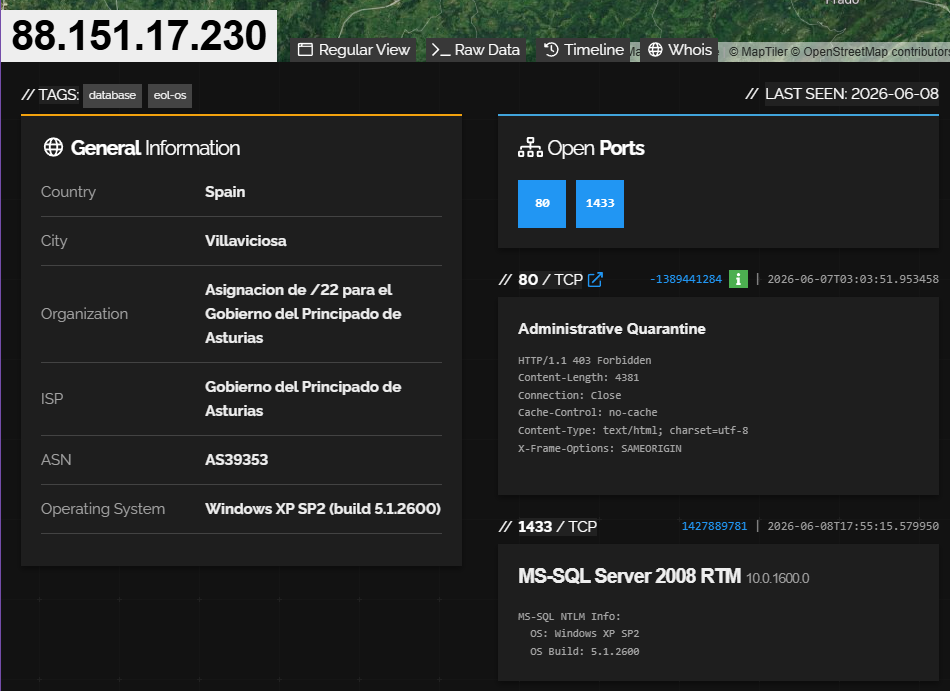
### Problemas de seguridad

Los sistemas operativos sin soporte (EOL) no reciben actualizaciones de seguridad, lo que deja vulnerabilidades conocidas sin corregir y fácilmente explotables mediante ataques automatizados; además, suelen ser compatibles con protocolos antiguos y débiles, lo que facilita el acceso no autorizado, o la ejecución de código remoto, convirtiéndolos en objetivos especialmente vulnerables cuando están expuestos a Internet.
## Ejercicio 4 - Estado de exposición en España

>[!INFO] Query
> `camera country:ES`
> `"SSLv2"`

| #   | Pregunta                                           | Respuesta                                                                                                                       |
| --- | -------------------------------------------------- | ------------------------------------------------------------------------------------------------------------------------------- |
| 1   | **¿Cuántos puertos abiertos hay en España?**       | **5.194.722**                                                                                                                   |
| 2   | **¿Cuál es el puerto más usado?**                  | **Puerto 161** (652.731 en total)                                                                                               |
| 3   | **¿A qué servicio corresponde?**                   | **SNMP** — monitorización de red.                                                                                               |
| 4   | **¿Cuántas webcams están expuestas?**              | 57.439 en España                                                                                                                |
| 5   | **¿Cuántos sistemas de control industrial (ICS)?** | **4.868**                                                                                                                       |
| 6   | **¿Cuántos servicios con SSLv2/obsoletos?**        | 80 servicios SSLv2 globalmente. 0 si buscamos como `country:ES`                                                                 |
| 7   | **¿Qué % de servidores SMB sin autenticación?**    | **14,5%** (1.085 de 7.462 tienen autenticación deshabilitada)                                                                   |
| 8   | **¿Cuántas bases de datos comprometidas?**         | **91**                                                                                                                          |
| 9   | **¿Cuál es la vulnerabilidad más detectada?**      | **CVE-2020-0796**                                                                                                               |
| 10  | **¿A qué fallo corresponde?**                      | **SMBGhost** — RCE crítica en SMBv3 de Windows (Windows 10 y Server 2019). Permite ejecución remota de código sin autenticación |
## Ejercicio 5 - Sistemas industriales

### Consulta usada en Google 

```
intitle:SCADA login
inurl:"/hmi"
intitle:"Siemens" "login"
```

```
intitle:SCADA login
```
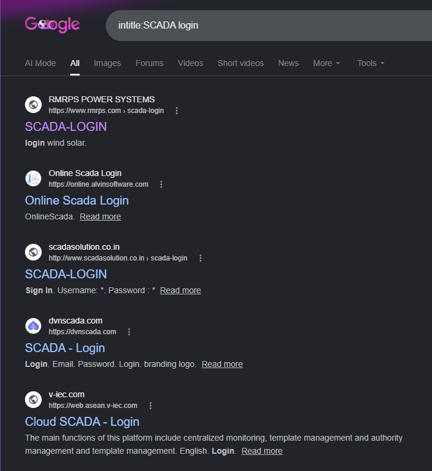

### Filtros usados en Shodan [^1]

```
# Modbus 
port:502 "Modbus"

# Siemens S7 PLCs
port:102 "Siemens" "S7"

# BACnet
port:47808 "BACnet"

# Tag genérico ICS de Shodan (solo si tienes cuenta Enterprise)
tag:ics

# Sistemas SCADA específicos
"Siemens SIMATIC"
"Schneider Electric"
"Rockwell Automation"
"ABB"
```
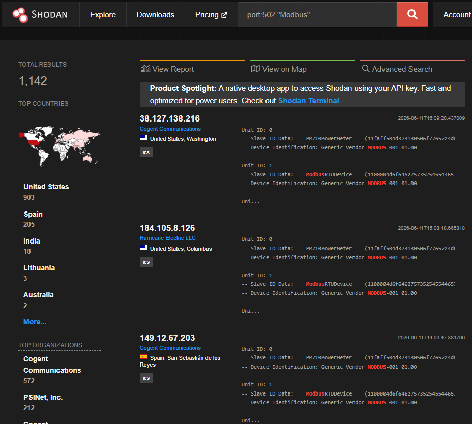
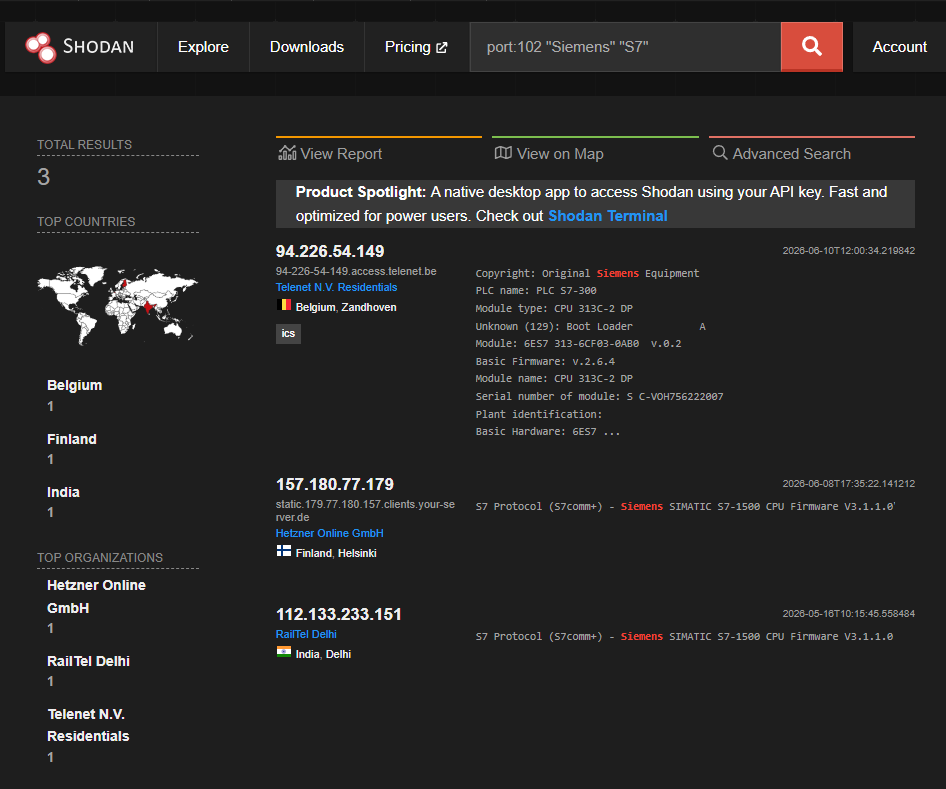
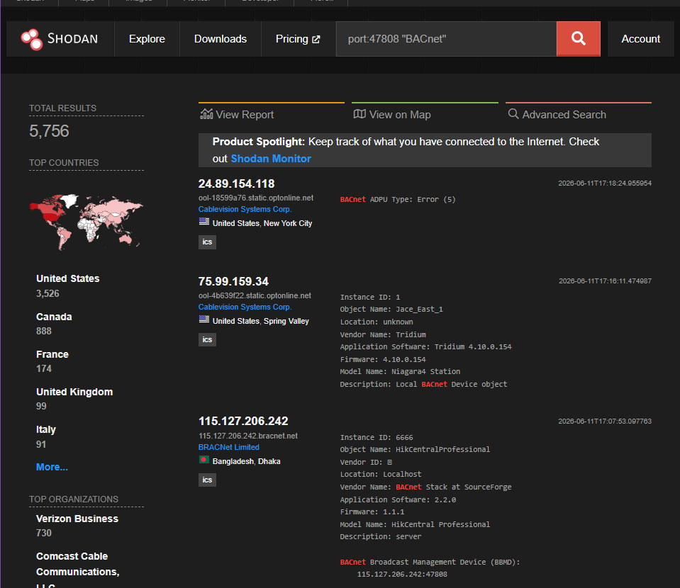
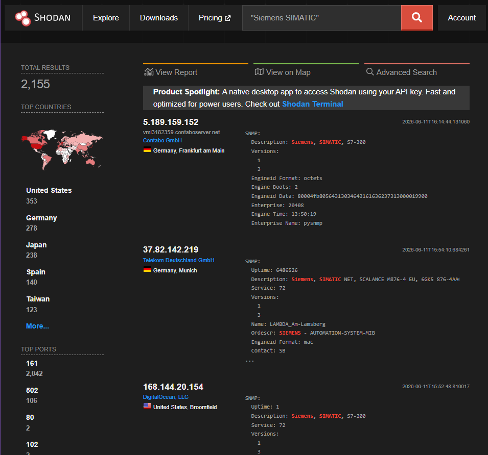
### Información obtenible sin interactuar

**IP analizada:** `149.12.67.203` — San Sebastián de los Reyes (Madrid) — Tag Shodan: `ics`

| #   | Información pública obtenida            | Dato real del dispositivo                                                                                    |
| --- | --------------------------------------- | ------------------------------------------------------------------------------------------------------------ |
| 1   | **Dirección IP** y ubicación geográfica | `149.12.67.203` — San Sebastián de los Reyes, Madrid, España                                                 |
| 2   | **Fabricante y modelo**                 | **Schneider Electric PM710 PowerMeter** (medidor de potencia eléctrica)                                      |
| 3   | **Versión de firmware**                 | `MODBUS-001 01.00`                                                                                           |
| 4   | **Nombre del proyecto o planta**        | No visible en este caso                                                                                      |
| 5   | **Puertos y protocolos industriales**   | **502** (Modbus), 21 (FTP), 22 (SSH), 80/443 (HTTP), 445 (SMB), 2222 (SSH), 5555 (Android Debug), 8080, etc. |
| 6   | **Número de serie**                     | No visible directamente                                                                                      |
| 7   | **Estado operativo**                    | **Unit IDs activos**: 0, 1 y 255 respondiendo en Modbus. `PM710PowerMeter` y `ModbusRTUDevice` detectados    |
| 8   | **Tipo de dispositivo**                 | **PowerMeter** (medidor de energía eléctrica industrial)                                                     |
| 9   | **Red / Organización**                  | Cogent Communications (AS174) — red de tránsitor internacional                                               |
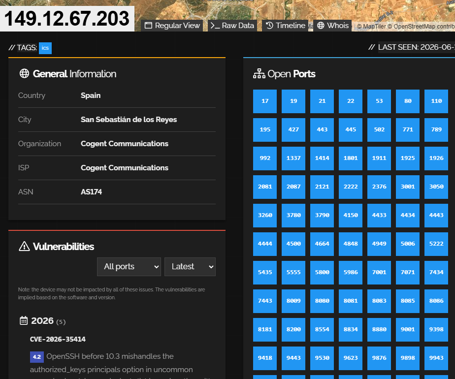
### ¿Por qué requieren especial protección?

Controlan infraestructuras críticas como energía, agua, transporte o producción industrial, y fueron diseñados originalmente para entornos aislados sin medidas de seguridad modernas, lo que permitiría manipular procesos si se accede al puerto o interfaz expuesta; un compromiso de estos sistemas puede provocar paradas de servicio, daños físicos en equipos, impactos ambientales o incluso riesgos para la seguridad de las personas, como el ataque a Stuxnet o redes eléctricas en Ucrania.
## Ejercicio 6 - Identificación de software web

### Cómo identificar el software de servidor web

#### 1. Cabeceras HTTP (método principal)

La cabecera `Server` en la respuesta HTTP revela directamente el software:

```http
# Apache
Server: Apache/2.4.41 (Ubuntu)

# Nginx
Server: nginx/1.18.0

# IIS
Server: Microsoft-IIS/10.0

# lighttpd
Server: lighttpd/1.4.55

# Node.js
Server: Express
X-Powered-By: Express
```
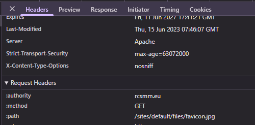
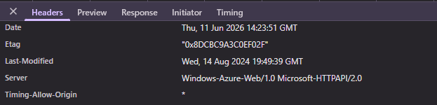
#### 2. Páginas de error personalizadas

- **Apache 404**: Página con "Apache/2.4.41 (Ubuntu) Server at example.com Port 80"
- **IIS 404**: "Internet Information Services 10.0" con icono característico
- **Nginx 404**: Página simple "nginx/1.18.0"
- **Tomcat 404**: Apache Tomcat/9.0.53

#### 3. Comandos para identificar versiones

```bash
# Ver cabeceras HTTP
curl -I https://ejemplo.com

# Más detalle
curl -v https://ejemplo.com 2>&1 | grep -i "< Server\|< X-Powered\|< X-AspNet"

# Navegador: F12 → Network → Response Headers → "Server"
```
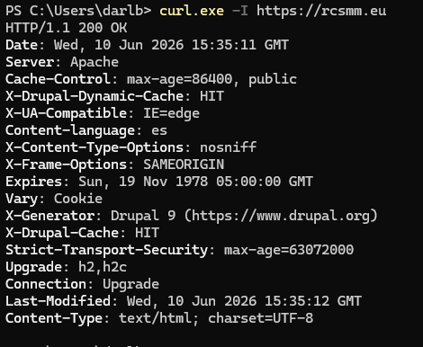
#### 4. Herramientas especializadas

`WhatWeb, Wappalyzer, BuiltWith,` o `whatruns.net`

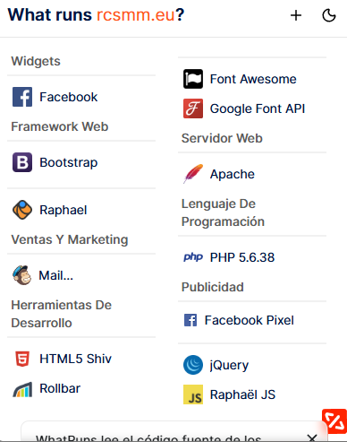
## Ejercicio 7 - SSL y TLS

### Cómo localizar puertos con SSL/TLS

Se identifican buscando servicios en puertos típicos cifrados como 443 (HTTPS), 8443, 993 (IMAPS), 465 (SMTPS) o mediante escaneo de certificados.[^2]

```
# Todos los servicios HTTPS
port:443

# Servicios con SSL/TLS en cualquier puerto
ssl:true

# Versiones de TLS  
ssl.version:tlsv1  
ssl.version:tlsv1.1  
ssl.version:tlsv1.2  
ssl.version:tlsv1.3  
  
# Versiones inseguras  
ssl.version:sslv2  
ssl.version:sslv3  
  
# Cifrados débiles (si están expuestos en banner)  
ssl.cipher:rc4  
ssl.cipher:des  
ssl.cipher:3des  
ssl.cipher:null  
ssl.cipher:export
```

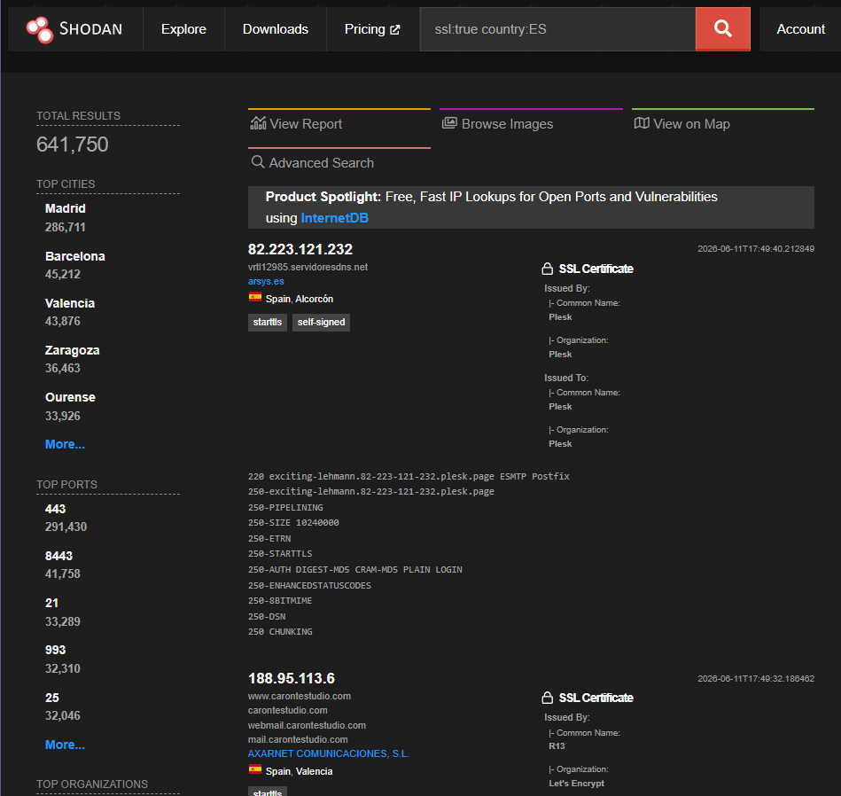
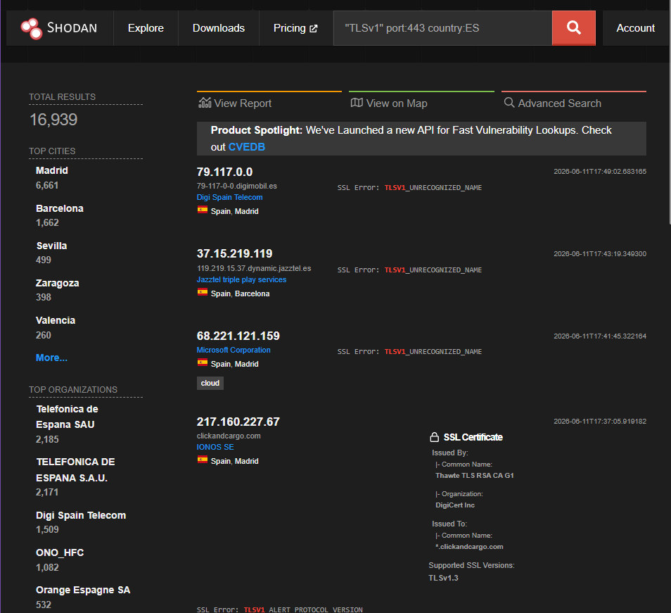
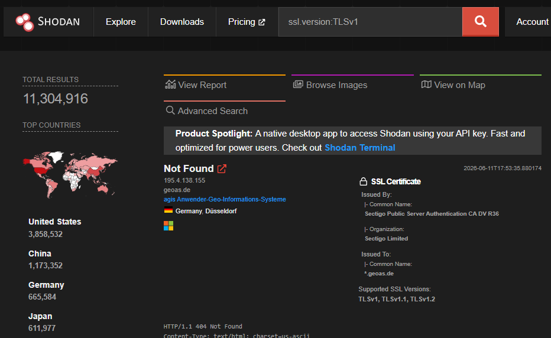
### Cómo distinguir versiones inseguras

| Versión     | Estado                        | Vulnerabilidades principales                |
| ----------- | ----------------------------- | ------------------------------------------- |
| **SSLv2**   | Prohibido (RFC 6176)          | DROWN (CVE-2016-0800), cifrado export débil |
| **SSLv3**   | Prohibido (RFC 7568)          | POODLE (CVE-2014-3566), CBC débil           |
| **TLS 1.0** | Deprecado (PCI-DSS, RFC 8996) | BEAST, Lucky13, POODLE-TLS                  |
| **TLS 1.1** | Deprecado (RFC 8996)          | Debilidades en CBC                          |
| **TLS 1.2** | Recomendado (mínimo actual)   | Seguro si se usan cifrados AEAD             |
| **TLS 1.3** | Estado del arte               | Seguro, elimina cifrados inseguros          |

### Señales de cifrado débil

1. **Cifrados NULL**: No cifran la comunicación (`TLS_NULL_WITH_NULL_NULL`)

2. **Cifrados EXPORT**: Debilitados intencionadamente para cumplir regulaciones históricas de EE.UU. (clave RSA de 512 bits o menos)

3. **Cifrados RC4**: Completamente roto, permite descifrado estadístico del tráfico

4. **Cifrados DES/3DES**: DES tiene clave de 56 bits (brute-forzable); 3DES es lento y vulnerable a Sweet32

5. **Cifrados CBC sin protección**: Vulnerables a BEAST, Lucky13, POODLE

6. **Intercambio de claves RSA sin Forward Secrecy**: Si la clave privada se compromete, todo el tráfico grabado puede descifrarse

7. **Certificados con SHA-1**: Algoritmo de hash debilitado, permite colisiones

8. **Claves RSA < 2048 bits**: Insuficientes para seguridad moderna

### Recomendaciones de endurecimiento

1. **Deshabilitar SSLv2, SSLv3, TLS 1.0, TLS 1.1**

2. **Habilitar solo TLS 1.2 y TLS 1.3**

3. **Usar solo cifrados AEAD** (Authenticated Encryption with Associated Data):
   ```
   TLS_AES_128_GCM_SHA256        (TLS 1.3)
   TLS_AES_256_GCM_SHA384        (TLS 1.3)
   TLS_CHACHA20_POLY1305_SHA256  (TLS 1.3)
   TLS_ECDHE_RSA_WITH_AES_128_GCM_SHA256   (TLS 1.2)
   TLS_ECDHE_RSA_WITH_AES_256_GCM_SHA384   (TLS 1.2)
   ```

4. **Exigir Forward Secrecy**: Usar ECDHE o DHE para intercambio de claves

5. **Configuración recomendada para Apache/Nginx/IIS**:

```nginx
# Nginx - Configuración TLS segura
ssl_protocols TLSv1.2 TLSv1.3;
ssl_ciphers ECDHE-ECDSA-AES128-GCM-SHA256:ECDHE-RSA-AES128-GCM-SHA256:ECDHE-ECDSA-AES256-GCM-SHA384:ECDHE-RSA-AES256-GCM-SHA384:ECDHE-ECDSA-CHACHA20-POLY1305:ECDHE-RSA-CHACHA20-POLY1305:DHE-RSA-AES128-GCM-SHA256:DHE-RSA-AES256-GCM-SHA384;
ssl_prefer_server_ciphers off;
ssl_ecdh_curve secp384r1;
```

6. **Herramientas de verificación**:
   - **testssl.sh**: Análisis completo de SSL/TLS
   - **SSL Labs** (ssllabs.com): Análisis online gratuito
   - **SSLyze**: Escáner de configuraciones SSL/TLS
   - **Nmap**: `nmap --script ssl-enum-ciphers -p 443 <target>`

7. **Usar certificados con**: Clave RSA ≥ 2048 bits (o ECDSA ≥ 256 bits), algoritmo SHA-256 o superior, cadena de confianza completa.


[^1]: https://github.com/Ilias1988/Hacking-Cheatsheets/blob/main/Shodan/README.md

[^2]: https://www.cyberly.org/en/can-shodan-help-identify-devices-with-outdated-ssl-tls-configurations/index.html
