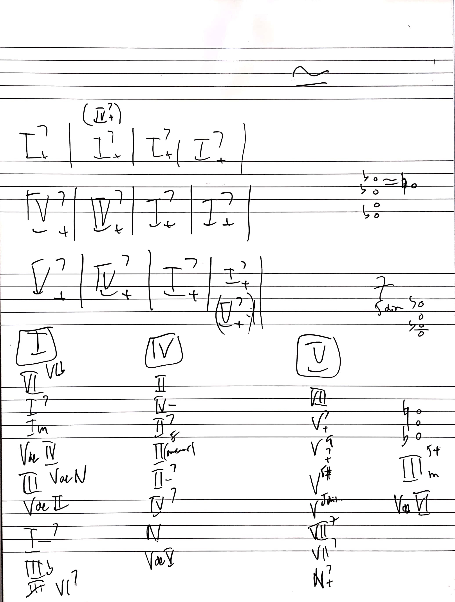

---

---

Melodía Blues 1-2-b3-3-4-#4-5-6-b7

## Blues 12 compases

$I - IV - I - I$

$IV-IV-I-I$

$V-IV-I-V$

Vals Jazzístico:
Estrechar 3a parte y 4a para 3/4

1 • Notas paso

2 • Saltos octava y arpegios quebrados en notas largas

3 • Apoyaturas a la melodía
(Melodía asc salto descendente)
Desc diatónico
Asc cromático

4 • Anillos
• De 1 trozo de melodía (repetir célula)
• De 1 trozo de acorde
• Inventar trozo

5 • Approche (aproximación. Apoyaturas al acorde)
• Simple Ascendente. Medio tono
• Simple Descendente. Diatónico
• Doble Ascendente
• Doble Descendente
• Doble Ascendente y Descendente (Sol# si la o viceversa)

Cada uno: A tiempo. Anticipados y en retardo. Sobre la 3ª y 5ª del acorde

- Walking diatónico de 5 u 8 o viceversa
- Walking cromático de 3 a 5 o viceversa

Armonía 6 notas
Mano izq F-5-7 o F-7-9
Mano dcha 3-6-9
(La do mi fa Sol si)
Buscar 3ª y añadirle dos 4as en función de tonalidad

Blues walking bass 1-3-5-6-b7 (más clásico de un blues)

Walking Bass cromático de 8va a 5 sin 3ª

Walking diatónico y salto a la 3ª

Walking cromático de F a 3ª / 3ª a 5ª

