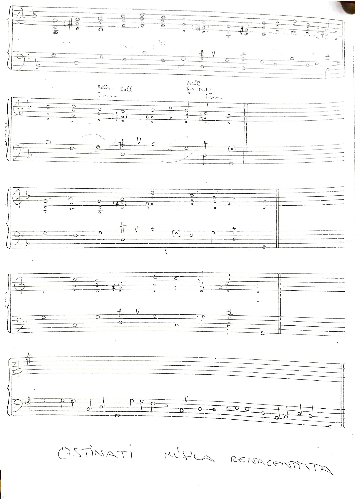

---

---

| **Modo** | **Progresión de acordes** |
| --- | --- |
| Dórico | $Im - IV - Im - Vm - Im - IV - Vm - Im$ |
| Frigio | $Im - IVm - Im - V^\circ dim - Im - IVm - V^\circ dim - I$ |
| Lidio | $I - IV^\circ dim - I - V - I - IV^\circ dim - V - I$ |
| Mixolidio | $I - IV - I - Vm - I - IV - Vm - I$ |
| Eólico | Todos menores |
| Locrio | $I^\circ dim - IVm - \flat V$ |

## Los 7 modos con ejemplos en Mi

| **Grado** | **Modo** | **Ejemplo en Mi** | **Tonalidad de referencia** |
| --- | --- | --- | --- |
| $II$ | Dórico | Mi dórico | $II$de ReM |
| $III$ | Frigio | Mi Frigio | $III$ de DoM |
| $IV$ | Lidio | Mi Lidio | $IV$de SiM |
| $V$ | Mixolidio | Mi mixolidio | $V$ de LaM |
| $VI$ | Eólico | Mi eólico | $VI$ de SolM |
| $VII$ | Locrio | Mi locrio | $VII$ De FaM |

## Ostinati renacentista

