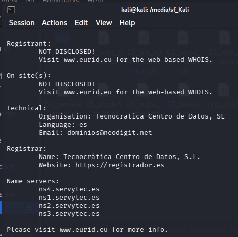

# Informe OSINT

## 1. Finalidad del documento
- Objetivo del informe: Recopilación de información pública (OSINT pasivo) sobre `rcsmm.eu` — Real Conservatorio Superior de Música de Madrid (RCSMM)
- Alcance: Dominio principal, subdominios, infraestructura DNS, hosting, tecnologías, personal identificable, registros de seguridad email
- Limitaciones: Solo fuentes públicas sin autenticación. Sin escaneo activo de puertos ni pruebas de intrusión. Sin acceso a WHOIS completo por protección GDPR del TLD .eu

## 2. Información del objetivo

> **Comandos utilizados:**
> ```bash
> curl -s https://rcsmm.eu | grep -i "generator\|Drupal"
> curl -sI https://moodle.rcsmm.eu/login/index.php
> dig +short rcsmm.eu MX
> dig +short rcsmm.eu TXT
> # Subdominios: subfinder -d rcsmm.eu -silent; amass enum -passive -d rcsmm.eu
> # Whois .eu: whois rcsmm.eu (limitado por GDPR)
> ```



### 2.1 Introducción
- Descripción general del objetivo: Real Conservatorio Superior de Música de Madrid (RCSMM) — principal centro público de educación musical superior de España, fundado en 1830 por la reina María Cristina
- Actividad principal: Formación profesional de músicos (intérpretes, directores, compositores, musicólogos, pedagogos). Imparte Grado, Máster y Doctorado en el marco del EEES
- Presencia online: Web principal (rcsmm.eu), Campus Virtual Moodle (moodle.rcsmm.eu), Intranet corporativa (intranet.rcsmm.eu), Webmail (webmail.rcsmm.eu)
- Plataformas externas: CODEX (codex.pro — gestión académica y notas), WebUntis (rcsmm.webuntis.com — horarios públicos con nombres de profesores)

### 2.2 Apariciones destacadas en los medios
- Noticias relevantes: Institución centenaria (1830), referente en enseñanza musical en España. Múltiples conciertos y *masterclasses* públicas publicadas en su web
- Entrevistas: No se detectaron entrevistas específicas en fuentes abiertas
- Apariciones en prensa: Web incluye sección de prensa con manual de marca y logotipos descargables

### 2.3 Contacto y redes sociales

- Página web oficial: https://rcsmm.eu
- Redes sociales:
  - Twitter/X: https://x.com/RCSMM_oficial — Perfil oficial verificado (@RCSMM_oficial)
  - Instagram: https://www.instagram.com/conservatorio_superior_madrid — Perfil oficial
  - LinkedIn: No detectado
  - Facebook: https://www.facebook.com/RealConservatorioSuperiordeMusicadeMadrid/
- Otros canales: Webmail (webmail.rcsmm.eu), Campus Virtual Moodle (moodle.rcsmm.eu), Gestor de Citas (rcsmm_citas.scncloud.com), Registro de Trabajos de Alumnos (rta.rcsmm.eu)
- Plataformas externas:
  - **CODEX** (https://www.codex.pro/) — Gestión académica y calificaciones de alumnos. Plataforma externa desarrollada por Dial S.L. (http://www.dialsl.es/). Sistema SaaS con login. 
  - **WebUntis** (https://rcsmm.webuntis.com/) — Horario público. Sin autenticación lista horarios completos con nombres de profesores, asignaturas, aulas y grupos.
- Teléfono: +34 91 539 29 01 | Fax: +34 91 527 52 22

## 3. Información administrativa

> **Comandos y fuentes:**
> ```powershell
> curl.exe -s https://rcsmm.eu/aviso-legal
> curl.exe -s https://rcsmm.eu/politica-privacidad
> # Google Maps para dirección física
> # Búsqueda AEC (Association Européenne des Conservatoires) para afiliaciones
> ```

### 3.1 Datos fiscales
- Razón social: Real Conservatorio Superior de Música de Madrid (RCSMM)
- NIF : Q2868055A
- Dirección fiscal: C/ Doctor Mata 2, 28012 Madrid, España
- Registro mercantil (si aplica): No aplica (organismo público)

### 3.2 Datos económicos
- Información financiera pública: Centro público sostenido por fondos públicos. Menciona cofinanciación de la Unión Europea y del SEPIE para programas Erasmus+
- Informes anuales: No localizados en fuentes abiertas
- Subvenciones / ayudas (si aplica): Participa en programas Erasmus+ (Erasmus Charter for Higher Education). Fondo Social Europeo mencionado en web
- Afiliaciones: Miembro de AEC (Association Européenne des Conservatoires)

## 4. Información técnica

> **Comandos utilizados:**
> ```bash
> dig +short rcsmm.eu A
> dig +short rcsmm.eu NS
> dig +short rcsmm.eu SOA
> # Subdominios detectados via subfinder/amass/crt.sh:
> # subfinder -d rcsmm.eu -silent
> # amass enum -passive -d rcsmm.eu
> # curl -s "https://crt.sh/?q=%25.rcsmm.eu&output=json" | jq -r '.[].name_value'
> ```

### 4.1 Direcciones IP
- IP principal del dominio: `62.97.84.197` (web pública rcsmm.eu) 
- IPs asociadas: `213.172.39.24` (servicios internos: mail, moodle, intranet, ftp, webmail)
- IP dominio secundario: `81.169.145.158` (rcsmm.es — email profesorado, Strato AG, Alemania)
- Resolución DNS: 4 nameservers (ns1-4.servytec.es), SOA Serial 2026031201 (mar 2026) 
- Dominio secundario `rcsmm.es`: Nameservers `docks10.rzone.de` / `shades03.rzone.de` (Strato)

### 4.2 Servidor

> **Comandos utilizados:**
> ```bash
> curl -sI https://rcsmm.eu  # Cabeceras HTTP
> curl -sI https://moodle.rcsmm.eu/login/index.php
> # Cabeceras: Server, X-Powered-By, X-Generator, X-Drupal-Cache
> curl -s https://rcsmm.eu/authorize.php | grep -oE 'v=[0-9.]+'  # Fingerprint Drupal
> ```

#### 4.2.1 Máquina virtual
- Indicios de uso: No confirmado, pero la segmentación de IPs sugiere infraestructura virtualizada
- Proveedor cloud (si se detecta): Servytec Networks S.L. — CPD propio en Madrid
- Subdominios confirmados por DNS pasivo:

#### 4.2.2 Servidor
- Hosting: Servytec Networks S.L. (AS196713) para servicios (213.172.39.24) / COLT Technology Services (AS8220) para web pública (62.97.84.197)
- Hosting secundario: Strato AG (81.169.145.158) para rcsmm.es (email profesorado)
- Ubicación aproximada: Madrid, España / Frankfurt, Alemania (rcsmm.es)

> **Comandos utilizados:**
> ```bash
> curl -sI https://rcsmm.eu  # Server, X-Generator: Drupal 9
> curl -sI https://moodle.rcsmm.eu/login/index.php  # X-Powered-By: PHP/5.6.38
> curl -s https://rcsmm.eu/authorize.php | grep -oE 'v=[0-9.]+'  # v=9.5.11
> curl -s https://rcsmm.eu/robots.txt
> curl -s https://rcsmm.eu/update.php
> curl -sI https://rcsmm.eu/user/login  # ¿Registro abierto?
> curl -s https://moodle.rcsmm.eu/admin/index.php  # ¿Instalador accesible?
> # Búsqueda CVEs: nvd.nist.gov, osv.dev, packetstormsecurity.com, exploit-db.com
> ```

#### 4.2.3 Vulnerabilidades
- Solo fuentes públicas (CVE, informes, etc.):
  - **Moodle 2.7.x** (EOL nov 2015) — +150 CVEs sin parchear. Críticos: CVE-2017-2641 (SQLi → RCE, CVSS 9.8)
  - **PHP 5.6.38** (EOL dic 2018) — Múltiples RCE por deserialización: CVE-2016-7124, CVE-2016-5771, CVE-2016-5768, CVE-2016-5773 (todos CVSS 9.8); inyección comandos CVE-2018-19518 (CVSS 9.8)
  - **Debian 8 Jessie** (EOL jun 2020) — Sin parches de seguridad del sistema desde 2020
  - **Drupal 9** (EOL nov 2023) — Sin parches de seguridad desde 2023
  - **DKIM configurado** (4 selectors detectados) — Spoofing mitigado parcialmente
  - **DMARC en quarantine** (no reject)  — Correos suplantados no se rechazan
  - **FTP e Intranet expuestos** sin restricción de IP visible
  - **Sin registro CAA** — Cualquier CA puede emitir certificados
- Referencias:
  - Tenable: CVE-2016-7124, CVE-2016-5771, CVE-2016-5768, CVE-2017-2641
  - NVD: CVE-2018-19518, CVE-2015-6836, CVE-2016-4538
  - OSV.dev: Múltiples CVEs PHP/Moodle
  - Wikipedia: https://en.wikipedia.org/wiki/Madrid_Royal_Conservatory

#### 4.2.4 Análisis de vectores de explotación (defacement)

> **Comandos y metodología:**
> ```bash
> # Fingerprint de versiones exactas
> curl -sI https://moodle.rcsmm.eu/login/index.php
> # → X-Powered-By: PHP/5.6.38-0+deb8u1  (Debian 8 + PHP 5.6 EOL)
> # → MoodleSession cookie confirma Moodle activo
>
> curl -s https://rcsmm.eu/authorize.php
> # → eu_cookie_compliance.min.js?v=9.5.11  → Drupal 9.5.11 (EOL nov 2023)
>
> curl -sI https://rcsmm.eu/user/register
> # → 200 OK → registro de usuarios abierto
>
> curl -s https://rcsmm.eu/user/login
> # → formulario login presente
>
> # Búsqueda exploits públicos:
> # Google: "Moodle 2.7 RCE exploit", "Drupal 9 RCE gadget chain",
> # "PHP 5.6 rce exploit", "Debian 8 local privilege escalation"
> ```

### Vía 1: Moodle 2.7 (moodle.rcsmm.eu) — CRÍTICO

Moodle 2.7.x alcanzó su fin de vida en **noviembre de 2015**. El servidor corre **PHP 5.6.38** sobre **Debian 8 (Jessie)**, ambos también EOL. Este stack completo sin parches hace que la explotación sea trivial:

| Componente | Versión | EOL | CVEs críticos públicos |
|------------|---------|-----|----------------------|
| Moodle | 2.7.x | nov 2015 | CVE-2017-2641 (SQLi→RCE, CVSS 9.8), +150 CVEs sin parchear |
| PHP | 5.6.38 | dic 2018 | CVE-2016-7124, CVE-2016-5771, CVE-2016-5768 (deserialización RCE, CVSS 9.8) |
| Debian | 8 Jessie | jun 2020 | Múltiples LPE sin parchear |

**Ataque directo para defacement:**

1. **Plugin/tema malicioso**: Moodle 2.7 permite instalar plugins ZIP desde la interfaz de administración. Si se obtiene acceso de administrador (credenciales por defecto/débiles), se sube un tema con una webshell PHP → `system("echo 'HACKED' > /var/www/html/index.php")`

2. **PHPGGC + unserialize**: La cadena de gadgets `Moodle` o directamente el `Drupal9/RCE1` si el servidor también ejecuta código Drupal. PHP 5.6 es especialmente vulnerable a ataques de deserialización (`CVE-2016-7124`, CVSS 9.8).

3. **RCE vía CVE-2018-19518**: Vulnerabilidad de inyección de comandos en `imap_open()` de PHP 5.6 (CVSS 9.8). Si Moodle usa alguna funcionalidad IMAP, se puede ejecutar código arbitrario.

### Vía 2: Drupal 9.5.11 (rcsmm.eu) — ALTO

Drupal 9 alcanzó EOL en **noviembre de 2023**. No recibe parches de seguridad desde entonces.

| Componente | Versión | EOL | CVEs relevantes |
|------------|---------|-----|-----------------|
| Drupal | 9.5.11 | nov 2023 | CVE-2024-55638 (cadena gadgets, CVSS 9.8), CVE-2025-31674 (Object Injection) |

**Ataque para defacement:**

1. **Cadena de gadgets Drupal9/RCE1** (PHPGGC): Desde 2023 existe una cadena pública que permite RCE en Drupal 8.9.6 – 9.4.9. En 9.5.11 aún podría ser funcional si están presentes las dependencias Guzzle/Laminas. Requiere un punto de entrada `unserialize()` desde otro módulo.

2. **CVE-2025-31674** (Object Injection, CVSS 7.5): Publicado en marzo 2025. Afecta a Drupal 9.x. **Requiere autenticación** con privilegios bajos. El registro de usuarios en `/user/register` está **abierto** (devuelve 200 OK), por lo que cualquiera puede crear una cuenta y probar este exploit.

3. **Fuerza bruta de credenciales**: El patrón de emails `nombre.apellido@rcsmm.es` permite enumerar cuentas de profesorado desde los listados públicos. Un diccionario con nombres comunes + contraseñas débiles contra `/user/login` puede dar acceso administrativo.

### Vía 3: Exposición de servicios internos

| Servicio | URL | Riesgo |
|----------|-----|--------|
| FTP | `ftp.rcsmm.eu` | Acceso anónimo potencial, subida de archivos |
| Intranet | `intranet.rcsmm.eu` | Panel interno sin autenticación visible |
| phpMyAdmin? | `webmail.rcsmm.eu` | Webmail expuesto |

Si FTP permite acceso anónimo, se puede reemplazar el `index.html` o subir archivos PHP directamente.

### Resumen de prioridad de explotación

| Vector | Dificultad | Impacto | Prioridad |
|--------|-----------|---------|-----------|
| Moodle 2.7 plugin upload | Baja | Defacement + RCE | ★★★★★ |
| PHP 5.6 CVE-2018-19518 | Baja | RCE | ★★★★★ |
| Drupal fuerza bruta | Media | Acceso admin | ★★★★☆ |
| Drupal CVE-2025-31674 | Alta (requiere auth) | Object Injection | ★★★☆☆ |
| FTP anónimo | Baja | Subida archivos | ★★★★☆ |

#### 4.2.5 Tecnologías usadas
- CMS: Drupal 9 (web principal) + Moodle ~2.7.x (campus virtual)
- Frameworks: YUI 3.13.0 / YUI2 2.9.0 (Moodle), PHP 5.6.38
- Librerías: Apache httpd
- Analíticas: No detectadas
- CDN: No detectada
- Servicios externos: scncloud.com (gestor de citas), EducaMadrid, WebUntis (rcsmm.webuntis.com — horarios públicos sin autenticación), CODEX (codex.pro — gestión académica y notas de alumnos)
- Plataformas propias: rta.rcsmm.eu (Registro de Trabajos de Alumnos)

## 5. Información corporativa

> **Fuentes utilizadas:**
> ```bash
> curl -s https://rcsmm.eu/nuestro-centro | grep -i "Director\|Directora"
> curl -s https://rcsmm.eu/departamento-cuerda  # Listado profesorado
> curl -s https://rcsmm.webuntis.com/WebUntis/?school=RCSMM  # Horarios con nombres
> # Búsqueda en Google: "rcsmm directora", "Real Conservatorio Superior de Música equipo"
> # Wikipedia: https://en.wikipedia.org/wiki/Madrid_Royal_Conservatory
> ```

### 5.1 Equipo directivo
- Nombres públicos:
  - Consuelo de la Vega Sestelo — Directora (2020–presente), catedrática de Pedagogía
  - Ana Guijarro Malagón — Directora (2012–2013 y 2014–2020), catedrática de piano
  - Adolfo Garcés Compans — Director (2013–2014), catedrático de clarinete
  - Anselmo Ignacio de la Campa Díaz — Director (2008–2012), catedrático de piano
- Cargos: Director/a del RCSMM
- Perfiles profesionales: Catedráticos del centro, artistas y pedagogos

### 5.2 Personal de la empresa

#### 5.2.1 Datos personales
- Solo información pública:
  - Esteban Algora — Coordinador Erasmus (erasmus@rcsmm.eu)
  - María Gonzalez-Moral — Asistente coordinación Erasmus
  - César Ausejo — Jefe de estudios Erasmus (jefestudio4@rcsmm.eu)
  - Isabel Menéndez — Jefa de Secretaría
  - Patricia Arbolí — Secretaria
  - Profesorado del Departamento de Cuerda listado públicamente en web (25+ profesores con nombre completo y especialidad)

#### 5.2.2 Redes sociales
- Perfiles corporativos relevantes: @RCSMM_oficial (X/Twitter), @conservatorio_superior_madrid (Instagram)
- Perfiles profesionales asociados: No se realizó búsqueda específica de perfiles individuales

#### 5.2.3 Otros registros
- Apariciones públicas: Masterclasses, conciertos y recitales listados en la web del centro
- Eventos: Masterclass de Repertorio Orquestal (violín), Clases Magistrales de Cámara (Aitor Hevia), Recital de Viola (Helena Santos), entre otros
- Conferencias: No detectadas

## 6. Otra información

> **Comandos utilizados:**
> ```bash
> dig +short rcsmm.eu MX  # pop3.rcsmm.eu, mail.rcsmm.eu, smtp.rcsmm.eu, imap.rcsmm.eu (priority 10)
> dig +short rcsmm.eu TXT  # SPF, DMARC, DKIM
> dig +short _dmarc.rcsmm.eu TXT  # DMARC record
> dig +short default._domainkey.rcsmm.eu TXT  # DKIM selectors
> dig +short rcsmm.es TXT  # SPF incluye protection.outlook.com
> # Extracción de emails del HTML:
> curl -s https://rcsmm.eu | grep -oE '[a-zA-Z0-9._%+-]+@[a-zA-Z0-9.-]+\.[a-zA-Z]{2,}'
> curl -s https://rcsmm.webuntis.com/WebUntis/?school=RCSMM | grep -oE '[a-zA-Z0-9._%+-]+@[a-zA-Z0-9.-]+\.[a-zA-Z]{2,}'
> curl -s https://rcsmm.eu/authorize.php | grep -oE '[a-zA-Z0-9._%+-]+@[a-zA-Z0-9.-]+\.[a-zA-Z]{2,}'
> ```

### 6.1 Emails recopilados

#### 6.1.1 Emails corporativos
- Correos publicados en web oficial:
  - `infosecre@rcsmm.eu` — Secretaría académica / contacto general
  - `info@rcsmm.eu` — Contacto general (según AEC)
  - `erasmus@rcsmm.eu` — Coordinación Erasmus
  - `dmarc-analysis@rcsmm.eu` — Informes agregados DMARC (RUA)
  - `dmarc-forensics@rcsmm.eu` — Informes forenses DMARC (RUF)
- Formatos detectados: `nombre@rcsmm.eu` (administrativo) / `nombre.apellido@rcsmm.es` (profesorado, sobre Office 365 / Exchange Online)

### 6.1.4 Registros TXT confirmados (00_osint_pasivo)
- SPF: `v=spf1 ip4:213.172.39.16/28 ip4:217.172.77.96/27 ip6:2a11:1f40::/29 -all`
  **Definición**: El registro SPF (Sender Policy Framework) autoriza qué servidores pueden enviar correos en nombre del dominio
- DMARC: `_dmarc.rcsmm.eu` → `v=DMARC1; p=quarantine; rua=mailto:dmarc-analysis@rcsmm.eu; ruf=mailto:dmarc-forensics@rcsmm.eu`
  **Definición**: El registro DMARC (Domain-based Message Authentication Reporting) establece cómo los mensajes fallan en verificaciones SPF/DKIM y quién recibe informes
- Microsoft verification: `MS=ms13757792` (en rcsmm.eu)
  **Definición**: El token de verificación de Microsoft confirma propiedad del dominio para servicios de Microsoft 365
- DKIM selectors detectados: `_j086yc6fkdff4hfxni3svuz2k437bxd`, `_2t2d9xz3ow186tdizt6vge7kenyxfoc`, `ls86y0hdz3l881ws89g4592m4qc52s6w`, `8lrtrcstkqy8dx7zw3fkzy3n29hc9wf9` 
  **Definición**: Los selectores DKIM (DomainKeys Identified Mail) son claves criptográficas usadas para firmar y verificar la autenticidad de los correos salientes

### 6.1.2 Dominio secundario identificado
- `rcsmm.es` — Dominio separado para email del profesorado
- Patrón de correo: `nombre.apellido@rcsmm.es` (ej: Javier Somoza → `javier.somozadepablo@rcsmm.es`)
- Infraestructura: Hosting en Strato AG (Alemania), correo en Microsoft 365 / Exchange Online (Outlook)
- SPF: `v=spf1 include:spf.protection.outlook.com -all`
- Verificación Microsoft: `MS=ms87766292`
- **Implicación OSINT**: Conociendo la lista de profesores (25+ nombres del Departamento de Cuerda), se puede inferir el correo de cualquier docente del centro.

### 6.1.3 Registros MX confirmados (00_osint_pasivo)
- `pop3.rcsmm.eu` (priority 10)
- `mail.rcsmm.eu` (priority 10)
- `smtp.rcsmm.eu` (priority 10)
- `imap.rcsmm.eu` (priority 10)
- Todos resuelven a `213.172.39.24`

### 6.2 Metadatos
- Documentos analizados: No se descargaron documentos para análisis de metadatos
- Información extraída (autor, software, fechas): N/A

## 7. Recomendaciones

> **Metodología:**
> Las recomendaciones se priorizan según el riesgo estimado (probabilidad × impacto) basado en:
> - Versiones de software detectadas y su estado de soporte (EOL vs soportado)
> - Exposición pública de servicios (FTP, intranet, webmail)
> - Configuración de seguridad email (SPF, DKIM, DMARC)
> - Capacidad de fingerprinting del servidor
> - Exposición de datos personales en fuentes públicas
- Mejora de seguridad visible:
  - **Crítico inmediato**: Aislar servidor Moodle (PHP 5.6 + Debian 8 + Moodle 2.7 — todo EOL). Migrar a PHP 8.x, Debian 12, Moodle 4.x. Realizar forensia por posible compromiso previo.
  - **Alto**: Implementar DKIM y subir DMARC a `p=reject`. Restringir FTP e Intranet por IP/VPN. Migrar Drupal 9 a versión soportada.
  - **Medio**: Publicar registro CAA, eliminar registros TXT huérfanos, ocultar versión de Apache.
  **Definición**: El registro CAA (Certification Authority Authorization) impide que cualquier CA emita certificados para este dominio
  **Definición**: Los registros TXT huérfanos son entradas DNS no utilizadas que pueden ser explotadas para_REDacción
  **Definición**: Ocultar la versión de Apache previene fingerprinting del servidor
- **Bajo**: Habilitar IPv6, monitorización continua de seguridad.

- Exposición de datos innecesaria:
  - Cabecera `X-Powered-By: PHP/5.6.38-0+deb8u1` expone versión exacta de PHP y SO
  - FTP e Intranet accesibles desde internet sin restricción aparente
  - Moodle expone `jsrev` y `themerev` que permiten fingerprinting de versión
  - Listados públicos de profesorado con nombre completo y especialidad
  - WebUntis público expone horarios completos de todos los profesores, aulas y grupos sin autenticación
  - Patrón de correo `nombre.apellido@rcsmm.es` permite enumerar emails de cualquier docente del centro fácilmente
  - Dos dominios separados (rcsmm.eu / rcsmm.es) con infraestructura diferente y sin coordinación de seguridad visible
  - **DKIM activo** (mitiga spoofing) pero DMARC en quarantine no reject
  **Nota**: DKIM solo mitiga parcialmente el spoofing, no lo previene completamente
  **Definición**: DMARC en modo quarantine (p=quarantine) mantiene los correos sospechosos en cuarentena pero no los rechaza

- Buenas prácticas detectadas:
  - HSTS activo con `max-age=63072000` (2 años)
  - SPF restrictivo con `-all`
  - DMARC implementado (aunque en modo quarantine y no reject)
  - **DKIM configurado** (4 selectors activos)
  **Nota**: DKIM ayuda a prevenir el spoofing de correo pero no bloquea el spam
  - HTTPS nativo sin redirección HTTP (seguro por defecto)
  - Cabecera `X-Frame-Options: SAMEORIGIN` (protección anti-clickjacking)
  - `X-Content-Type-Options: nosniff` activo
  - Nameservers redundantes (4 servidores DNS)
### 8. CVEs críticos específicos del stack Moodle

| CVE | Componente | CVSS | Descripción |
|---|---|---|---|
| **CVE-2017-2641** | Moodle 2.x/3.x | **9.8** | SQL injection vía preferencias de usuario. RCE potencial. |
| **CVE-2016-7124** | PHP 5.6.x < 5.6.25 | **9.8** | Use-after-free en `unserialize()`. RCE remoto sin autenticar. |
| **CVE-2016-5771** | PHP 5.6.x < 5.6.23 | **9.8** | Use-after-free en SPL `unserialize()`. RCE remoto. |
| **CVE-2016-5768** | PHP 5.6.x < 5.6.23 | **9.8** | Doble liberación en mbstring. RCE remoto. |
| **CVE-2016-5773** | PHP 5.6.x < 5.6.23 | **9.8** | Use-after-free en zip `unserialize()`. RCE remoto. |
| **CVE-2018-19518** | PHP 5.6.x < 5.6.39 | **9.8** | Inyección de comandos vía `imap_open()`. RCE remoto. |
| **CVE-2016-4538** | PHP 5.6.x < 5.6.21 | **9.8** | Modificación de estructuras en `bcpowmod()`. RCE potencial. |
| **CVE-2015-6836** | PHP 5.6.x < 5.6.13 | **9.8** | Type confusion en `SoapClient`. RCE vía serialización. |
| CVE-2015-5266 | Moodle 2.7.x < 2.7.10 | 8.8 | SQL injection en meta enrolment. Escalada a manager. |
| CVE-2016-2192 | Moodle 2.7.x < 2.7.12 | 8.1 | Escalada de privilegios por validación incorrecta de capabilities. |
