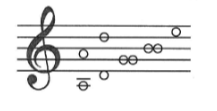
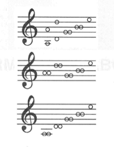

# Escuelas nacionales. Tablaturas, criterios de transcripción y de edición

# Índice

# Introducción

Cuando el Renacimiento se ve agotado como corriente y estética, aparece una nueva etapa denominada Barroco. La música, a diferencia de otras artes, tenía libertad para ampliar su campo expresivo en distintas direcciones, lo que estimuló el desarrollo del lado emocional de la misma, creándose teorías como la de los afectos.  

Entre los muchos cambios que se produjeron en la música podemos destacar algunos como:  
- La irrupción del bajo cifrado o continuo, que se convirtió en la textura predilecta de la época.  
- Desarrollo de la armonía tonal, dejando atrás la modalidad y apareciendo poco a poco la dualidad entre tonalidad mayor y menor.  
- Diferenciación del estilo vocal e instrumental.  
- Preferencia por la familia del violín.  

Como anteriormente expusimos, estamos ante una nueva etapa en la que es primordial expresar los "afectos", aquellos "estados del alma" que afectan al compositor y que deben ser transmitidos de distintas formas (en parte establecidas) hacia los oyentes.  

Si nos centramos en la guitarra, aunque aún quedan algunas incógnitas por aclarar (como la gran diferencia de tamaño o la coexistencia de instrumentos de cuatro y cinco órdenes según Fuenllana y Bermudo), parece más o menos aceptado que la guitarra barroca es una evolución de la guitarra renacentista en cuanto a número de órdenes.  

Según Lope de Vega, Nicolao Doizi de Velasco y Gaspar Sanz (en *Instrucción de música sobre la guitarra española*), el “inventor” del quinto orden y de la guitarra española fue Vicente Espinel. No obstante, como no podemos contrastar con las guitarras conservadas (porque de cuatro órdenes no queda ninguna), únicamente podemos observar unas pocas unidades de guitarras de cinco órdenes.  

Lo único que parece claro es que, al igual que la de cuatro órdenes, la de cinco órdenes nació en España y a finales del siglo XVI llegó a ser el instrumento más popular del país, algo favorecido por Espinel. Su popularidad se extendió poco a poco por Europa.  

En ese mismo siglo, además, nacía una nueva forma de tañer la guitarra: el **rasgueado**. La guitarra barroca fue fruto de distintos cambios acaecidos en "la guitarrilla" en España:  
- Aumento del tamaño.  
- Perfeccionamiento de la estructura interna.  
- Mejora del aspecto externo mediante ornamentación.  
- Añadido de un quinto orden.  

A mediados del siglo XVI, Juan Bermudo en su *Declaración de instrumentos musicales* relata que la vihuela de mano y la guitarra eran prácticamente idénticas. Para convertir la vihuela en guitarra bastaba quitarle los órdenes extremos más graves.  

Miguel de Fuenllana, en *Orphenica Lyra*, habla de una vihuela de cinco órdenes que podría considerarse una guitarra renacentista a la que se le podría añadir un orden más. Es curioso, además, que aun teniendo la vihuela la importancia que disfrutaba durante el Renacimiento y el Barroco, haya tanta escasez de guitarras barrocas conservadas.  

Incluso en el mundo de la violería ya se hablaba de **guitarreros**, ya que de los instrumentos de cuerda de finales del siglo XVI, la guitarra era la de mayor demanda. Gracias a algunas obras literarias, podemos deducir que el **rasgueo** se extendió como la pólvora y se convirtió en imprescindible en el teatro, donde se usaba para acompañar canciones. Los escritores españoles de la época la mencionan como un instrumento popular y muy extendido.  

No mucho después, durante la década de 1630, ocurrió una innovación más: el **estilo mixto** de rasgueado y punteado. La persona que lo ideó fue **Giovanni Paolo Foscarini**, tiorbista, laudista, compositor, teórico musical y guitarrista. Foscarini introdujo este estilo en sus libros a modo de curiosidad, sin imaginar que llegaría a ser una de las características más importantes de la guitarra barroca (aunque en aquel momento era más bien una imitación de la música de laúd).  

A partir de ese momento, se escribieron libros dedicados a distintas formas de tañer la guitarra:  
- Estilo mixto.  
- Punteado.  
- Rasgueado, que poco a poco fue perdiendo importancia.
# Afinación

Aunque la mayoría de guitarristas lo tenían claro y preferían una **prima sencilla** y las demás dobles, afinadas con **la-re-sol-si-mi**, muchos italianos (s. XVII) no lo tenían tan claro. Prácticamente sólo conservamos algunos testimonios que dan vagos esbozos en cuanto a la afinación por **cuartas justas** y una **tercera mayor** entre los órdenes tercero y segundo.  

Sin embargo, hubo autores que fueron más precisos, como **Giloramo Montesardo**, que describió de forma exacta el número de cuerdas y las octavas en su *Nuova inventione* (1606).  

No todo el mundo estaba de acuerdo con esta configuración. Uno de ellos fue **Joan Carles Amat**, que en su tratado (1586) indica una afinación lógica para la guitarra de cinco órdenes.  

Esta afinación fue generalizándose en el resto de los países europeos, aunque con algunas variantes. A lo largo del siglo XVII, la guitarra sufrió muchas innovaciones en cuanto a afinación, al igual que ocurrió con el laúd y otros instrumentos.  

Por lo tanto, se emplearon una gran diversidad de afinaciones, pero generalizando podemos deducir que las **tres más empleadas** fueron:

# El repertorio de guitarra barroca: su estilo y notación

La guitarra barroca en sus comienzos fue considerada un instrumento **humilde y popular**. El estilo habitual de tocar esta guitarra era al **estilo rasgueado o rasgado**, y se utilizaba mayoritariamente para **acompañar la voz**, ejecutando acordes sencillos.  

Sin embargo, poco a poco se fue introduciendo la guitarra **punteada**, que consistía en tocar pequeñas melodías de canciones y danzas. La evolución del anterior estilo hizo que en la guitarra barroca se estableciese un nuevo sistema de enseñanza que se denominaría **"estilo punteado"**.  

Si echamos la vista atrás, vemos que a principios del siglo XVII **España** era el lugar con más compositores e intérpretes de este instrumento, aunque fueron los **italianos** quienes publicaron primero para guitarra renacentista.  

A partir del siglo XVII, la guitarra ya se denominaba **“española”** y goza de gran popularidad. La nueva forma de tañer, el **rasgueado**, alcanzó posteriormente a otros países, siendo los más importantes **Francia** e **Italia**.  

En este siglo también aparecen los primeros **métodos didácticos** y sistemas de escritura, aunque estaban dedicados al estilo tradicional: **rasgueado**. La escritura de este estilo se basaba en la incorporación de **acordes de distinta dificultad** que debían ser percutidos (rasgueados) según **estructuras rítmicas o fórmulas para la mano derecha**.  

Esta escritura predominó durante la primera etapa del Barroco, surgiendo **tratados, colecciones de danzas, obras vocales con acompañamiento**, etc., basadas en el estilo.  

En los primeros años del siglo XVII se editan algunos métodos de escritura al **estilo punteado**, fundamentalmente en Francia. Este estilo estaba más en línea con la **tradición renacentista de la vihuela y del laúd barroco**, ya que permitía explorar las propiedades contrapuntísticas de la guitarra.  

**Giovanni Paolo Foscarini** fue el primero en introducir una escritura en **tablatura italiana con signos propios para la guitarra**, en la cual aparecía reflejada la combinación del **estilo rasgueado con el punteado**.  

La nueva forma de escritura que nos muestra Foscarini se convertiría en el próximo sistema pedagógico denominado: **Estilo mixto**.
El anterior estilo será el que **perdurará en el futuro en la guitarra**, convirtiéndose en la **característica fundamental** del instrumento.  

Hay que decir que los **métodos y documentos** que encontramos para guitarra barroca abarcan un total de **ocho temáticas distintas**, aunque algunos de ellos tratan varias a la vez. Las temáticas tratadas son:  

1. **Obras pensadas expresamente para la enseñanza de los acordes**, principalmente tratan la pulsación de los mismos con la mano izquierda, aunque a veces tratan el tema del rasgueo con la derecha.  
2. **Tratados dedicados únicamente al arte del acompañamiento**.  
3. **Colecciones de danzas y piezas populares** para:  
   - a. Rasgueado  
   - b. Punteado  
   - c. Estilo mixto  
4. **Obras vocales con alfabeto** para ser acompañadas de rasgueado.  
5. **Textos de canciones sin notación musical** con alfabeto para acompañar de rasgueado.  
6. **Obras vocales con acompañamiento punteado**.  

Si tuviéramos que **ordenar los documentos de cada autor**, grosso modo podríamos hacerlo de la siguiente forma:  

- **J.C. Amat** — Tipo 1  
- **Nicolao Doizi de Velasco** — Tipo 1  
- **Gaspar Sanz** — Tipos 1, 2, 3a, 3b y 3c  
- **Ribayaz** — Tipos 1, 3a y 3b  
- **Francisco Guerau** — Tipo 3b  
- **Briceño** — Tipo 6  
- **José Marín** — Tipo 5  
- **Santiago de Murcia** — Tipos 2, 3b y 3c  

Si volvemos a mediados del siglo XVII, tenemos que decir que los **libros y métodos que proliferan** hacen referencia a los **tres tipos de escritura** antes descritos (rasgueado, punteado y mixto).  

Al final del Barroco, sobre todo en **Italia y España**, el **sistema de notación que se impondrá será la escritura mixta**, convirtiéndose en el **sistema ideal para el instrumento**.  

Gracias al **estilo mixto** se escribieron formas musicales de gran calidad como **pasacalles, chaconas y suites**.  

La evolución a este estilo permitió que la **guitarra española de cinco órdenes**, que estaba catalogada como popular, se elevara en **popularidad y prestigio**, siendo conocida por las cortes más importantes de países europeos como: **Francia, Inglaterra y Países Bajos**.

