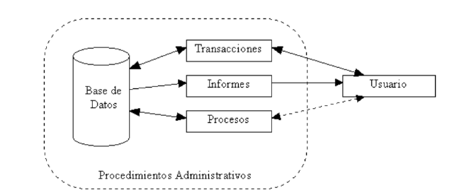
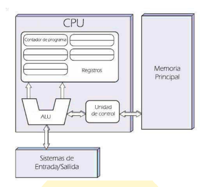

# Informática básica. Representación y comunicación de la información: elementos constitutivos de un sistema de información. Características y funciones. Arquitectura de ordenadores. Componentes internos de los equipos microinformáticos.
## 1. Concepto de dato e información
### Dato
Representación simbólica (numérica, alfabética, etc.) de un atributo o variable cuantitativa o cualitativa. Describe hechos empíricos, sucesos y entidades.
Los datos son la mínima unidad semántica y se corresponden con elementos primarios de información que, por sí solos, son irrelevantes (pueden no contener información relevante).
También se pueden considerar un conjunto discreto de valores que no explican el porqué de las cosas ni orientan la acción.
Pueden provenir de fuentes externas o internas a la organización, y ser de carácter objetivo o subjetivo, así como cualitativo o cuantitativo.
### Información
Tras procesar los datos, se obtiene información que aporta hechos relevantes para el usuario.
## 1.2 Clasificación de datos
Aunque clasificar los datos puede llegar a ser un concepto subjetivo, existen algunas clasificaciones ampliamente aceptadas por ser las más comunes.
### Según el sistema de información
- **Datos de entrada**: datos necesarios para el procesamiento y la obtención de información. Son suministrados por periféricos de entrada (teclado, discos, escáner, etc.).
- **Datos intermedios**: se obtienen tras procesar los datos de entrada. No son facilitados al usuario; simplemente son utilizados por las aplicaciones para completar los procesos.
- **Datos de salida**: son los datos mostrados al usuario, agrupados, ordenados y convertidos en información relevante. Son suministrados por los periféricos de salida (monitor, impresora, etc.).
### Según la variación
- **Fijos**: datos cuyo valor no cambia durante todo el procesamiento. En programación se denominan **constantes**.
- **Variables**: permiten almacenar distintos valores a lo largo del procesamiento de los datos.
### Según la información que almacenan
- **Datos numéricos**
- **Datos alfabéticos**
- **Datos alfanuméricos** (aúnan letras y números)
### Información
Se puede entender como información a un conjunto de datos significativos (contienen información relevante, propósito y contexto), que contienen símbolos reconocibles y están completos, expresando una idea sin ambigüedad.
La información debe cumplir lo siguiente:
- **Integridad**: todos los datos necesarios están disponibles.
- **Inequívoca**: no genera dudas sobre su significado.
Desglosado de otra forma, el conjunto de características que debe cumplir la información para que sea útil es el siguiente:
- Relevante.
- Precisa.
- Completa.
- Adecuada.
**Información = Datos + Contexto (añadir valor) + Utilidad (disminuir la incertidumbre)**
## 2. Sistema de información
Un sistema de información es un conjunto de elementos (aplicaciones, maquinaria, usuarios, procedimientos, etc.) diseñado para el tratamiento de información, de manera que esta quede disponible de forma eficiente para su uso posterior.

En informática, los sistemas de información ayudan a administrar, recolectar, recuperar, procesar, almacenar y distribuir información relevante para los procesos fundamentales y las particularidades de cada organización.

La importancia de un sistema de información radica en la eficiencia en la correlación de una gran cantidad de datos ingresados a través de procesos diseñados para cada área, con el objetivo de producir información válida para la posterior toma de decisiones.

Un sistema de información se destaca por su diseño, facilidad de uso, flexibilidad, mantenimiento automático de los registros, apoyo en la toma de decisiones críticas y mantenimiento del anonimato en informaciones irrelevantes.

Habitualmente, el término «sistema de información» se usa de manera errónea como sinónimo de sistema de información informático, en parte porque en la mayoría de los casos los recursos materiales de un sistema de información están constituidos casi en su totalidad por sistemas informáticos.

Estrictamente hablando, un sistema de información no tiene por qué disponer de dichos recursos (aunque en la práctica esto no suele ocurrir).

Se podría decir entonces que los sistemas de información informáticos son una subclase o un subconjunto de los sistemas de información en general.
## 2.1 Componentes básicos de un sistema de información
Los sistemas de información son una combinación de tres partes principales: las personas, los procesos de negocio y los equipos de tecnologías de la información.
- **Hardware**: tecnología de almacenamiento, comunicaciones, entrada y salida de datos.
- **Software**: conjunto de aplicaciones destinadas a recoger los datos, almacenarlos, procesarlos y analizarlos, generando conocimiento para el usuario final.
- **Datos**: porciones de información donde reside todo el valor.
- **Procedimientos**: políticas y reglas de negocio aplicables a los procesos de la organización.
- **Usuarios**: interactúan con la información extraída de los datos, constituyendo el componente decisivo para el éxito o el fracaso de cualquier iniciativa empresarial.
- **Retroalimentación**: elemento clave de cualquier sistema de información, al ser la base para la mejora continua.
- **Red**: permite compartir recursos entre computadoras y dispositivos.
## 2.2 Características de un sistema de información
Para que un sistema de información pueda ser considerado como tal, debe cumplir una serie de características básicas:
- Disponibilidad de la información cuando se precise y por el medio requerido.
- Selección adecuada de la información mostrada, evitando la información irrelevante.
- Adaptación y personalización de la forma de presentar la información.
- Generación de relaciones entre contenidos.
- Tiempos de respuesta adecuados.
- Exactitud de los datos mostrados.
- Flexibilidad del sistema para adaptarlo a diferentes necesidades.
- Fiabilidad del sistema.
- Seguridad ante accesos a información restringida.
- Realización periódica de copias de seguridad de la información.
## 2.3 Elementos de un sistema de información
Una primera clasificación de los elementos que componen un sistema de información podría ser la que expresa la figura siguiente, en la que se muestra un sistema estándar.

- **Base de datos**: es donde se almacena toda la información necesaria para la toma de decisiones. La información se organiza en registros específicos e identificables.
- **Transacciones**: corresponden a todos los elementos de interfaz que permiten al usuario consultar, agregar, modificar o eliminar un registro específico de información.
- **Informes**: corresponden a todos los elementos de interfaz mediante los cuales el usuario puede obtener uno o más registros y/o información de tipo estadístico (contar, sumar), de acuerdo con criterios de búsqueda y selección definidos.
- **Procesos**: corresponden a todos aquellos elementos que, de acuerdo con una lógica predefinida, obtienen información de la base de datos y generan nuevos registros de información. Los procesos solo son controlados por el usuario.
- **Usuario**: identifica a todas las personas que interactúan con el sistema. Esto incluye desde el máximo nivel ejecutivo que recibe los informes de estadísticas procesadas hasta el usuario operativo que se encarga de recolectar e introducir la información en el sistema.
- **Procedimientos administrativos**: corresponden al conjunto de reglas y políticas de la organización que rigen el comportamiento de los usuarios frente al sistema. Particularmente, deben asegurar que nunca, bajo ninguna circunstancia, un usuario tenga acceso directo a la base de datos.
Los sistemas de información están construidos de forma modular, de manera que cada módulo se encarga de realizar una tarea concreta.
Esto permite que cada módulo pueda evolucionar de forma independiente sin afectar al resto de módulos del sistema.
Los módulos que componen el sistema deben respetar las características descritas en el punto anterior.
Se describen a continuación los distintos módulos y las funciones que realiza cada uno de ellos:
- **Módulo de definición del SI**: define la estructura de la(s) base(s) de datos y los formatos de documentos que se van a utilizar.
- **Módulo de entrada**: desarrolla los elementos necesarios para dotar al SI de mecanismos de entrada adecuados a la información que se va a tratar.
- **Módulo de análisis**: una vez que se dispone de los datos, este módulo se encarga de aplicar los distintos algoritmos para procesarlos y obtener la información.
- **Módulo de búsqueda de información**: las distintas fuentes de información del sistema son gestionadas por este módulo para que las búsquedas puedan realizarse de manera coordinada y sencilla para el usuario.
- **Módulo de difusión de la información**: encargado de las notificaciones de información relevante a los usuarios.
- **Módulo de evaluación del SI**: se encarga de recopilar estadísticas y opiniones sobre el SI, de cara a posibles mejoras del mismo.
## 2.4 Funciones de un sistema de información
La función principal es ofrecer información relevante, eliminando los datos superfluos.
Esta información debe ofrecerse filtrada y ordenada, de manera que se puedan realizar búsquedas de forma sencilla y eficiente.
Se distinguen cuatro funciones consideradas básicas:
- **Entrada**
- **Almacenamiento**
- **Procesamiento**
- **Salida de información**
### Entrada de información
Proceso mediante el cual el sistema de información toma los datos que requiere para procesar la información.
Las entradas pueden ser manuales o automáticas.
Las manuales son aquellas que se proporcionan de forma directa por el usuario, mientras que las automáticas son datos o información que provienen o son tomados de otros sistemas o módulos.
Esto último se denomina **interfaces automáticas**.
### Almacenamiento de información
El almacenamiento es una de las actividades o capacidades más importantes que tiene un sistema de información, ya que, a través de esta propiedad, el sistema puede recordar la información guardada en la sección o proceso anterior.
### Procesamiento de información
Es la capacidad del sistema de información para efectuar cálculos de acuerdo con una secuencia de operaciones preestablecida.
Estos cálculos pueden efectuarse con datos introducidos recientemente en el sistema o bien con datos que ya están almacenados.
Esta característica permite la transformación de datos fuente en información que puede ser utilizada para la toma de decisiones, lo que hace posible, entre otras cosas, que un responsable genere decisiones de calidad.
### Salida de información
La salida es la capacidad de un sistema de información para extraer la información procesada o los datos de entrada hacia el exterior.
La salida de un sistema de información puede constituir la entrada a otro sistema de información o módulo.
## 2.5 Tipos de sistemas de información
Debido a que el principal uso de los sistemas de información es optimizar el desarrollo de las actividades de una organización para ser más productivos y obtener ventajas competitivas, pueden clasificarse de forma genérica en:
- **Sistemas competitivos**.
- **Sistemas cooperativos**.
- **Sistemas que modifican el estilo de operación del negocio**.
Desde el punto de vista de la función que realizan, pueden clasificarse de la siguiente manera:
- **Sistemas de soporte a la decisión (DSS)**: herramienta enfocada al análisis de los datos de una organización, con la finalidad de apoyar el proceso de toma de decisiones.
- **Sistema de procesamiento de transacciones (TPS)**: gestiona la información referente a las transacciones producidas en una empresa u organización. También se le conoce como sistema de información operativa.
- **Sistemas de información ejecutiva (EIS)**: herramienta orientada a usuarios de nivel gerencial que permite monitorizar el estado de las variables de un área o unidad de la empresa a partir de información interna y externa. Es en este nivel donde los sistemas de información manejan información estratégica para las empresas.
- **Sistemas de información gerencial (MIS)**: orientados a solucionar problemas empresariales en general.
## 2.6 Otras herramientas usadas en sistemas de información
- **Cuadro de Mando Integral**: el Cuadro de Mando Integral (CMI), también conocido como Balanced Scorecard (BSC) o dashboard, es una herramienta de control empresarial que permite establecer y monitorizar los objetivos de una empresa y de sus diferentes áreas o unidades. También se puede considerar como una aplicación que ayuda a una compañía a expresar los objetivos e iniciativas necesarias para cumplir con su estrategia, mostrando de forma continuada cuándo la empresa y los empleados alcanzan los resultados definidos en su plan estratégico.
- **Datawarehouse**: un Datawarehouse es una base de datos corporativa que se caracteriza por integrar y depurar información de una o más fuentes distintas, para luego procesarla permitiendo su análisis desde múltiples perspectivas y con grandes velocidades de respuesta.
## 3. Arquitectura de ordenadores
La arquitectura de ordenadores se define como el conjunto de reglas, normas y procedimientos que especifican las interrelaciones entre los componentes lógicos y físicos que forman parte de un sistema informático, así como las características que deben cumplir cada uno de estos componentes.
A día de hoy se distinguen dos tipos de arquitecturas de ordenador:
- Arquitectura VON-NEUMANN
- Arquitectura HARVARD
## 3.1 Arquitectura Von Neumann
También conocida como modelo de Von Neumann o arquitectura Princeton.
Consta de:
- **Unidad de proceso (CPU)**: contiene una unidad aritmético-lógica (ALU o UAL), registros del procesador y una unidad de control (UC) que contiene un registro de instrucciones y un contador de programa (CP).
- **Memoria**: para almacenar tanto datos como instrucciones, incluyendo almacenamiento masivo externo.
- **Mecanismos de entrada y salida (E/S)**.
Estos elementos están conectados por buses de datos, que se pueden definir como las autopistas por las que viaja la información.
En la siguiente figura se detalla cómo sería el aspecto de un sistema informático diseñado con esta arquitectura:

En esta arquitectura no pueden darse simultáneamente una búsqueda de instrucciones y una operación de datos, ya que comparten un bus de datos común. Esto se conoce como el cuello de botella de Von Neumann, y puede limitar el rendimiento del sistema.

El canal de transmisión de datos compartido entre CPU y memoria genera un cuello de botella de Von Neumann, es decir, un rendimiento limitado (tasa de transferencia de datos) entre la CPU y la memoria en comparación con la capacidad de la propia memoria.

En la mayoría de computadoras modernas, la velocidad de comunicación entre la memoria y la CPU es más baja que la velocidad a la que puede trabajar esta última, reduciendo el rendimiento del procesador y limitando seriamente la velocidad de proceso efectiva, sobre todo cuando se necesitan procesar grandes cantidades de datos.

La CPU se ve forzada a esperar continuamente a que lleguen los datos necesarios desde o hacia la memoria.

Dado que la velocidad de procesamiento y la capacidad de memoria han aumentado mucho más rápido que el rendimiento de transferencia entre ellas, el cuello de botella se ha convertido en un problema creciente cuya gravedad aumenta con cada nueva generación de CPU.