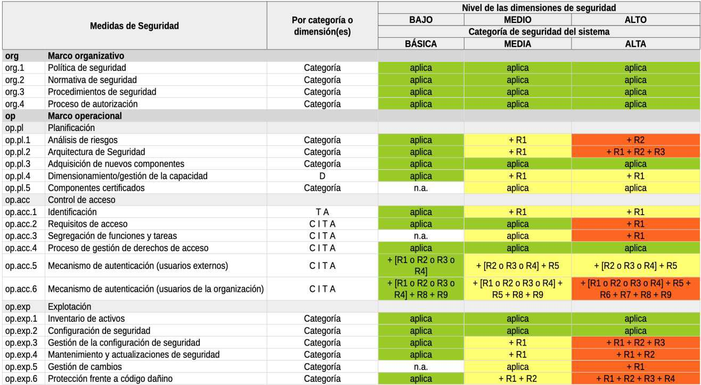
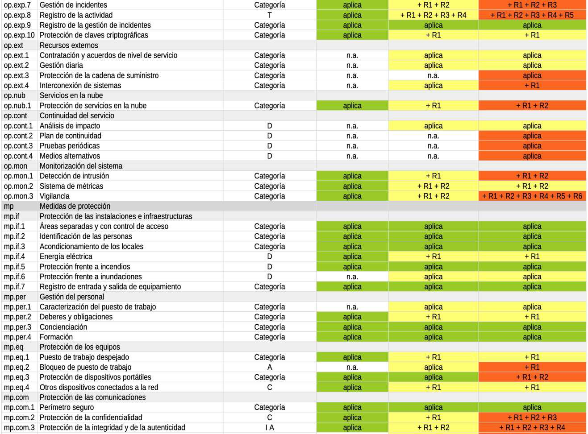
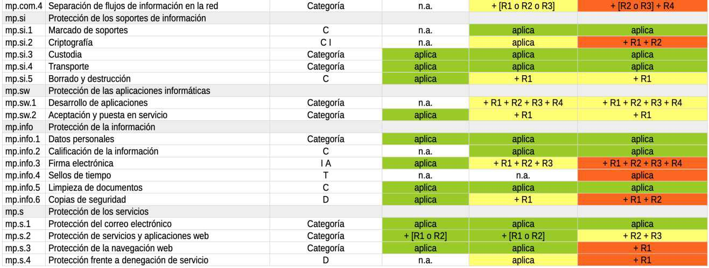

> Tema 8. Acceso electrónico de los ciudadanos a los servicios públicos y normativa de desarrollo. La gestión electrónica de los procedimientos administrativos: registros, notificaciones y uso de medios electrónicos. Esquema Nacional de Seguridad y de Interoperabilidad. Normas técnicas de Interoperabilidad. 

## Ley 39/2015 - Procedimiento Administrativo Común de las Administraciones Públicas
## Título Preliminar
##### Objeto
- Regular los requisitos de validez y eficacia de los actos administrativos.
- Establecer el procedimiento administrativo común aplicable a todas las Administraciones Públicas, incluyendo:
  - Procedimientos sancionadores.
  - Reclamaciones de responsabilidad de las AAPP.
- Definir los principios del ejercicio de la iniciativa legislativa y la potestad reglamentaria.

##### Modificaciones permitidas
- Solo por ley se pueden establecer trámites adicionales o distintos de los previstos.
- Reglamentariamente se regulan especialidades en órganos competentes, plazos, formas de iniciación y terminación, publicación e informes.

##### Ámbito de aplicación
- Aplica a todo el sector público e institucional:
  - AGE, Administraciones de las CCAA, Entidades locales y sector público institucional.
  - Incluye organismos públicos, entidades vinculadas a las AAPP (de derecho público o privado) y universidades públicas.

## Título I: De los interesados en el procedimiento
### CAPÍTULO I: LA CAPACIDAD DE OBRAR Y EL CONCEPTO DE INTERESADO
##### Capacidad de obrar y concepto de interesado
- Personas físicas, jurídicas y, cuando lo declare la ley:
  - Grupos de afectados, uniones y entidades sin personalidad jurídica, y patrimonios independientes.
- Incluye a menores.
- Se excluyen discapacitados graves.

##### Concepto de interesado
- Titulares de derechos o intereses legítimos y los afectados por el procedimiento.

##### Representación
- Acreditada mediante:
  - Apoderamiento apud acta, personal o electrónico.
  - Inscripción en el registro electrónico de apoderamientos de la AAPP competente.
- Tipos de poderes: generales, para actuar ante un organismo concreto o realizar trámites específicos.
- Validez: 5 años, prorrogables otros 5.

### CAPÍTULO II. IDENTIFICACIÓN Y FIRMA DE LOS INTERESADOS EN EL PROCEDIMIENTO ADMINISTRATIVO
##### Identificación y firma de los interesados
- Las AAPP verificarán la identidad mediante:
  - Medios ordinarios (nombre, DNI).
  - Medios electrónicos basados en certificados electrónicos cualificados.
- Sistemas de firma aceptados:
  - Firma electrónica cualificada y avanzada.
  - Sello electrónico cualificado y avanzado.
- La identificación se entiende acreditada con el acto de la firma.

##### Uso obligatorio de la firma electrónica
- Para formular solicitudes, presentar declaraciones responsables, interponer recursos, desistir de acciones y renunciar a derechos.
- La AAPP debe garantizar medios electrónicos para relacionarse con los interesados.

## Título II: De la actividad de las Administraciones Públicas
### CAPÍTULO I: NORMAS GENERALES DE ACTUACIÓN
##### Derechos de las personas
- Comunicarse electrónicamente con las AAPP a través del Punto de Acceso General electrónico.
- Ser asistidos en el uso de medios electrónicos.
- Acceder a la información pública.
- Exigir responsabilidades a la AAPP.
- Obtener y utilizar medios de identificación y firma electrónica.
- Garantizar la protección de datos personales.

##### Obligaciones de relacionarse electrónicamente con las AAPP
- Personas físicas: Pueden elegir entre medios electrónicos o no, salvo obligación expresa.
- Personas jurídicas y entidades sin personalidad jurídica: Obligadas a relacionarse electrónicamente.
- Obligados adicionales:
  - Profesionales con colegiación obligatoria.
  - Representantes de interesados obligados a medios electrónicos.
  - Empleados públicos en ejercicio de sus funciones.
  - Otras personas según disposiciones reglamentarias.

##### Registro Electrónico General
- Cada AAPP debe disponer de un registro para incluir documentos presentados en cualquier órgano administrativo.
- Los documentos podrán presentarse en:
  - Registros de las AAPP a las que se dirigen.
  - AGE, Administraciones de las CCAA, Administraciones locales, universidades, oficinas de correos, consulados, etc.
- Digitalización obligatoria de documentos presentados presencialmente.

##### Archivo único de documentos electrónicos
- Cada AAPP debe mantener un archivo único de los documentos electrónicos de procedimientos finalizados, garantizando:
  - Autenticidad, integridad y conservación.

##### Comparecencia
- Puede ser presencial o electrónica.
- Será obligatoria únicamente si así lo establece la ley.

##### Responsabilidad de tramitación
- Los titulares de las unidades administrativas y el personal a su cargo son responsables de la correcta tramitación de los procedimientos.

##### Obligación de resolver
- Las AAPP están obligadas a dictar resolución expresa y a notificarla.
- Plazo máximo para notificar la resolución:
  - Fijado por norma.
  - Por defecto: 3 meses.
  - No excederá 6 meses, salvo disposición en contrario.

##### Suspensión del plazo máximo para resolver
- En casos como:
  - Subsanación de deficiencias o aportación de documentos.
  - Pronunciamientos de la UE.
  - Informes preceptivos.
  - Pruebas en el procedimiento.

##### Ampliación del plazo máximo para resolver
- Solo en casos excepcionales y de forma motivada.

##### Silencio administrativo
- Estimatorio (positivo): Por defecto, el vencimiento del plazo sin resolución expresa da por estimada la solicitud del interesado.
- Desestimatorio (negativo):
  - En procedimientos relacionados con actividades que puedan dañar el medio ambiente.
  - En procedimientos de responsabilidad patrimonial.
  - Derecho de petición.
- Efectos: La desestimación permite al interesado recurrir por vía administrativa o contencioso-administrativa.
- Certificado acreditativo del silencio:
  - Lo expedirá de oficio el órgano competente en 15 días desde la expiración del plazo máximo de resolución.
  - El interesado puede solicitarlo en cualquier momento.

##### Documentos públicos administrativos
- Emitidos válidamente por las AAPP:
  - Deben realizarse por escrito, preferentemente mediante medios electrónicos.
  - Salvo que la naturaleza del procedimiento requiera otra forma.

##### Requisitos de validez de los documentos administrativos
- Soporte electrónico.
- Formato identificable y tratable de forma diferenciada.
- Datos de identificación del órgano que lo emite.
- Referencias temporales y metadatos.
- Firma electrónica si procede.

##### Excepción de firma electrónica
- No requieren firma los documentos informativos y los que no formen parte de un expediente administrativo, aunque deben permitir identificar su origen.

##### Régimen de validez y eficacia de las copias
- Copias auténticas:
  - Realizadas por funcionarios habilitados o mediante actuación administrativa automatizada.
  - Tienen la misma validez y eficacia que los originales.
  - Las AAPP deben mantener un registro actualizado de funcionarios habilitados para expedir copias auténticas.
- Autenticidad garantizada:
  - En documentos electrónicos: Mediante metadatos visibles que acrediten la condición de copia.
  - En documentos en papel: Mediante digitalización y metadatos.

##### Documentos aportados por los interesados
- Las AAPP no pueden requerir documentos que ya hayan sido aportados por el interesado previamente, que ya obren en su poder o que hayan sido elaborados por otra administración.

### CAPÍTULO II: TÉRMINOS Y PLAZOS
##### Cómputo de plazos
- Las horas y días serán hábiles (salvo que se exprese otro cómputo):
  - Días hábiles: Excluyen sábados, domingos y festivos.
  - Horas hábiles: Dentro de los días hábiles.
- Los plazos empiezan a contarse desde el día siguiente a la notificación o publicación.
- Plazos en meses o años: Finalizan el mismo día que se produjo la notificación o publicación.

##### Cómputo en registros electrónicos
- Basado en la fecha y hora oficial de la sede electrónica de acceso.
- Permiten presentación de documentos 24/7:
  - Si se presenta en día inhábil, se considera presentado el primer día hábil siguiente.

##### Ampliación de plazos
- Solo aplicable antes del vencimiento.
- Puede ser:
  - De oficio o a solicitud del interesado.
  - No puede exceder la mitad del plazo original.
  - Procede cuando no afecta derechos de terceros.
- Por incidencia técnica o ciberincidente:
  - Se publicará la incidencia y la ampliación del plazo correspondiente.

##### Tramitación de urgencia
- Por interés público, los plazos se reducen a la mitad, salvo en solicitudes y recursos.
- Puede acordarse de oficio o a petición del interesado.

## Título III: De los actos administrativos
### CAPÍTULO I. REQUISITOS DE LOS ACTOS ADMINISTRATIVOS
##### Actos motivados
- Requieren motivación aquellos actos que:
  - Limiten derechos e intereses de los ciudadanos.
  - Resuelvan procedimientos de revisión de oficio.
  - Decidan sobre recursos administrativos.
  - Resuelvan procedimientos de arbitraje.
  - Se separen de actuaciones precedentes.
  - Incluyan suspensión de actos, tramitación de urgencia, ampliaciones de plazo, actuaciones complementarias o rechacen pruebas propuestas.
  - Terminen el procedimiento por imposibilidad material.
  - Sean procedimientos de carácter sancionador.

##### Forma de los actos administrativos
- Deben dictarse por escrito a través de medios electrónicos, salvo que la naturaleza del acto exija otra forma.
- Si la competencia se ejerce verbalmente, el funcionario debe dejar constancia escrita.

### CAPÍTULO II. EFICACIA DE LOS ACTOS
##### Inderogabilidad singular
- Las resoluciones administrativas particulares no pueden vulnerar disposiciones generales, aunque sean dictadas por órganos de igual o superior jerarquía.
- Infringir esta norma conlleva la nulidad del acto.

##### Ejecutividad de los actos administrativos
- Los actos administrativos son ejecutivos desde la fecha en que se dicten, salvo disposición en contrario.
- Si un acto administrativo se basa en otro considerado ilegal, será necesario declarar su nulidad o proceder a su revisión.

##### Notificaciones
- El órgano que dicte los actos administrativos debe notificarlos en un plazo de 10 días desde su emisión.
- Preferencia por medios electrónicos:
  - En todo caso, los interesados obligados deberán recibir notificación electrónica, salvo excepciones:
    - Comparecencia espontánea del interesado en la oficina.
    - Asegurar la eficacia del acto mediante notificación directa.
    - Cuando el acto contenga elementos no susceptibles de conversión a formato electrónico o incluya medios de pago.
- Los interesados no obligados pueden optar entre notificación en papel o electrónica.
- Se puede señalar un dispositivo o dirección electrónica para recibir avisos de notificación, pero no para realizar notificaciones oficiales.

##### Notificaciones en papel
- Deben ponerse a disposición del interesado en la sede electrónica.
- Si se practica en el domicilio, puede ser recogida por un mayor de 14 años.

##### Notificaciones electrónicas
- Se practican mediante comparecencia en la sede electrónica, accediendo al contenido de la notificación de forma identificada.
- Si el interesado no accede al contenido en 10 días naturales, se entenderá como rechazada.
- Notificación infructuosa: Si no puede realizarse de otra forma, se publicará un anuncio en el BOE, y opcionalmente en otros boletines o tablones.

### CAPÍTULO III. NULIDAD Y ANULABILIDAD
##### Nulidad de pleno derecho
- Los actos son nulos cuando:
  - Lesionan derechos y libertades susceptibles de amparo constitucional.
  - Son dictados por órganos manifiestamente incompetentes.
  - Tienen contenido imposible.
  - Son constitutivos de infracción penal.
  - Carecen de elementos esenciales o contravienen normas de rango legal.

##### Anulabilidad
- Los actos son anulables cuando:
  - Infringen el ordenamiento jurídico.
  - Carecen de los requisitos formales indispensables.
  - Causan indefensión a los interesados.
- La anulabilidad no afecta a los actos sucesivos en la medida en que puedan subsistir por sí mismos.

## Título IV: De las disposiciones sobre el procedimiento administrativo común
### CAPÍTULO I: GARANTÍAS DEL PROCEDIMIENTO
##### Derechos del interesado
- Conocer el estado de la tramitación.
- Saber el sentido del silencio administrativo aplicable.
- Identificar al órgano competente para la instrucción y resolución del procedimiento.
- Formular alegaciones y presentar documentos en cualquier fase del procedimiento.
- Actuar asistido por un asesor o representante si lo desea.

### CAPÍTULO II: INICIACIÓN DEL PROCEDIMIENTO
#### Sección 1.ª Disposiciones generales
- Clases de iniciación:
  - De oficio: Por iniciativa de la Administración, orden superior, petición razonada de otros órganos o denuncia.
  - A petición del interesado.
- Información y actuaciones previas:
  - Finalidad: Determinar las circunstancias del caso y la conveniencia o no de iniciar el procedimiento.
- Medidas provisionales:
  - Aseguran la eficacia del procedimiento.
  - Pueden incluir: Suspensión de actividades, embargo preventivo, retención de bienes, etc.
  - No se adoptarán si pueden causar perjuicio de difícil o imposible reparación.

#### Sección 2.ª Iniciación del procedimiento de oficio
- Formas de iniciación:
  - Iniciativa propia: Por conocimiento directo o indirecto de circunstancias, hechos o conductas.
  - Orden superior: Emitida por un órgano jerárquicamente superior.
  - Petición razonada de otros órganos: Si carecen de competencia para iniciar el procedimiento, pero han tenido conocimiento de los hechos.
  - Por denuncia: Requiere identificar al denunciante y detallar los hechos denunciados.
    - El denunciante está exento de pago de multas.
- Especialidades:
  - Procedimientos sancionadores:
    - Siempre de oficio, con separación entre la fase instructora y la sancionadora.
  - Responsabilidad patrimonial:
    - Requiere que no haya prescrito el derecho del interesado para reclamar.

#### Sección 3.ª Iniciación del procedimiento a solicitud del interesado
- Requisitos de la solicitud:
  - Identificación del medio electrónico para notificaciones.
  - Detalle de hechos, razones y petición.
  - Identificación del órgano administrativo destinatario.
  - Uso obligatorio de modelos específicos, cuando existan.
- Responsabilidad patrimonial:
  - Derecho a reclamar prescribirá en 1 año.
- Subsanación y mejora de la solicitud:
  - Plazo de 10 días desde la notificación del requerimiento.
- Declaración responsable y comunicación:
  - Permiten el ejercicio de derechos o inicio de actividades desde su presentación.
  - Declaración responsable: El interesado declara cumplir requisitos y tener la documentación requerida.
  - Comunicación: Informa a la AAPP de datos para iniciar una actividad o ejercer un derecho.

### CAPÍTULO III: ORDENACIÓN DEL PROCEDIMIENTO
##### Expediente administrativo
- Conjunto de documentos y actuaciones que fundamentan la resolución administrativa.
- Formato electrónico obligatorio.
- Cuando se remita, debe estar completo, foliado, autenticado y acompañado de un índice autenticado.
- No incluirá información auxiliar o de apoyo.

##### Impulso del procedimiento
- Siempre por medios electrónicos, respetando los principios de transparencia y publicidad.

##### Concentración de trámites
- Agrupación en un único trámite cuando sea posible, siguiendo el principio de simplificación administrativa.

##### Cumplimiento de trámites
- Plazo de 10 días salvo disposición específica.

### CAPÍTULO IV: INSTRUCCIÓN DEL PROCEDIMIENTO
#### Sección 1.ª Disposiciones generales
- Actos de instrucción:
  - Realizados de oficio y por medios electrónicos.
  - Deben garantizar:
    - Control de tiempos y plazos.
    - Identificación de los órganos responsables.
    - Simplificación y publicidad del procedimiento.
- Alegaciones:
  - Pueden presentarse en cualquier momento antes del trámite de audiencia.

#### Sección 2.ª Prueba
- Medios de prueba:
  - Admitidos en derecho, siguiendo la Ley de Enjuiciamiento Civil.
- Plazos:
  - Período ordinario: Entre 10 y 30 días.
  - Período extraordinario: Máximo de 10 días.
- Informes como prueba:
  - Emitidos por órganos administrativos, son preceptivos.

#### Sección 3.ª Informes
- Tipos de informes:
  - Preceptivos: Obligatorios, pueden suspender plazos.
  - Facultativos: No vinculantes.
- Plazos:
  - Preceptivos: Plazo de 10 días, salvo dictámenes (2 meses).

#### Sección 4.ª Participación de los interesados
- Trámite de audiencia:
  - Antes de la solicitud de informe del órgano jurídico o del dictamen del Consejo de Estado.
- Información pública:
  - Anunciada en Diarios Oficiales cuando el procedimiento lo exija.

### CAPÍTULO V: FINALIZACIÓN DEL PROCEDIMIENTO
#### Sección 1.ª Disposiciones generales
- Formas de terminación del procedimiento:
  - Resolución.
  - Desistimiento del interesado.
  - Renuncia al derecho en que se funde la solicitud.
  - Declaración de caducidad.
- Procedimientos sancionadores:
  - Se podrá resolver con la imposición de una sanción si el infractor reconoce su responsabilidad.
- Terminación convencional:
  - Cuando el acuerdo sea competencia directa de la Administración.
  - Requerirá aprobación expresa del Consejo de Ministros u órgano equivalente de las CCAA en determinados casos.

#### Sección 2.ª Resolución
- Actuaciones complementarias:
  - Podrán ser realizadas antes de dictar resolución por el órgano competente.
  - Notificación a los interesados en el plazo de 7 días para formular alegaciones.
  - El plazo para practicar actuaciones complementarias es de 15 días.
- Contenido de la resolución:
  - Se realizará por medios electrónicos.
  - Garantizará la identidad del órgano competente y la autenticidad e integridad del documento.
- Resoluciones en procedimientos sancionadores:
  - Serán ejecutivas si no cabe recurso ordinario en vía administrativa.

#### Sección 3.ª Desistimiento y renuncia
- Derecho del interesado:
  - Puede desistir de su solicitud o renunciar a sus derechos en cualquier momento y por cualquier medio que permita su constancia.
  - La Administración podrá limitar los efectos de la renuncia si afecta al interés general.

#### Sección 4.ª Caducidad
- Plazos para declarar la caducidad:
  - 3 meses para procedimientos iniciados por interesados y paralizados por causas imputables a ellos.
  - 6 meses para procedimientos de revisión iniciados de oficio.

### CAPÍTULO VI: TRAMITACIÓN SIMPLIFICADA DEL PROCEDIMIENTO ADMINISTRATIVO COMÚN
- Motivos para aplicar la tramitación simplificada:
  - Por razones de interés público.
  - Cuando la falta de complejidad del procedimiento lo aconseje.
- Notificación y oposición de los interesados:
  - Si se acuerda de oficio, se notificará a los interesados, quienes podrán oponerse y solicitar la tramitación ordinaria.
  - Si lo solicita un interesado, la Administración podrá desestimarlo en un plazo de 5 días, sin posibilidad de recurso.
- Plazo máximo para resolver:
  - 30 días, contados desde la notificación del acuerdo de tramitación simplificada.
- Trámites esenciales:
  - Iniciación (de oficio o a solicitud del interesado).
  - Subsanación.
  - Alegaciones (plazo de 5 días).
  - Audiencia (si la resolución es desfavorable).
  - Informes del servicio jurídico o Consejo de Estado (cuando sean preceptivos).
  - Resolución.

### CAPÍTULO VII: EJECUCIÓN
- Inicio de la ejecución:
  - Las AAPP no iniciarán la ejecución de un acto sin que haya sido adoptada y notificada la resolución correspondiente.
- Medios electrónicos de pago:
  - Incluyen tarjeta, transferencia bancaria, domiciliación y otros.
- Ejecución forzosa:
  - Aplicable para garantizar el cumplimiento de resoluciones administrativas, respetando el principio de proporcionalidad.
  - Requiere previo apercibimiento al obligado.
- Medios de ejecución forzosa:
  - Apremio sobre el patrimonio: Obligación de pagar o embargo de bienes.
  - Ejecución subsidiaria: Otro realiza la prestación a cargo del obligado.
  - Multa coercitiva: Pueden ser reiteradas hasta el cumplimiento del acto.
  - Compulsión sobre las personas: Obliga al cumplimiento de deberes personalísimos.
- Coerción física:
  - Solo aplicable en los casos previstos por la ley, para impedir, prohibir o ejecutar.

## Título V: De la revisión de los actos en vía administrativa
### CAPÍTULO I: REVISIÓN DE OFICIO
##### Revisión de disposiciones y actos nulos
- Los actos administrativos y disposiciones que sean nulos de pleno derecho podrán ser revisados de oficio.
- El procedimiento para la revisión de oficio caducará si:
  - Iniciado de oficio: Caduca si no se resuelve en 6 meses.
  - Iniciado por el interesado: Desestimado por silencio administrativo.

##### Declaración de lesividad
- Para actos anulables que perjudiquen al interés público, es necesaria una declaración de lesividad antes de su impugnación ante el orden jurisdiccional contencioso-administrativo.
- Si no se declara en 6 meses, el procedimiento caducará.

##### Revocación de actos
- Procede la revocación de actos desfavorables siempre que no hayan prescrito y no contravengan el ordenamiento jurídico ni perjudiquen derechos de terceros.

##### Rectificación de actos
- Podrán rectificarse errores materiales, de hecho o aritméticos en cualquier momento.

### CAPÍTULO II: RECURSOS ADMINISTRATIVOS
##### Finalidad de los recursos administrativos
- Pueden interponerse contra resoluciones y actos administrativos que:
  - Decidan sobre el fondo del asunto.
  - Determinen la imposibilidad de continuar el procedimiento.
  - Produzcan indefensión o perjuicio irreparable.

##### Tipos de recursos administrativos

**1. Recurso de alzada**
- Objeto:
  - Contra resoluciones y actos de trámite que no pongan fin a la vía administrativa.
- Plazo para interponerlo:
  - 1 mes desde la notificación (si el acto es expreso).
  - Si el acto no es expreso, puede interponerse en cualquier momento desde el día siguiente a los efectos del silencio administrativo.
- Órgano competente:
  - Puede presentarse ante el órgano que dictó el acto o el competente para resolver.
- Plazo de resolución:
  - 3 meses desde la interposición. Si no se resuelve, el recurso se entiende desestimado por silencio administrativo.
- Recurso adicional:
  - No cabe otro recurso administrativo salvo el extraordinario de revisión.

**2. Recurso potestativo de reposición**
- Objeto:
  - Contra actos administrativos que pongan fin a la vía administrativa.
- Plazo para interponerlo:
  - 1 mes desde la notificación (si el acto es expreso).
  - Si el acto no es expreso, puede interponerse en cualquier momento desde el día siguiente a los efectos del silencio administrativo.
- Órgano competente:
  - Se interpone ante el mismo órgano que dictó el acto.
- Plazo de resolución:
  - 1 mes desde la interposición. Si no se resuelve, se entiende desestimado por silencio administrativo.

**3. Recurso extraordinario de revisión**
- Objeto:
  - Contra actos firmes en vía administrativa cuando concurran las siguientes circunstancias:
    - Error de hecho que resulte de los propios documentos.
    - Aparición de documentos de valor esencial desconocidos al dictar el acto.
    - Acto basado en documentos falsos declarados como tales.
    - Acto dictado como consecuencia de prevaricación, cohecho, violencia u otra conducta punible.
- Plazo para interponerlo:
  - 4 años: Si el motivo es un error de hecho.
  - 3 meses: Para el resto de casos desde que se tuvo conocimiento del motivo.
- Órgano competente:
  - El mismo que dictó el acto.
- Plazo de resolución:
  - 3 meses. Si no se resuelve, se entiende desestimado.

##### Fin de la vía administrativa
- Finaliza con las siguientes resoluciones y actos:
  - Resoluciones de recursos de alzada.
  - Resoluciones de procedimientos cuya competencia esté atribuida al órgano administrativo.
  - Acuerdos, pactos, convenios y contratos que finalicen el procedimiento.
  - Actos administrativos de los miembros del Gobierno y Ministros.
  - Actos de Secretarios de Estado, Directores Generales (o superior) en materia de personal, y máximos órganos de dirección de organismos públicos.

##### Causas de inadmisión de recursos
- Falta de competencia del órgano administrativo.
- Recurrente no legitimado.
- Acto no recurrible.
- Presentación fuera de plazo.
- Recursos que carezcan de fundamento.

##### Suspensión de la ejecución de los actos impugnados
- Regla general:
  - La interposición de un recurso no suspende la ejecución del acto impugnado.
- Suspensión de oficio:
  - Procede si la ejecución pudiera causar perjuicios de difícil o imposible reparación.
  - Si hay causas de nulidad de pleno derecho.
- Solicitud de suspensión por parte del interesado:
  - Si no se resuelve en 1 mes, se entiende desestimada.

##### Requisitos formales para la interposición de recursos
- Identificación del interesado y del acto recurrido.
- Motivación de la impugnación.
- Órgano al que se dirige.
- Si hay varios interesados, se debe dar audiencia para alegaciones (plazo de 10-15 días).
## Esquema Nacional de Seguridad (ENS)
### Real Decreto 311/2022, de 3 de mayo, por el que se regula el Esquema Nacional de Seguridad

##### Objeto
- El objeto de este Real Decreto es regular el Esquema Nacional de Seguridad, el cual establece los principios básicos y requisitos mínimos necesarios para una protección adecuada de la información, a fin de asegurar el acceso, confidencialidad, integridad, trazabilidad, autenticidad, disponibilidad y conservación de los datos, información y servicios.

##### Ámbito de aplicación
- El ENS aplica a todo el sector público y a las entidades del sector privado cuando presten servicios a las entidades del sector público.
- Para los sistemas de información clasificada, se podrán adoptar medidas complementarias.

##### Principios básicos
1. Seguridad como proceso integral: Involucra elementos técnicos, humanos, materiales y organizativos.
2. Gestión de la seguridad basada en los riesgos: La seguridad debe gestionarse mediante un sistema actualizado que evalúe riesgos.
3. Prevención, detección, respuesta y conservación: Se requiere un enfoque preventivo y reactivo.
4. Existencia de líneas de defensa: Deben implementarse medidas organizativas, físicas y lógicas.
5. Vigilancia continua: Monitoreo constante de la seguridad.
6. Reevaluación periódica: Revisión y actualización constantes.
7. Diferenciación de responsabilidades:
   - Responsable de Información: Determina los requisitos de la información tratada.
   - Responsable del Servicio: Define los requisitos de los servicios prestados.
   - Responsable de Seguridad: Establece los requisitos de seguridad de la información y los servicios.
   - Responsable del Sistema: Implementa y supervisa la seguridad del sistema, pudiendo delegar en administradores u operadores.

##### Requisitos mínimos de la política de seguridad
- Permiten una protección adecuada de la información y los servicios, incluyendo:
  - Organización e implantación del proceso de seguridad.
  - Análisis y gestión de riesgos específicos de cada organización.
  - Gestión de personal: Formación, información y supervisión.
  - Profesionalidad: Personal cualificado y dedicado.
  - Autorización y control de accesos: Control y limitación de accesos.
  - Protección de instalaciones: Control de acceso y áreas diferenciadas.
  - Adquisición de productos y servicios de seguridad acorde a la categoría y nivel de seguridad.
  - Mínimo privilegio y seguridad por defecto.
  - Integridad y actualización del sistema con autorización formal previa.
  - Protección de la información almacenada y en tránsito.
  - Prevención ante interconexiones de redes públicas.
  - Registro de actividad y detección de código dañino.
  - Gestión de incidentes de seguridad y continuidad de la actividad.
  - Mejora continua del proceso de seguridad.

##### Perfiles de cumplimiento específicos
- El Centro Criptológico Nacional (CCN) valida y publica perfiles de cumplimiento específicos aplicables a entidades o sectores de actividad concretos.

##### Esquemas de acreditación y validación
- Garantizan que las implementaciones y configuraciones de soluciones de seguridad cumplan con el ENS y las guías de seguridad CCN-STIC.

##### Auditoría de la seguridad
- Es obligatoria una auditoría ordinaria cada dos años o cuando se realicen modificaciones sustanciales en el sistema.
- Los niveles de auditoría dependen de la categoría del sistema:
  - Básica: Autoevaluación y análisis del responsable de seguridad.
  - Media/Alta: Auditoría completa con informe de cumplimiento.

##### Estado de seguridad de los sistemas
- El Comité Sectorial de Administración Electrónica debe conocer el estado de la seguridad en los sistemas de información.
- El CCN facilita la recogida y consolidación de información de seguridad.

##### Centro Criptológico Nacional (CCN)
- El CCN, a través del CCN-CERT, gestiona la respuesta ante incidentes de seguridad.
- Sus funciones incluyen:
  - Respuesta a incidentes, formación, concienciación y sensibilización.
  - Divulgación de buenas prácticas, guías CCN-STIC y avisos de ciberseguridad.
  - Validación de perfiles de cumplimiento específicos y esquemas de acreditación.

##### CCN-CERT
- Es el coordinador estatal de la respuesta técnica ante incidentes de seguridad en el sector público.
- Actúa en coordinación con INCIBE-CERT para el sector privado, brindando soporte y supervisando la reconexión de sistemas tras incidentes.

##### Normas de conformidad
- El ENS rige la seguridad en sedes y registros electrónicos, así como el acceso de los ciudadanos a servicios públicos.
- Cada organismo debe establecer su propio mecanismo de control.

##### Actualización
- El ENS requiere una actualización constante para adaptarse a los cambios tecnológicos.

##### Plazos de adecuación
- Las entidades tienen un plazo de 24 meses para adaptarse a los nuevos requisitos del ENS.

##### Categorización de los sistemas de información
- Los sistemas se clasifican en función del impacto de un incidente en las dimensiones de seguridad (Disponibilidad, Autenticidad, Integridad, Confidencialidad, Trazabilidad) y pueden tener una categoría de seguridad Básica, Media o Alta.

### Anexo I: Categorías de los sistemas
- Determina la categoría del sistema en función del nivel de seguridad en cada dimensión.
- Los niveles de seguridad son:
  - Bajo: Perjuicio limitado.
  - Medio: Perjuicio grave.
  - Alto: Perjuicio muy grave.

### Anexo II: Medidas de seguridad
- Las medidas de seguridad se estructuran en el Marco Organizativo, el Marco Operacional y las Medidas de Protección:
  - Marco Organizativo: Define normativa, política y procedimientos de seguridad.
  - Marco Operacional: Protege la operación del sistema, incluye control de acceso, gestión de recursos externos, servicios en nube y continuidad del servicio.
  - Medidas de Protección: Protección de instalaciones, gestión del personal, seguridad de equipos y comunicaciones, protección de soportes de información y aplicaciones.

##### Proceso de Adecuación al ENS
- Para la certificación o conformidad con el ENS, se debe elaborar un Plan de Adecuación que incluya:
  1. Identificación del alcance del sistema.
  2. Categorización del sistema.
  3. Declaración de Aplicabilidad.
  4. Análisis de riesgos.
  5. Validación de la Declaración de Aplicabilidad definitiva.
  6. Política de seguridad.
  7. Hoja de ruta para la implementación de medidas de seguridad.
  8. Elaboración del marco normativo e implementación.
  9. Aprobación del sistema de gestión de seguridad.

## Esquema Nacional de Interoperabilidad (ENI)
### Real Decreto 4/2010, de 8 de enero, por el que se regula el Esquema Nacional de Interoperabilidad en el ámbito de la Administración Electrónica

##### Definición
- El Real Decreto 4/2010 establece el Esquema Nacional de Interoperabilidad (ENI) en el ámbito de la Administración Electrónica.
- Su objetivo es comprender y definir el conjunto de criterios y recomendaciones que las Administraciones Públicas deben tener en cuenta para la toma de decisiones tecnológicas que garanticen la interoperabilidad.
- El ENI busca asegurar un nivel adecuado de interoperabilidad en los datos, informaciones y servicios, evitando así la discriminación de los ciudadanos por razones de elección tecnológica.
- Se atiende, además, al Marco Europeo de Interoperabilidad.

##### Objeto
- El ENI tiene como objeto establecer los criterios y recomendaciones en materia de seguridad, normalización y conservación de la información, formatos y aplicaciones utilizados por las Administraciones Públicas, garantizando así la interoperabilidad organizativa, semántica y técnica.

##### Ámbito de Aplicación
- El ENI es de aplicación obligatoria para todas las Administraciones Públicas españolas.

##### Principios Básicos de la Interoperabilidad
- La interoperabilidad en el ENI se basa en los siguientes principios:
  - Interoperabilidad como cualidad integral: Debe estar presente durante todo el ciclo de vida de los sistemas y servicios, incluyendo planificación, diseño, adquisición, implantación, despliegue, explotación y finalización.
  - Carácter multidimensional: Abarca dimensiones organizativa, semántica y técnica, y considera también la interoperabilidad temporal.
  - Enfoque de soluciones multilaterales: Se promueve el aprovechamiento de ventajas de escalado, arquitecturas modulares y multiplataforma, y la colaboración para compartir y reutilizar soluciones.

##### Interoperabilidad Organizativa
- Se refiere a las condiciones de acceso y utilización de los servicios, datos y documentos en formato electrónico que se ponen a disposición del resto de Administraciones Públicas.
- Servicios disponibles electrónicamente: Las AAPP deben publicar las condiciones de acceso y uso de sus servicios, datos y documentos en la Red de comunicaciones de las Administraciones Públicas españolas o equivalente.
- Uso de Nodos de Interoperabilidad: Son entidades que gestionan la interoperabilidad de forma global o parcial.
- Inventarios de Información Administrativa: Cada AAPP debe mantener actualizado un inventario que incluye los procedimientos administrativos y servicios que prestan, clasificados y estructurados en familias, indicando su nivel de informatización. Este inventario debe integrarse con el de la Administración General del Estado.

##### Interoperabilidad Semántica
- Busca establecer un lenguaje común de información entre las AAPP.
- Se deben establecer y mantener actualizadas las relaciones de modelos de datos de intercambio.

##### Interoperabilidad Técnica
- Se enfoca en el uso de estándares abiertos o de uso generalizado.
- Estándares Aplicables: Se deben utilizar estándares abiertos o, en su defecto, estándares de uso generalizado. Si no existe alternativa abierta, se pueden utilizar estándares no abiertos.
- Criterios de Selección: Se consideran las especificaciones técnicas TIC, la definición de estándar abierto según la Ley 11/2007, la formalización de especificaciones y los costes que no supongan una dificultad de acceso.

##### Infraestructuras y Servicios Comunes
- Las AAPP deben enlazar sus infraestructuras y servicios con las de la Administración General del Estado para facilitar la interoperabilidad y la relación multilateral.

##### Comunicaciones de las Administraciones Públicas
- Uso Preferente de la Red SARA: Las AAPP utilizarán preferentemente la Red SARA (Sistema de Aplicaciones y Redes para las Administraciones) para sus comunicaciones internas. Esta red conecta las redes de las AAPP españolas e instituciones europeas, facilitando el intercambio de información y el acceso a servicios.
- Plan de Direccionamiento e Interconexión: Se establece según las Normas Técnicas de Interoperabilidad.
- Sincronización Horaria: Las AAPP deben sincronizar sus sistemas con la hora oficial basada en el Real Instituto y Observatorio de la Armada, y con la hora oficial a nivel europeo cuando sea posible.

##### Reutilización y Transferencia de Tecnología
- Condiciones de Licenciamiento: La licencia de las tecnologías debe ser libre y abierta, procurando aplicar la Licencia Pública de la Unión Europea.
- Tecnología Propiedad de las AAPP: Se promueve el aprovechamiento y reutilización de recursos públicos, protección contra apropiación por terceros, y ausencia de responsabilidad y asistencia técnica. Por defecto, se facilita sin contraprestación ni necesidad de convenio.
- Tecnología Utilizada por las AAPP: Debe permitir ejecución libre, acceso al código fuente, posibilidad de modificación y mejora, y libertad para redistribuir.
- Directorios de Aplicaciones Reutilizables: Se crean para favorecer el compartir, reutilizar y colaborar, mejorando la eficiencia. Los directorios propios deben ser accesibles desde el Centro de Transferencia de Tecnología.

##### Firma Electrónica y Certificados
- Las AAPP deben aprobar y publicar su política de firma electrónica y de certificados para regular la interoperabilidad en la autenticación y reconocimiento mutuo de firmas electrónicas dentro de su ámbito.
- Interoperabilidad en la Política de Firma Electrónica y Certificados:
  - Definida por la Administración General del Estado como marco general.
  - Aplicada por todos los organismos y entidades de Derecho Público de la AGE.
  - La no aplicación debe estar justificada y autorizada por la Secretaría General de Administración Digital.
  - Otras AAPP pueden desarrollar políticas propias, partiendo de la norma técnica y comunicándolas a la Secretaría General de Administración Digital.
- Aspectos Definidos en las Políticas de Firma:
  - Validación y aceptación de documentos electrónicos recibidos.
  - Interoperabilidad de las aplicaciones usuarias.
  - Características técnicas y operativas de la lista de prestadores de servicios de certificación de confianza.
- Plataformas de Validación:
  - Proporcionan servicios de confianza a las aplicaciones usuarias.
  - Centralizan elementos de confianza e interoperabilidad.
  - Potencian la armonización técnica y el uso común de formatos, estándares y políticas.
  - Incorporan listas de confianza de certificados interoperables entre AAPP nacionales y europeas.

##### Recuperación y Conservación del Documento Electrónico
- Las AAPP deben adoptar medidas técnicas y organizativas para garantizar la interoperabilidad en la recuperación y conservación de los documentos electrónicos a lo largo de su ciclo de vida.
- Medidas a Implementar:
  - Políticas de gestión de documentos.
  - Expedientes con un índice electrónico.
  - Identificación única e inequívoca de cada documento.
  - Uso de metadatos mínimos obligatorios.
  - Clasificación y periodo de conservación definidos.
  - Acceso completo e inmediato a los documentos.
  - Conservación a largo plazo.
  - Registro de eliminación de documentos.
  - Formación del personal.
- Seguridad: Se aplicará el Esquema Nacional de Seguridad para garantizar la integridad, autenticidad, confidencialidad, disponibilidad, trazabilidad, calidad, protección, recuperación y conservación física y lógica de los documentos electrónicos, sus soportes y medios.
- Firma Electrónica en la Conservación: Se seguirá la política de firma electrónica y de certificados, utilizando firmas longevas.
- Formatos de los Documentos:
  - Se conservarán en el formato en que fueron elaborados, enviados o recibidos.
  - Preferentemente en estándares abiertos que perduren en el tiempo.
  - Si existe riesgo de obsolescencia o el formato deja de ser admitido en el ENI, se aplicarán procedimientos normalizados de copiado auténtico.
- Digitalización de Documentos en Papel:
  - Se realizará según la Norma Técnica de Interoperabilidad correspondiente.
  - Considera aspectos como formatos estándar, resolución, garantía de imagen fiel e íntegra y metadatos mínimos obligatorios y complementarios asociados al proceso de digitalización.

##### Normas de Conformidad del ENI
- El cumplimiento del ENI es obligatorio en:
  - Sedes y registros electrónicos.
  - Ciclo de vida de servicios y sistemas.
- Cada AAPP debe establecer sus mecanismos de control y publicar sus declaraciones de conformidad respecto al ENI.
- Es necesaria una actualización permanente de la adecuación al ENI.

### Normas Técnicas de Interoperabilidad (NTI)

##### Definición
- Las Normas Técnicas de Interoperabilidad (NTI) son un conjunto de directrices que establecen criterios y recomendaciones para garantizar la interoperabilidad técnica entre las Administraciones Públicas en España.
- Estas normas son esenciales para asegurar que los sistemas y servicios electrónicos puedan comunicarse y trabajar juntos de manera eficiente y segura.

##### Catálogo de Normas Técnicas de Interoperabilidad
- Catálogo de Estándares.
- Documento Electrónico.
- Digitalización de Documentos.
- Expediente Electrónico.
- Política de Firma Electrónica y de Certificados de la Administración.
- Protocolos de Intermediación de Datos.
- Relación de Modelos de Datos Comunes en la Administración.
- Política de Gestión de Documentos Electrónicos.
- Requisitos de Conexión a la Red SARA.
- Procedimientos de Copiado Auténtico y Conversión entre Documentos Electrónicos.
- Modelo de Datos para el Intercambio de Asientos entre Entidades Registrales.

##### NTI de Expedientes Electrónicos
- Esta norma establece la estructura y el formato que deben tener los expedientes electrónicos, así como las especificaciones para los servicios de remisión y puesta a disposición entre las Administraciones Públicas.
- Los expedientes electrónicos deben incluir una serie de metadatos mínimos, entre los que se encuentran:
  - Versión de la NTI utilizada.
  - Identificador único del expediente.
  - Órgano administrativo responsable.
  - Fecha de apertura del expediente.
  - Clasificación o materia del expediente.
  - Estado actual del expediente.
  - Interesado o interesados involucrados.
  - Tipo de firma electrónica aplicada.
  - Código Seguro de Verificación (CSV).
- Estos metadatos deben estar presentes en cualquier proceso de intercambio entre Administraciones Públicas y no deben ser modificados en ninguna fase posterior, excepto en caso de errores.

##### NTI de Documento Electrónico
- Esta norma define los metadatos mínimos obligatorios que deben acompañar a un documento electrónico, la asociación de los datos y metadatos de firma o de sellado de tiempo, así como otros metadatos complementarios asociados. También especifica los formatos que deben utilizarse para los documentos electrónicos.
- Los metadatos mínimos incluyen:
  - Versión de la NTI utilizada.
  - Identificador único del documento.
  - Órgano administrativo que emite el documento.
  - Fecha de captura o creación del documento.
  - Origen del documento.
  - Estado de elaboración.
  - Nombre del formato del documento.
  - Tipo documental.
  - Tipo de firma electrónica aplicada.
  - Código Seguro de Verificación (CSV).
  - Identificador del documento origen (si procede).
- Estos metadatos garantizan la autenticidad, integridad y trazabilidad del documento electrónico en los procesos administrativos y en los intercambios entre Administraciones Públicas.

##### NTI de Digitalización de Documentos
- Esta norma aborda los formatos y estándares aplicables en la digitalización de documentos, los niveles de calidad requeridos, las condiciones técnicas y los metadatos asociados al proceso de digitalización.
- Requisitos de la imagen electrónica resultante:
  - Utilizar formatos de imagen según el Catálogo de Estándares del ENI.
  - Resolución mínima de 200 ppp (puntos por pulgada) en color, blanco y negro o escala de grises.
  - Respetar la geometría original del documento, sin alteraciones.
  - No contener caracteres o gráficos que no estuviesen en el documento de origen.
- El proceso de digitalización debe incluir:
  - Digitalización mediante un medio fotoeléctrico.
  - Optimización automática de la imagen electrónica para garantizar su legibilidad, si procede.
  - Asignación de los metadatos correspondientes.
  - Firma de la imagen electrónica, si procede.

##### NTI de Política de Firma Electrónica y Certificados de la Administración
- Esta norma trata sobre los formatos de firma, los algoritmos y longitudes mínimas de las claves, las reglas de creación y validación de la firma electrónica, la gestión de las políticas de firma, el uso de referencias temporales y de sellos de tiempo, así como la normalización de la representación de la firma electrónica en pantalla y en papel para el ciudadano y en las relaciones entre Administraciones Públicas.
- La política de firma electrónica debe definir:
  - Los procesos de creación, validación y conservación de firmas electrónicas y sellos electrónicos.
  - Las características y requisitos de los sistemas de firma electrónica, sellos electrónicos, certificados y sellos de tiempo.
- La política debe incluir:
  - Definición del alcance y ámbito de aplicación.
  - Datos para la identificación del documento y del responsable de su gestión.
  - Reglas comunes y responsabilidades para el firmante, el creador del sello y el verificador de la firma o sello electrónicos.
- Agentes involucrados:
  - Firmante: Persona física que crea una firma electrónica.
  - Creador del sello: Entidad que aplica un sello electrónico en representación de una persona jurídica.
  - Verificador: Entidad o persona que valida la firma o sello electrónico.
  - Prestador de servicios de confianza: Proveedor que emite certificados y servicios relacionados.
  - Emisor: Entidad que emite el documento electrónico.
  - Gestor de la política de firma: Responsable de la definición y mantenimiento de la política de firma electrónica.

##### NTI de Protocolos de Intermediación de Datos
- Esta norma establece las especificaciones de los protocolos de intermediación de datos que facilitan la integración y reutilización de servicios entre las Administraciones Públicas. Es aplicable tanto para los prestadores como para los consumidores de estos servicios.
- Agentes en el intercambio de datos:
  - Cedente: Entidad propietaria de los datos y responsable de su cesión.
  - Emisor: Responsable del tratamiento tecnológico de los datos y de su transmisión.
  - Cesionario: Organismo que necesita los datos para sus procedimientos y solicita su cesión.
  - Requirente: Responsable del tratamiento tecnológico de los datos y de su recepción.
- El Protocolo de Acceso a Servicios Intermediados (SCSP) es fundamental para garantizar un intercambio seguro y eficiente de datos entre las Administraciones Públicas, facilitando la integración de servicios y promoviendo la interoperabilidad.

##### Instrumentos para la Interoperabilidad
- Inventario de Procedimientos Administrativos y Servicios Prestados: Contiene información detallada de los procedimientos y servicios de las AAPP.
- Centro de Interoperabilidad Semántica de la Administración: Publica los modelos de datos de intercambio.
- Directorio de Aplicaciones para su Libre Reutilización: Incluye la relación de aplicaciones disponibles para reutilización, fomentando la eficiencia y colaboración entre las AAPP.

### Interoperabilidad Europea, Nacional y Autonómica

##### Definición de Interoperabilidad
- La interoperabilidad es la capacidad que tienen los sistemas de información y los procedimientos que estos soportan para compartir datos y posibilitar el intercambio de información y conocimiento entre ellos. Esta cualidad es esencial para garantizar una comunicación efectiva y eficiente entre diferentes entidades y niveles administrativos.

##### Tipos de interoperabilidad
- Interoperabilidad Organizativa: Se refiere al conjunto de políticas y acuerdos de colaboración entre organizaciones con estructuras internas y niveles de servicio distintos que desean intercambiar información. Facilita la coordinación y alineación de procesos entre entidades diversas.
- Interoperabilidad Semántica: Es la capacidad de distintos sistemas de información, definidos por organismos y orígenes diferentes, para entender y procesar la información de manera coherente. Asegura que el significado de los datos intercambiados sea interpretado de la misma forma por todos los sistemas involucrados.
- Interoperabilidad Técnica: Comprende el conjunto de características técnicas que garantizan el intercambio físico y lógico de datos entre los sistemas de información de diferentes organismos. Incluye protocolos, interfaces y estándares tecnológicos que permiten la comunicación efectiva entre sistemas.

##### Aspectos relevantes de la interoperabilidad
- Identidad
- Intercambio de expedientes
- Intercambio de documentos
- Intercambio de datos
- Servicios de interoperabilidad
- Marco legal

##### Política de la Unión Europea y Normativa al Respecto
- La Unión Europea promueve activamente la interoperabilidad entre las administraciones públicas de sus Estados miembros para facilitar la prestación de servicios públicos electrónicos y apoyar la aplicación de políticas comunitarias.
- Programa ISA (Soluciones de Interoperabilidad para las Administraciones Públicas): Su objetivo es apoyar la cooperación entre las administraciones públicas europeas, posibilitando la prestación de servicios públicos electrónicos que fomenten la aplicación de políticas y actividades comunitarias.
- NIFO (Observatorio de los Marcos Nacionales de Interoperabilidad): Este observatorio realiza el seguimiento de las principales actividades de interoperabilidad, analiza las normativas nacionales y su alineamiento con el marco europeo, y proporciona información sobre las mejores prácticas en interoperabilidad.
- Proyecto e-SENS (Servicios Electrónicos Europeos Simples e Interconectados):
  - Facilita el acceso de los ciudadanos de cualquier país de la UE a los servicios públicos de los distintos países miembros.
  - Dota a los servicios públicos de una perspectiva transfronteriza.
  - Consolida soluciones existentes para proponer una infraestructura única y coherente.

##### Plataformas de Interoperabilidad
- Las plataformas de interoperabilidad son infraestructuras tecnológicas que facilitan el intercambio de datos entre administraciones públicas, simplificando la complejidad administrativa y organizando los servicios de interoperabilidad en un único punto común.
- Plataforma de Intermediación de Datos del Ministerio de Hacienda y Administraciones Públicas (MinHaP): Facilita el intercambio de datos entre administraciones públicas para evitar solicitar al ciudadano información que ya obra en poder de la administración.
  - Servicios ofrecidos: Datos de identidad, residencia, desempleo, información censal, títulos oficiales, estado al corriente de pagos con la Seguridad Social, información de renta y obligaciones tributarias, entre otros.
- Plataforma Autonómica de Interoperabilidad de la Generalitat Valenciana (PAI): Tiene como objetivo ofrecer y facilitar servicios web para el intercambio de información a las diferentes entidades de la Comunitat Valenciana, incluida la propia Generalitat.
  - Servicios ofrecidos: Verificación de datos de un ciudadano, como por ejemplo su identidad o situación administrativa.
- NISUE (Nodo de Interoperabilidad del Sistema Universitario Español): Actúa como punto único para el intercambio de información universitaria.
  - Servicios ofrecidos: Cesión de datos académicos, traslado de expedientes académicos, entre otros.

##### Red SARA (Sistemas de Aplicaciones y Redes para las Administraciones)
- Es un conjunto de infraestructuras de comunicaciones y servicios básicos que conecta a las administraciones públicas españolas y a instituciones europeas, facilitando el intercambio de información y el acceso a servicios.
- Las administraciones públicas publicarán aquellos servicios que pongan a disposición de las demás administraciones a través de la red de comunicaciones de las administraciones públicas españolas, o de cualquier otra red equivalente o conectada a la misma que garantice el acceso seguro al resto de administraciones.
- Características de la Red SARA:
  - Fiabilidad: Operatividad 24x7x365.
  - Seguridad: Garantiza la protección y confidencialidad de la información.
  - Capacidad: Soporta un gran volumen de tráfico y usuarios.
  - Calidad de Servicio (QoS): Asegura un rendimiento óptimo en la prestación de servicios.
  - Interoperabilidad: Facilita la comunicación entre diferentes sistemas y plataformas.
  - Flexibilidad: Se adapta a las necesidades cambiantes de las administraciones.
- Organismos responsables:
  - Ministerio de Hacienda y Administraciones Públicas.
  - Secretaría de Estado de Administraciones Públicas.
  - Dirección de Tecnologías de la Información y las Comunicaciones.
- Alcance: Conecta a más de 4,000 entidades, cubriendo al 93% de la población española.
- Servicios ofrecidos:
  - Verificación de datos (identidad, residencia, datos tributarios, catastro, desempleo, Seguridad Social, títulos académicos, etc.).
  - Plataforma de validación de firma electrónica (@Firma).
  - Comunicación de cambio de domicilio.
  - Punto de entrada centralizado para facturas electrónicas (FACE).
  - Pasarela de pago.
  - Registro electrónico común.
  - Consultas del estado de expedientes.
  - Catálogos de procedimientos de las administraciones públicas.
  - Servicios de correo electrónico SMTP, sincronización horaria NTP, resolución de nombres DNS, videoconferencia, Voz IP, entre otros.
- Catálogo de Soluciones de Administración Digital: Su propósito es difundir los servicios compartidos, infraestructuras y otras soluciones disponibles para las administraciones públicas.

### Infraestructuras de interoperabilidad

##### Definición
- La interoperabilidad entre Administraciones Públicas se refiere a la capacidad de intercambiar información y servicios de manera eficiente y efectiva. Esto se logra mediante infraestructuras y servicios comunes y compartidos.
- Infraestructuras: Incluyen redes de comunicación, sistemas de información y estándares técnicos de interoperabilidad. Ejemplos:
  - Comunicaciones SARA: Red de comunicaciones segura.
  - Servicio unificado de telecomunicaciones: Gestión centralizada.
  - Servicio de seguridad gestionada: Protección de infraestructuras TIC.
  - Servicio de nube híbrida (nubeSARA): Infraestructura cloud para la Administración.
- Servicios comunes: Servicios utilizados por varias administraciones simultáneamente:
  - Red de comunicaciones de las AAPP (SARA).
  - DNI electrónico (DNIe).
  - @Firma.
  - Plataforma de Intermediación de Datos (PID).
  - Red 060.
  - Ventanilla Única (EUGO.ES).
  - Pack Administración-e (ORVE, ACCEDA, PORTAFIRMAS, INSIDE, +PORTAL).
  - Notificaciones electrónicas.
  - Reutilización de información pública.
- Servicios compartidos: Ofrecidos por una sola administración, pero accesibles para otras.

##### Sistema de Información Administrativa (SIA)
- El SIA es una aplicación informática que actúa como catálogo de información sobre tramitación administrativa.
- Es conocido como el "Inventario de información administrativa de la AGE" y organiza procedimientos administrativos para garantizar acceso centralizado y actualizado.

##### Directorio común de unidades orgánicas y oficinas (DIR3)
- El DIR3 es un directorio electrónico que contiene información actualizada sobre las unidades orgánicas y oficinas de las Administraciones Públicas españolas.
- Objetivos:
  - Crear un inventario unificado y corresponsable de unidades orgánicas, oficinas y organismos públicos.
  - Mejorar la localización, contacto e interoperabilidad entre administraciones.

##### Sistema de Interconexión de Registros (SIR)
- El SIR permite el intercambio seguro de asientos electrónicos de registro entre Administraciones Públicas, facilitando la interoperabilidad y la comunicación administrativa eficiente.
- Es considerado una infraestructura clave para el registro electrónico.

##### Cl@ve
- Cl@ve es un sistema de identificación y autenticación unificada para ciudadanos y empresas, diseñado para simplificar el acceso a servicios electrónicos públicos.
- Tipos de acceso:
  - Cl@ve PIN: Contraseñas de un solo uso para accesos esporádicos.
  - Cl@ve Permanente: Contraseñas de validez duradera para accesos habituales y firma en la nube.

##### Plataforma de Intermediación de Datos (PID)
- La PID permite a las Administraciones Públicas compartir y verificar datos de manera segura y estandarizada, asegurando la protección de la información y la optimización de trámites administrativos.
- Es el "servicio estatal de verificación y consulta".

##### Dirección Electrónica Habilitada (DEH)
- La DEH, reemplazada por la Dirección Electrónica Habilitada Única (DEHú), permite la recepción segura de notificaciones administrativas telemáticas.
- Características:
  - Uso de certificados digitales.
  - Disponible para personas físicas y jurídicas.
  - Comunicación oficial segura con las administraciones.

##### INSIDE (Infraestructura y Sistemas de Documentación Electrónica)
- INSIDE es una plataforma para gestionar documentos y expedientes electrónicos según los estándares del Esquema Nacional de Interoperabilidad (ENI).
- Funciones principales:
  - Gestión segura de documentos.
  - Almacenamiento estándar de expedientes electrónicos.

##### ARCHIVE
- ARCHIVE es el sistema de archivo definitivo para expedientes y documentos electrónicos, asegurando su conservación y accesibilidad a largo plazo, cumpliendo con los estándares normativos.