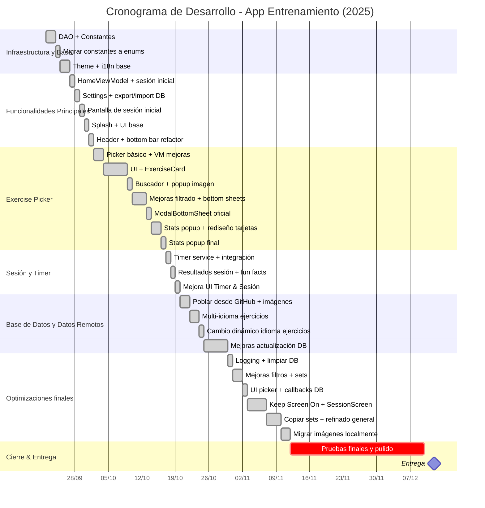

```mermaid
gantt
    title Cronograma de Desarrollo - App Entrenamiento (2025)
    dateFormat  YYYY-MM-DD
    axisFormat  %d/%m

    section Infraestructura y Base
    DAO + Constantes                    :done, a1, 2025-09-22, 2d
    Migrar constantes a enums           :done, a2, 2025-09-24, 1d
    Theme + i18n base                   :done, a3, 2025-09-25, 2d

    section Funcionalidades Principales
    HomeViewModel + sesión inicial      :done, b1, 2025-09-27, 1d
    Settings + export/import DB         :done, b2, 2025-09-28, 1d
    Pantalla de sesión inicial          :done, b3, 2025-09-29, 1d
    Splash + UI base                    :done, b4, 2025-09-30, 1d
    Header + bottom bar refactor        :done, b5, 2025-10-01, 1d

    section Exercise Picker
    Picker básico + VM mejoras          :done, c1, 2025-10-02, 2d
    UI + ExerciseCard                   :done, c2, 2025-10-04, 5d
    Buscador + popup imagen             :done, c3, 2025-10-09, 1d
    Mejoras filtrado + bottom sheets    :done, c4, 2025-10-10, 3d
    ModalBottomSheet oficial            :done, c5, 2025-10-13, 1d
    Stats popup + rediseño tarjetas     :done, c6, 2025-10-14, 2d
    Stats popup final                   :done, c7, 2025-10-16, 1d

    section Sesión y Timer
    Timer service + integración         :done, d1, 2025-10-17, 1d
    Resultados sesión + fun facts       :done, d2, 2025-10-18, 1d
    Mejora UI Timer & Sesión            :done, d3, 2025-10-19, 1d

    section Base de Datos y Datos Remotos
    Poblar desde GitHub + imágenes      :done, e1, 2025-10-20, 2d
    Multi-idioma ejercicios             :done, e2, 2025-10-22, 2d
    Cambio dinámico idioma ejercicios   :done, e3, 2025-10-24, 1d
    Mejoras actualización DB            :done, e4, 2025-10-25, 5d

    section Optimizaciones finales
    Logging + limpiar DB                :done, f1, 2025-10-30, 1d
    Mejoras filtros + sets              :done, f2, 2025-10-31, 2d
    UI picker + callbacks DB            :done, f3, 2025-11-02, 1d
    Keep Screen On + SessionScreen      :done, f4, 2025-11-03, 4d
    Copiar sets + refinado general      :done, f5, 2025-11-07, 3d
    Migrar imágenes localmente          :done, f6, 2025-11-10, 2d

    section Cierre & Entrega
    Pruebas finales y pulido            :crit, g1, 2025-11-12, 28d
    Entrega                             :milestone, g2, 2025-12-12, 0d

```