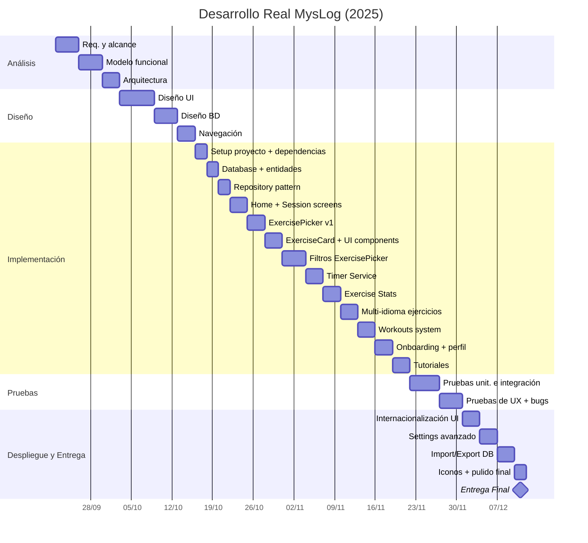

```mermaid
gantt

    title Desarrollo Real MysLog (2025)

    dateFormat  YYYY-MM-DD

    axisFormat  %d/%m

    todayMarker off

  

    section Análisis

    Req. y alcance     : 2025-09-22, 4d

    Modelo funcional    : 2025-09-26, 4d

    Arquitectura    : 2025-09-30, 3d

  

    section Diseño

    Diseño UI          : 2025-10-03, 6d

    Diseño BD        : 2025-10-09, 4d

    Navegación    : 2025-10-13, 3d

  

    section Implementación

    Setup proyecto + dependencias : 2025-10-16, 2d

    Database + entidades : 2025-10-18, 2d

    Repository pattern : 2025-10-20, 2d

    Home + Session screens : 2025-10-22, 3d

    ExercisePicker v1 : 2025-10-25, 3d

    ExerciseCard + UI components : 2025-10-28, 3d

    Filtros ExercisePicker : 2025-10-31, 4d

    Timer Service : 2025-11-04, 3d

    Exercise Stats : 2025-11-07, 3d

    Multi-idioma ejercicios : 2025-11-10, 3d

    Workouts system : 2025-11-13, 3d

    Onboarding + perfil : 2025-11-16, 3d

    Tutoriales : 2025-11-19, 3d

  

    section Pruebas

    Pruebas unit. e integración  : 2025-11-22, 5d

    Pruebas de UX + bugs    : 2025-11-27, 4d

  

    section Despliegue y Entrega

    Internacionalización UI : 2025-12-01, 3d

    Settings avanzado : 2025-12-04, 3d

    Import/Export DB : 2025-12-07, 3d

    Iconos + pulido final : 2025-12-10, 2d

    Entrega Final :milestone, 2025-12-11, 0d
```