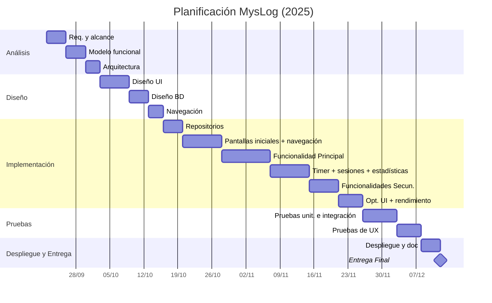

```mermaid
  
gantt

    title Planificación MysLog (2025)

    dateFormat  YYYY-MM-DD

    axisFormat  %d/%m

    todayMarker off

  

    %% ====== FASE 1: ANÁLISIS ======

    section Análisis

    Req. y alcance      :a1, 2025-09-22, 4d

    Modelo funcional    :a2, 2025-09-26, 4d

    Arquitectura    :a3, 2025-09-30, 3d

  

    %% ====== FASE 2: DISEÑO ======

    section Diseño

    Diseño UI          :b1, 2025-10-03, 6d

    Diseño BD        :b2, 2025-10-09, 4d

    Navegación    :b3, 2025-10-13, 3d

  

    %% ====== FASE 3: IMPLEMENTACIÓN ======

    section Implementación

    Repositorios :c1, 2025-10-16, 4d

    Pantallas iniciales + navegación    :c2, 2025-10-20, 8d

    Funcionalidad Principal           :c3, 2025-10-28, 10d

    Timer + sesiones + estadísticas     :c4, 2025-11-07, 8d

    Funcionalidades Secun.   :c5, 2025-11-15, 6d

    Opt. UI + rendimiento       :c6, 2025-11-21, 5d

  

    %% ====== FASE 4: PRUEBAS ======

    section Pruebas

    Pruebas unit. e integración  :d1, 2025-11-26, 7d

    Pruebas de UX        :d2, 2025-12-03, 5d

  

    %% ====== FASE 5: ENTREGA ======

    section Despliegue y Entrega

    Despliegue y doc :e1, 2025-12-08, 4d

    Entrega Final                       :milestone, e2, 2025-12-12, 0d
```
