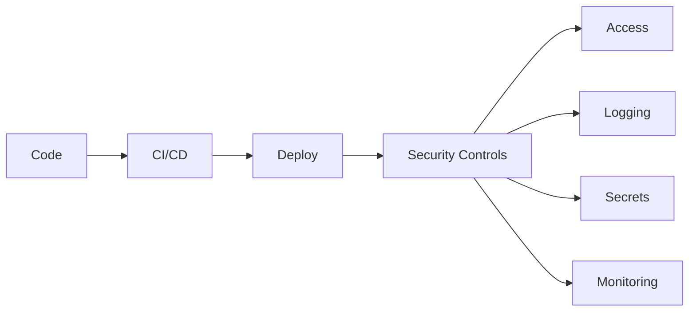
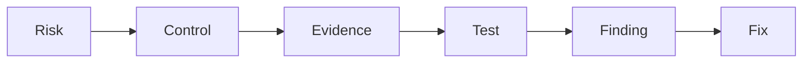

## Core concepts
- [[Risk]]
- [[Control]]
- [[Evidence]]
- [[Finding]]
- [[Remediation]]

# Internal Audit Framework
- [[Internal Audit]]
- [[Three Lines of Defense]]
- [[Walkthrough]]
- [[Control Testing]]
- [[Audit Work Papers]]
- [[Audit Report]]
- [[Action Plan]]
- [[Risk Assessment]]

# SOX ITGC (Sarbanes-Oxley — IT General Controls)
## Access Management
- [[IAM]] (Identity & Access Management)
- [[RBAC]] (Role-Based Access Control)
- [[Privileged Access]]
- [[MFA]] (Multi-Factor Authentication)

## Change Management
- [[Change Management]]
Flow: Request → Approve → Test → Deploy → Evidence

## Segregation of Duties
- [[SoD]] (Segregation of Duties)
Ej: Developer ≠ Production approver

## Operations
- [[IT Operations]]

# US Regulatory Frameworks
- [[SOX]] (Sarbanes-Oxley Act, 2002 — exige controles internos sobre reporting financiero)
- [[IT General Controls]] (ITGC — controles TI que soportan SOX: acceso, cambios, operaciones, SoD)
- [[NIST 800-53]] (National Institute of Standards and Technology — catálogo de controles de seguridad)
- [[FFIEC IT Examination Handbook]] (Federal Financial Institutions Examination Council — guía de supervisión tecnológica para entidades financieras)
- [[OCC Guidance]] (Office of the Comptroller of the Currency — guías sobre tecnología y ciberseguridad)
- [[Federal Reserve Guidance]] (guías de la Reserva Federal sobre riesgos tecnológicos)
- [[COSO]] (Committee of Sponsoring Organizations — modelo de control interno: 5 componentes)

# NIST CSF (Cybersecurity Framework)
- [[Govern]]
- [[Identify]]
- [[Protect]]
- [[Detect]]
- [[Respond]]
- [[Recover]]

# Technical Security
- [[Hardening]]
- [[Secrets Management]]
- [[Logging]]
- [[Vulnerability Management]]

# DevSecOps connection

- [[DevSecOps]]
- [[CI CD Security]] (Continuous Integration / Continuous Deployment)
- [[Container Security]]
- [[API Security]] (Application Programming Interface)
- [[JWT Authentication]] (JSON Web Token — token stateless firmado)

# Programming Languages (Hard Skills)
- [[Python]] — automatización de pruebas, análisis de logs
- [[SQL]] — consultas a BBDD, extracción de muestras
- [[R]] — análisis estadístico, visualización de datos
- [[SAS]] (Statistical Analysis System) — reporting y modelos de riesgo en banca

# Auditor mindset

