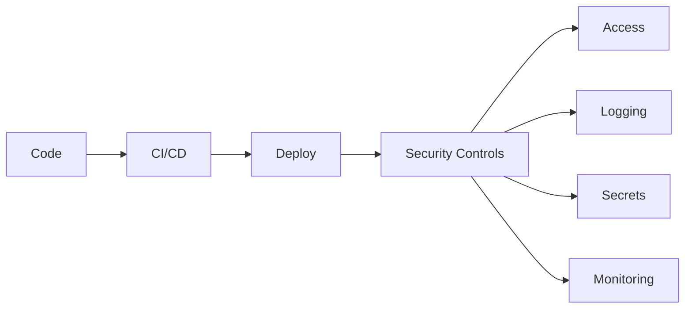
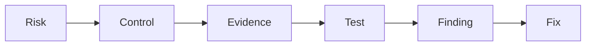

## Core concepts
- [[Sox-NIST/Risk]]
- [[Sox-NIST/Control]]
- [[Sox-NIST/Evidence]]
- [[Sox-NIST/Finding]]
- [[Sox-NIST/Remediation]]

# Internal Audit Framework
- [[Sox-NIST/Internal Audit]]
- [[Sox-NIST/Three Lines of Defense]]
- [[Sox-NIST/Walkthrough]]
- [[Sox-NIST/Control Testing]]
- [[Sox-NIST/Audit Work Papers]]
- [[Sox-NIST/Audit Report]]
- [[Sox-NIST/Action Plan]]
- [[Sox-NIST/Risk Assessment]]

# SOX ITGC (Sarbanes-Oxley — IT General Controls)
## Access Management
- [[Sox-NIST/IAM]] (Identity & Access Management)
- [[Sox-NIST/RBAC]] (Role-Based Access Control)
- [[Sox-NIST/Privileged Access]]
- [[Sox-NIST/MFA]] (Multi-Factor Authentication)

## Change Management
- [[Sox-NIST/Change Management]]
Flow: Request → Approve → Test → Deploy → Evidence

## Segregation of Duties
- [[Sox-NIST/SoD]] (Segregation of Duties)
Ej: Developer ≠ Production approver

## Operations
- [[Sox-NIST/IT Operations]]

# US Regulatory Frameworks
- [[Sox-NIST/SOX]] (Sarbanes-Oxley Act, 2002 — exige controles internos sobre reporting financiero)
- [[Sox-NIST/IT General Controls]] (ITGC — controles TI que soportan SOX: acceso, cambios, operaciones, SoD)
- [[Sox-NIST/NIST 800-53]] (National Institute of Standards and Technology — catálogo de controles de seguridad)
- [[Sox-NIST/FFIEC IT Examination Handbook]] (Federal Financial Institutions Examination Council — guía de supervisión tecnológica para entidades financieras)
- [[Sox-NIST/OCC Guidance]] (Office of the Comptroller of the Currency — guías sobre tecnología y ciberseguridad)
- [[Sox-NIST/Federal Reserve Guidance]] (guías de la Reserva Federal sobre riesgos tecnológicos)
- [[Sox-NIST/COSO]] (Committee of Sponsoring Organizations — modelo de control interno: 5 componentes)

# NIST CSF (Cybersecurity Framework)
- [[Sox-NIST/Govern]]
- [[Sox-NIST/Identify]]
- [[Sox-NIST/Protect]]
- [[Sox-NIST/Detect]]
- [[Sox-NIST/Respond]]
- [[Sox-NIST/Recover]]

# Technical Security
- [[Sox-NIST/Hardening]]
- [[Sox-NIST/Secrets Management]]
- [[Sox-NIST/Logging]]
- [[Sox-NIST/Vulnerability Management]]

# DevSecOps connection

- [[Sox-NIST/DevSecOps]]
- [[Sox-NIST/CI CD Security]] (Continuous Integration / Continuous Deployment)
- [[Sox-NIST/Container Security]]
- [[Sox-NIST/API Security]] (Application Programming Interface)
- [[Sox-NIST/JWT Authentication]] (JSON Web Token — token stateless firmado)

# Programming Languages (Hard Skills)
- [[Sox-NIST/Python]] — automatización de pruebas, análisis de logs
- [[Sox-NIST/SQL]] — consultas a BBDD, extracción de muestras
- [[Sox-NIST/R]] — análisis estadístico, visualización de datos
- [[Sox-NIST/SAS]] (Statistical Analysis System) — reporting y modelos de riesgo en banca

# Auditor mindset

## 🧾 Background / CV

**1. Walk me through your CV.**  
I’m a backend developer with a strong interest in cybersecurity and IT risk. I recently completed my DAM degree, where I built a solid foundation in software development, databases and systems.  
After that, I did an internship at RADMAS Technologies, where I strengthened my backend and DevOps skills. I worked on real technical challenges involving system compatibility, documentation and updating legacy architecture.  
I’m a highly motivated person, and I’m constantly learning new technologies, which is why I’m now focusing more on cybersecurity and IT audit roles.

---

**2. Why did you move from development to cybersecurity / audit?**  
Cybersecurity has always been an area I was naturally drawn to. Over time, I realised I’m particularly interested in how systems are controlled, assessed and protected rather than only built.  
I also see a strong connection between my analytical mindset and the structured, control-oriented nature of IT audit and cybersecurity.

---

**3. What did you do during your internship at Radmas Technologies?**  
During the internship I mainly followed technical training courses, which I completed quickly due to my learning pace.  
After that, I was given a practical challenge: rebuilding and updating a legacy version of a RADMAS application architecture. This involved dealing with version incompatibilities, understanding service dependencies, and resolving integration issues by reviewing documentation and troubleshooting.  
I successfully delivered the updated system within the internship period.

---

**4. Which project from your CV are you most proud of and why?**  
From an IT perspective, the GymLog app. It was my first experience with Kotlin, and I had to learn while building and debugging at the same time, which made it very rewarding.  
From an academic perspective, my publication on Carlos Galán’s guitar music, because it taught me how to research properly and communicate complex ideas clearly.

---

**5. How has your musical background influenced your way of working?**  
Music taught me discipline, patience and performance under pressure.  
It also strengthened my communication skills, especially in explaining complex ideas clearly. I think it also improved my ability to stay consistent over long-term goals.

---

**6. What technical skills do you think are most relevant for this role?**  
I would highlight Python and SQL, as well as my ability to learn quickly and work with structured, analytical problems.  
I’m also comfortable working with technical documentation and adapting to new systems, which I think is key in audit and risk environments.

---

**7. What have you learned from teaching that is useful in IT work?**  
Teaching helped me understand how to break down complex problems and adapt communication to different audiences.  
It also improved my teamwork skills and my ability to learn quickly while explaining concepts clearly.

---

**8. Why did you choose a technical career after music studies?**  
I’ve always wanted to work in technology. Music is still part of who I am, but I’ve always had a strong curiosity for how systems and software work.  
Both fields complement each other: music gave me discipline and abstraction skills, while IT lets me apply them in a technical and structured way.

---

## 🎯 Motivation / Role fit

9. Why do you want to work in IT Audit instead of pure development?
10. What do you understand about the third line of defense?
11. Why Santander and not another company?
12. What do you expect to learn in this role?
13. Where do you see yourself in 2–3 years?
14. What interests you about IT General Controls?
15. What do you think is the main value of internal audit?

---

## 🧠 Understanding of role

16. What does Internal Audit actually do day to day?
17. What is the difference between risk management and internal audit?
18. What is an IT General Control (ITGC)?
19. What frameworks have you heard of (SOX, NIST, etc.)?
20. What is independent assurance?
21. What is the three lines of defense model?
22. What do you think makes a good auditor?

---

## ⚙️ Soft skills / behaviour

23. Tell me about a time you had to learn something quickly.
24. How do you handle working with people more senior than you?
25. How do you deal with not knowing something technical?
26. Describe a situation where you had to be very detail-oriented.
27. How do you prioritize tasks when you have multiple deadlines?
28. How do you handle feedback or criticism?

---

## 🔥 Pressure / tricky (muy típico)

29. Why should we hire you with no direct audit experience?
30. What is your biggest weakness?
31. What would you do if you disagree with an IT team?
32. What if you cannot find enough evidence for an audit?
33. What if you find a critical issue just before reporting?
34. How do you make sure your findings are correct?

---

## 🧠 Bonus (muy Santander / IT Audit real)

35. Explain change management in simple terms.
36. What is the risk of poor access management?
37. What is the purpose of ITGC testing?
38. How would you test a control?
39. What is a control failure?
40. What is remediation in audit?