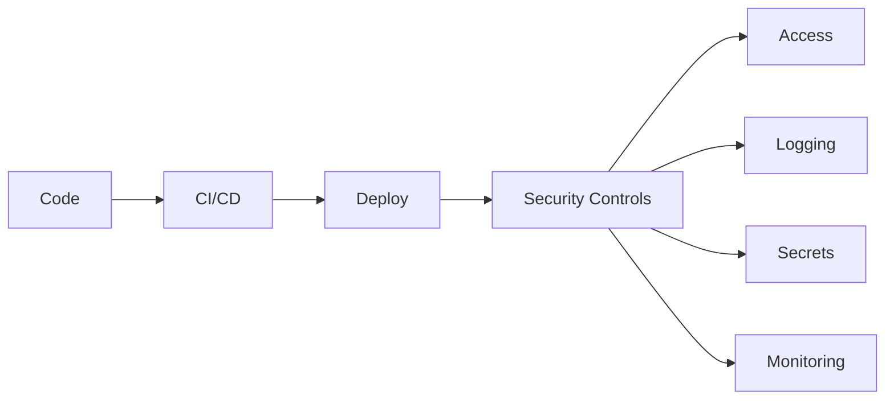
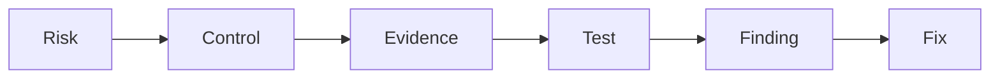

## Core concepts
- [[Sox-NIST/Risk]]
- [[Sox-NIST/Control]]
- [[Sox-NIST/Evidence]]
- [[Sox-NIST/Finding]]
- [[Sox-NIST/Remediation]]

# Internal Audit Framework
- [[Sox-NIST/Internal Audit]]
- [[Sox-NIST/Three Lines of Defense]]
- [[Sox-NIST/Walkthrough]]
- [[Sox-NIST/Control Testing]]
- [[Sox-NIST/Audit Work Papers]]
- [[Sox-NIST/Audit Report]]
- [[Sox-NIST/Action Plan]]
- [[Sox-NIST/Risk Assessment]]

# SOX ITGC (Sarbanes-Oxley — IT General Controls)
## Access Management
- [[Sox-NIST/IAM]] (Identity & Access Management)
- [[Sox-NIST/RBAC]] (Role-Based Access Control)
- [[Sox-NIST/Privileged Access]]
- [[Sox-NIST/MFA]] (Multi-Factor Authentication)

## Change Management
- [[Sox-NIST/Change Management]]
Flow: Request → Approve → Test → Deploy → Evidence

## Segregation of Duties
- [[Sox-NIST/SoD]] (Segregation of Duties)
Ej: Developer ≠ Production approver

## Operations
- [[Sox-NIST/IT Operations]]

# US Regulatory Frameworks
- [[Sox-NIST/SOX]] (Sarbanes-Oxley Act, 2002 — exige controles internos sobre reporting financiero)
- [[Sox-NIST/IT General Controls]] (ITGC — controles TI que soportan SOX: acceso, cambios, operaciones, SoD)
- [[Sox-NIST/NIST 800-53]] (National Institute of Standards and Technology — catálogo de controles de seguridad)
- [[Sox-NIST/FFIEC IT Examination Handbook]] (Federal Financial Institutions Examination Council — guía de supervisión tecnológica para entidades financieras)
- [[Sox-NIST/OCC Guidance]] (Office of the Comptroller of the Currency — guías sobre tecnología y ciberseguridad)
- [[Sox-NIST/Federal Reserve Guidance]] (guías de la Reserva Federal sobre riesgos tecnológicos)
- [[Sox-NIST/COSO]] (Committee of Sponsoring Organizations — modelo de control interno: 5 componentes)

# NIST CSF (Cybersecurity Framework)
- [[Sox-NIST/Govern]]
- [[Sox-NIST/Identify]]
- [[Sox-NIST/Protect]]
- [[Sox-NIST/Detect]]
- [[Sox-NIST/Respond]]
- [[Sox-NIST/Recover]]

# Technical Security
- [[Sox-NIST/Hardening]]
- [[Sox-NIST/Secrets Management]]
- [[Sox-NIST/Logging]]
- [[Sox-NIST/Vulnerability Management]]

# DevSecOps connection

- [[Sox-NIST/DevSecOps]]
- [[Sox-NIST/CI CD Security]] (Continuous Integration / Continuous Deployment)
- [[Sox-NIST/Container Security]]
- [[Sox-NIST/API Security]] (Application Programming Interface)
- [[Sox-NIST/JWT Authentication]] (JSON Web Token — token stateless firmado)

# Programming Languages (Hard Skills)
- [[Sox-NIST/Python]] — automatización de pruebas, análisis de logs
- [[Sox-NIST/SQL]] — consultas a BBDD, extracción de muestras
- [[Sox-NIST/R]] — análisis estadístico, visualización de datos
- [[Sox-NIST/SAS]] (Statistical Analysis System) — reporting y modelos de riesgo en banca

# Auditor mindset

