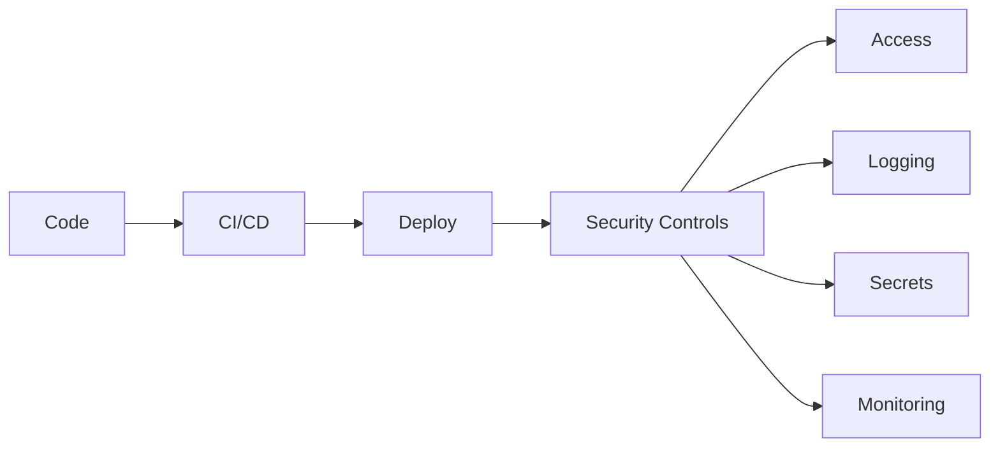
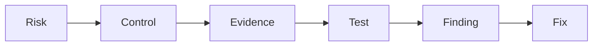

## Core concepts

- [[Risk]]
  - Algo que puede causar impacto.
  - Ej: acceso no autorizado.

- [[Control]]
  - Medida que reduce un riesgo.
  - Ej: MFA.

- [[Evidence]]
  - Prueba de que un control existe.
  - Ej: logs, tickets.

- [[Finding]]
  - Problema encontrado en una auditoría.

- [[Remediation]]
  - Acción para corregir un problema.

# Internal Audit Framework

- [[Internal Audit]]
  - Aseguramiento independiente sobre control interno, riesgos y gobierno.

- [[Three Lines of Defense]]
  - 1ª: dueños del riesgo, 2ª: supervisión, 3ª: auditoría interna.

- [[Walkthrough]]
  - Recorrer un proceso con el auditado para entender controles.

- [[Control Testing]]
  - Evaluar diseño y efectividad operativa de un control.

- [[Audit Work Papers]]
  - Documentación completa de la auditoría (procedimientos, evidencias, conclusiones).

- [[Audit Report]]
  - Informe final con hallazgos, riesgos y recomendaciones.

- [[Action Plan]]
  - Plan correctivo acordado con fechas y responsable.

- [[Risk Assessment]]
  - Identificar y priorizar riesgos para definir alcance de auditoría.

# SOX ITGC

## Access Management

- [[IAM]]
  - Control de usuarios y permisos.

- [[RBAC]]
  - Permisos basados en roles.

- [[Privileged Access]]
  - Usuarios con permisos elevados.

- [[MFA]]
  - Segundo factor de autenticación.

## Change Management

- [[Change Management]]
  - Control de cambios.

Flow:
Request → Approve → Test → Deploy → Evidence

## Segregation of Duties

- [[SoD]]
  - Separar responsabilidades.

Ej:
Developer ≠ Production approver

## Operations

- [[IT Operations]]
  - Backups
  - Monitoring
  - Logs
  - Incidents

# US Regulatory Frameworks

- [[SOX]]
  - Ley Sarbanes-Oxley: exige controles internos sobre reporting financiero.

- [[IT General Controls]]
  - Controles TI que soportan SOX: acceso, cambios, operaciones, SoD.

- [[NIST 800-53]]
  - Catálogo detallado de controles de seguridad para sistemas federales.

- [[FFIEC IT Examination Handbook]]
  - Guía de supervisión tecnológica para entidades financieras en EE. UU.

- [[OCC Guidance]]
  - Guías del Office of the Comptroller of the Currency sobre tecnología y ciberseguridad.

- [[Federal Reserve Guidance]]
  - Guías de la Reserva Federal sobre riesgos tecnológicos y ciberseguridad.

- [[COSO]]
  - Modelo de control interno: 5 componentes (entorno de control, evaluación de riesgos, actividades de control, información y comunicación, monitoreo).

# NIST CSF

- [[Govern]]
  - Políticas, estrategia, responsabilidades.

- [[Identify]]
  - Saber qué activos y riesgos existen.

- [[Protect]]
  - Evitar problemas.
  - MFA, hardening, encryption.

- [[Detect]]
  - Encontrar problemas.
  - Logs, SIEM, alerts.

- [[Respond]]
  - Actuar ante incidentes.

- [[Recover]]
  - Restaurar y mejorar.

# Technical Security

- [[Hardening]]
  - Reducir superficie de ataque.

- [[Secrets Management]]
  - Proteger passwords/tokens.

- [[Logging]]
  - Registrar eventos.

- [[Vulnerability Management]]
  - Detectar → corregir → verificar.

# DevSecOps connection

- [[DevSecOps]]
  - Seguridad integrada en el ciclo DevOps: SAST, DAST, hardening, cumplimiento.

- [[CI CD Security]]
  - Controles en pipelines: escaneo, firmado, aprobaciones, secrets scanning.

- [[Container Security]]
  - Seguridad en contenedores: imágenes mínimas, escaneo, políticas de red.

- [[API Security]]
  - Protección de APIs: JWT, OAuth, rate limiting, validación de entrada.

- [[JWT Authentication]]
  - Token stateless firmado. Control clave: rotación, expiración, no almacenar secrets en cliente.

# Auditor mindset

