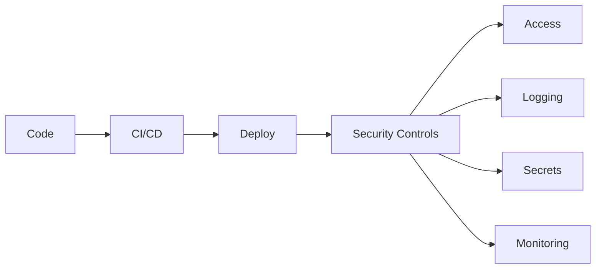
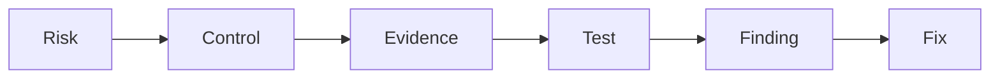

## Core concepts
- [[Sox-NIST/Risk]]
- [[Sox-NIST/Control]]
- [[Sox-NIST/Evidence]]
- [[Sox-NIST/Finding]]
- [[Sox-NIST/Remediation]]

# Internal Audit Framework
- [[Sox-NIST/Internal Audit]]
- [[Sox-NIST/Three Lines of Defense]]
- [[Sox-NIST/Walkthrough]]
- [[Sox-NIST/Control Testing]]
- [[Sox-NIST/Audit Work Papers]]
- [[Sox-NIST/Audit Report]]
- [[Sox-NIST/Action Plan]]
- [[Sox-NIST/Risk Assessment]]

# SOX ITGC (Sarbanes-Oxley — IT General Controls)
## Access Management
- [[Sox-NIST/IAM]] (Identity & Access Management)
- [[Sox-NIST/RBAC]] (Role-Based Access Control)
- [[Sox-NIST/Privileged Access]]
- [[Sox-NIST/MFA]] (Multi-Factor Authentication)

## Change Management
- [[Sox-NIST/Change Management]]
Flow: Request → Approve → Test → Deploy → Evidence

## Segregation of Duties
- [[Sox-NIST/SoD]] (Segregation of Duties)
Ej: Developer ≠ Production approver

## Operations
- [[Sox-NIST/IT Operations]]

# US Regulatory Frameworks
- [[Sox-NIST/SOX]] (Sarbanes-Oxley Act, 2002 — exige controles internos sobre reporting financiero)
- [[Sox-NIST/IT General Controls]] (ITGC — controles TI que soportan SOX: acceso, cambios, operaciones, SoD)
- [[Sox-NIST/NIST 800-53]] (National Institute of Standards and Technology — catálogo de controles de seguridad)
- [[Sox-NIST/FFIEC IT Examination Handbook]] (Federal Financial Institutions Examination Council — guía de supervisión tecnológica para entidades financieras)
- [[Sox-NIST/OCC Guidance]] (Office of the Comptroller of the Currency — guías sobre tecnología y ciberseguridad)
- [[Sox-NIST/Federal Reserve Guidance]] (guías de la Reserva Federal sobre riesgos tecnológicos)
- [[Sox-NIST/COSO]] (Committee of Sponsoring Organizations — modelo de control interno: 5 componentes)

# NIST CSF (Cybersecurity Framework)
- [[Sox-NIST/Govern]]
- [[Sox-NIST/Identify]]
- [[Sox-NIST/Protect]]
- [[Sox-NIST/Detect]]
- [[Sox-NIST/Respond]]
- [[Sox-NIST/Recover]]

# Technical Security
- [[Sox-NIST/Hardening]]
- [[Sox-NIST/Secrets Management]]
- [[Sox-NIST/Logging]]
- [[Sox-NIST/Vulnerability Management]]

# DevSecOps connection

- [[Sox-NIST/DevSecOps]]
- [[Sox-NIST/CI CD Security]] (Continuous Integration / Continuous Deployment)
- [[Sox-NIST/Container Security]]
- [[Sox-NIST/API Security]] (Application Programming Interface)
- [[Sox-NIST/JWT Authentication]] (JSON Web Token — token stateless firmado)

# Programming Languages (Hard Skills)
- [[Sox-NIST/Python]] — automatización de pruebas, análisis de logs
- [[Sox-NIST/SQL]] — consultas a BBDD, extracción de muestras
- [[Sox-NIST/R]] — análisis estadístico, visualización de datos
- [[Sox-NIST/SAS]] (Statistical Analysis System) — reporting y modelos de riesgo en banca

# Auditor mindset

## 🧾 Background / CV

**1. Walk me through your CV.**  
I’m a backend developer with a strong interest in cybersecurity and IT risk. I recently completed my DAM degree, where I built a solid foundation in software development, databases and systems.  
After that, I did an internship at RADMAS Technologies, where I strengthened my backend and DevOps skills. I worked on real technical challenges involving system compatibility, documentation and updating legacy architecture.  
I’m a highly motivated person, and I’m constantly learning new technologies, which is why I’m now focusing more on cybersecurity and IT audit roles.

---

**2. Why did you move from development to cybersecurity / audit?**  
Cybersecurity has always been an area I was naturally drawn to. Over time, I realised I’m particularly interested in how systems are controlled, assessed and protected rather than only built.  
I also see a strong connection between my analytical mindset and the structured, control-oriented nature of IT audit and cybersecurity.

---

**3. What did you do during your internship at Radmas Technologies?**  
During the internship I mainly followed technical training courses, which I completed quickly due to my learning pace.  
After that, I was given a practical challenge: rebuilding and updating a legacy version of a RADMAS application architecture. This involved dealing with version incompatibilities, understanding service dependencies, and resolving integration issues by reviewing documentation and troubleshooting.  
I successfully delivered the updated system within the internship period.

---

**4. Which project from your CV are you most proud of and why?**  
From an IT perspective, the GymLog app. It was my first experience with Kotlin, and I had to learn while building and debugging at the same time, which made it very rewarding.  
From an academic perspective, my publication on Carlos Galán’s guitar music, because it taught me how to research properly and communicate complex ideas clearly.

---

**5. How has your musical background influenced your way of working?**  
Music taught me discipline, patience and performance under pressure.  
It also strengthened my communication skills, especially in explaining complex ideas clearly. I think it also improved my ability to stay consistent over long-term goals.

---

**6. What technical skills do you think are most relevant for this role?**  
I would highlight Python and SQL, as well as my ability to learn quickly and work with structured, analytical problems.  
I’m also comfortable working with technical documentation and adapting to new systems, which I think is key in audit and risk environments.

---

**7. What have you learned from teaching that is useful in IT work?**  
Teaching helped me understand how to break down complex problems and adapt communication to different audiences.  
It also improved my teamwork skills and my ability to learn quickly while explaining concepts clearly.

---

**8. Why did you choose a technical career after music studies?**  
I’ve always wanted to work in technology. Music is still part of who I am, but I’ve always had a strong curiosity for how systems and software work.  
Both fields complement each other: music gave me discipline and abstraction skills, while IT lets me apply them in a technical and structured way.

---

## 🎯 Motivation / Role fit

9. Why do you want to work in IT Audit instead of pure development?
I enjoy understanding how systems are controlled and assessed, not just built. Audit lets me combine my technical background with a more analytical, risk-driven perspective.

10. What do you understand about the third line of defense?
It's independent assurance — internal audit evaluates the effectiveness of the first line (management controls) and second line (risk/compliance functions) and reports to the board or audit committee.

11. Why Santander and not another company?
Santander has a mature, global IT audit function and a strong regulatory environment. It's a great place to build a career in IT audit because of the scale, complexity, and learning opportunities.

12. What do you expect to learn in this role?
I want to deepen my knowledge of SOX, ITGC, and regulatory frameworks, and develop hands-on audit skills — planning, testing, reporting, and remediation follow-up.

13. Where do you see yourself in 2–3 years?
As a confident IT audit professional who can lead control testing independently and contribute to the overall risk assessment. I'd also like to pursue relevant certifications like CISA.

14. What interests you about IT General Controls?
ITGCs are the foundation of reliable financial reporting. Without them, application-level controls can't be trusted. I find the structure — access, change, operations, SoD — very concrete and logical.

15. What do you think is the main value of internal audit?
It provides independent, objective assurance that helps the organization manage risk effectively and improve its control environment. It's a safety mechanism for governance.

---

## 🧠 Understanding of role

16. What does Internal Audit actually do day to day?
Plan audits, perform walkthroughs, test controls, document work papers, identify findings, discuss with auditees, draft reports, and track remediation.

17. What is the difference between risk management and internal audit?
Risk management (2nd line) defines policies and monitors risk. Internal audit (3rd line) independently evaluates whether those processes work effectively.

18. What is an IT General Control (ITGC)?
A control over the IT environment that supports financial reporting. The main domains are access management, change management, IT operations, and segregation of duties.

19. What frameworks have you heard of (SOX, NIST, etc.)?
SOX (Sarbanes-Oxley), NIST 800-53, NIST CSF, COSO, FFIEC IT Examination Handbook, OCC Guidance, and COBIT.

20. What is independent assurance?
An objective, unbiased evaluation of controls and processes, free from management influence, typically performed by internal audit for the board or audit committee.

21. What is the three lines of defense model?
First line: operational management owns and manages risk. Second line: risk/compliance oversees risk. Third line: internal audit provides independent assurance.

22. What do you think makes a good auditor?
Curiosity, analytical thinking, strong communication, attention to detail, professional skepticism, and the ability to learn new systems quickly.

---

## ⚙️ Soft skills / behaviour

23. Tell me about a time you had to learn something quickly.
During my internship at RADMAS, I had to rebuild a legacy application architecture with no prior knowledge of the specific tools. I learned by reading documentation, troubleshooting errors, and testing iteratively under time pressure.

24. How do you handle working with people more senior than you?
I listen carefully, prepare well for meetings, ask thoughtful questions, and show that I'm eager to learn. I respect their experience but am not afraid to speak up when I have something to contribute.

25. How do you deal with not knowing something technical?
I acknowledge it honestly, then research it, test it, or ask for guidance. In audit, you can't know every system, but you can learn enough quickly — I'm comfortable with that process.

26. Describe a situation where you had to be very detail-oriented.
When I published my academic article on Carlos Galán's guitar music, I had to verify every footnote, reference, and musical example for accuracy. A single error could undermine credibility.

27. How do you prioritize tasks when you have multiple deadlines?
I assess urgency and impact, break work into smaller steps, and focus on what's time-sensitive first. I also communicate early if I see a risk of delay.

28. How do you handle feedback or criticism?
I see it as an opportunity to improve. When teaching, I constantly adjusted based on student feedback. In development, code reviews taught me to separate ego from the work.

---

## 🔥 Technical rapid-fire (preguntas técnicas cortas)
41. Walk me through a SOX ITGC audit process end-to-end.
Scoping (identify in-scope systems) → risk assessment → planning → walkthroughs → control testing (design + operating effectiveness) → evaluate findings → draft report → discuss with management → final report → remediation follow-up.

42. What's the difference between a control deficiency and a material weakness?
A control deficiency is a flaw in design or operation. A material weakness is a deficiency (or combination) that could result in a material misstatement in financial reporting — it's more severe.

43. Design vs Operating Effectiveness — how do you test each?
Design: review control documentation, walkthrough, assess if the control would work as intended. Operating effectiveness: test actual performance over time — inspect evidence, reperform, or observe.

44. What's the difference between a preventive and a detective control?
Preventive controls stop issues before they happen (e.g., access approval). Detective controls identify issues after they occur (e.g., log review, anomaly alerts).

45. What is a compensating control? Give an example.
A secondary control that mitigates the risk of a primary control failing. Example: if user access reviews aren't reliable, compensating controls like automated segregation-of-duties monitoring can reduce the risk.

46. How do you select a sample for testing?
Based on control frequency and risk. For high-risk controls or manual controls, larger samples. I'd use professional judgment, guided by the audit firm's methodology (e.g., for monthly controls, test 2–4 instances).

47. What would you audit in a cloud migration?
Access control configuration (IAM, MFA, RBAC), data encryption at rest and in transit, change management during migration, logging and monitoring setup, vendor risk assessment, and contract/SLA review.

48. What's the difference between ITGC and application controls?
ITGCs govern the IT environment (access, changes, operations). Application controls are embedded in specific applications (e.g., input validation, edit checks, reconciliation logic). ITGCs must work for application controls to be reliable.

49. Explain the concept of "least privilege" and why it matters for SOX.
Users should only have the minimum access needed to do their job. It matters for SOX because excessive access increases the risk of unauthorised transactions or data manipulation that could affect financial reporting.

50. What's the difference between NIST CSF and NIST 800-53?
NIST CSF is a high-level framework for managing cybersecurity risk (Govern, Identify, Protect, Detect, Respond, Recover). NIST 800-53 is a detailed catalog of specific security controls used by US federal agencies and regulated industries.

## 🔥 Pressure / tricky (muy típico)

29. Why should we hire you with no direct audit experience?
I bring strong technical foundations (backend, DevOps, security awareness), analytical thinking, and a fast learning curve. I've already studied the key frameworks and understand the audit mindset. I'm starting focused and motivated.

30. What is your biggest weakness?
I tend to be perfectionistic and can spend too much time refining work. I'm learning to balance quality with deadlines by setting clear timeboxes and prioritising what matters most.

31. What would you do if you disagree with an IT team?
I'd explain my reasoning with evidence and listen to their perspective. If we still disagree, I'd escalate through the proper audit channels. The goal is accuracy, not winning.

32. What if you cannot find enough evidence for an audit?
I'd expand my sample, try alternative testing procedures, or request additional documentation. If evidence still isn't sufficient, I'd document that as a limitation and discuss the impact with the audit lead.

33. What if you find a critical issue just before reporting?
I'd inform the audit lead immediately, document the finding with evidence, and assess whether reporting needs to be delayed or updated. Transparency is more important than timing.

34. How do you make sure your findings are correct?
I corroborate evidence from multiple sources, discuss findings with the auditee before finalising, and have my work reviewed by a senior auditor. Professional scepticism applies throughout.

---

## 🧠 Bonus (muy Santander / IT Audit real)

35. Explain change management in simple terms.
A formal process to ensure changes to systems are requested, reviewed, tested, approved, and deployed in a controlled way — so nothing breaks and nothing unauthorised happens.

36. What is the risk of poor access management?
Unauthorised users could access, modify, or delete sensitive data or systems, leading to financial misstatement, data breaches, or regulatory penalties.

37. What is the purpose of ITGC testing?
To verify that IT controls over access, changes, operations, and segregation of duties are designed properly and operating effectively to support reliable financial reporting.

38. How would you test a control?
First, understand the control through walkthroughs. Then design a test — inspect documentation, reperform the control, or observe it in action. Select a sample, execute the test, document evidence, and conclude.

39. What is a control failure?
A control does not operate as designed, or is missing entirely, so it doesn't adequately prevent or detect a risk. It can be a design deficiency or an operating deficiency.

40. What is remediation in audit?
The process where management implements corrective actions to fix a control failure. Audit then verifies the fix is effective through follow-up testing.

---

## 📋 Process Tracking (OSINT verified)

### Contactos verificados

**David Cano Chica**
- LinkedIn: `es.linkedin.com/in/davidcanochica`
- Senior IT Talent Acquisition Partner — Cloud, DevOps, Data y Ciberseguridad | Banca & Fintech
- 9+ años en recruiting end-to-end
- **Activo**: publicó sobre recruiting hace 1 y 3 semanas. No está de vacaciones.

**Pritesh Patel**
- LinkedIn: `linkedin.com/in/pritesh-patel` (verificar URL exacta)
- **Executive Director - Head of Cybersecurity Audit** — Santander US
- Base: New York, NY
- 20+ años en IT Audit (Morgan Stanley, Nomura, GM, HP)
- Certificaciones: CISA
- En Santander desde 2018 (8 años)
- Sin actividad pública reciente en LinkedIn

**María Dolores Segovia (Dolores Segovia)**
- LinkedIn: `linkedin.com/in/dolores-segovia-38846927`
- **Data & AI Internal Audit Director** — Santander (Group, Madrid)
- Background: NTT Data, Accenture, Medtronic
- Educación: ETSIT-UPM (Ingeniería de Telecomunicación)
- **Activa**: publicó hace 2 semanas sobre Internal Audit como carrera
- Intervino en tu proceso como Directora (entrevista en español)

**Borja Guisasola**
- LinkedIn: `linkedin.com/in/borja-guisasola-45a12633`
- **Chief Audit Executive, Santander US** — base: Greater Boston
- 20+ años en Santander (empezó 2000), PwC 2005-2009
- Confirmado como CAE post-Webster (SEC filing 29 abril 2026)
- CV envía tu CV a él para aprobación final

**Julia Bayón**
- Group CAE Santander (reporta a Ana Botín)
- Aprueba a nivel global — último filtro

### Estado del proceso

| Fecha | Evento |
|---|---|
| ~Jun 2026 | Entrevista Pritesh Patel (screening, imperfecto pero pasaste) |
| ~Jun 2026 | Entrevista María Dolores Segovia (excelente, feedback positivo) |
| ~Jun 2026 | CV enviado a Borja Guisasola para aprobación |
| ~Jul 2026 | David Cano confirma posición on hold hasta septiembre |
| 22 Jul 2026 | Santander publica resultados H1 2026: récord €7.3B (+15%) |
| **Sep 2026** | **Próximo contacto — follow-up con David Cano** |

### Webster integration status
- OCC aprobó adquisición: junio 2026
- "Walk the Walls" session: mayo 2026 (250+ dependencias, 225 milestones)
- Cierre previsto: H2 2026
- Borja Guisasola confirmado como CAE de entidad combinada

### Señales de mercado
- ✅ Santander sin hiring freeze — resultados récord
- ✅ David Cano activo contratando (publicaciones recientes)
- ✅ Borja Guisasola confirmado en su rol post-Webster
- ⚠️ 0 vacantes Audit publicadas en Santander US careers (posición interna no pública)
- ⚠️ Sr. IT Auditor (Dorchester, MA) ya no está publicado