# Listado de capturas — OSINT rcsmm.eu

Sistema: **Kali Linux**. Todas las capturas de terminal deben mostrar **comando + salida** en la misma ventana.

---

## Exhibit 1 — Google dorking
Abrir navegador, buscar:
```
site:rcsmm.eu filetype:pdf
```
**Captura**: Pantalla completa con la URL y resultados.
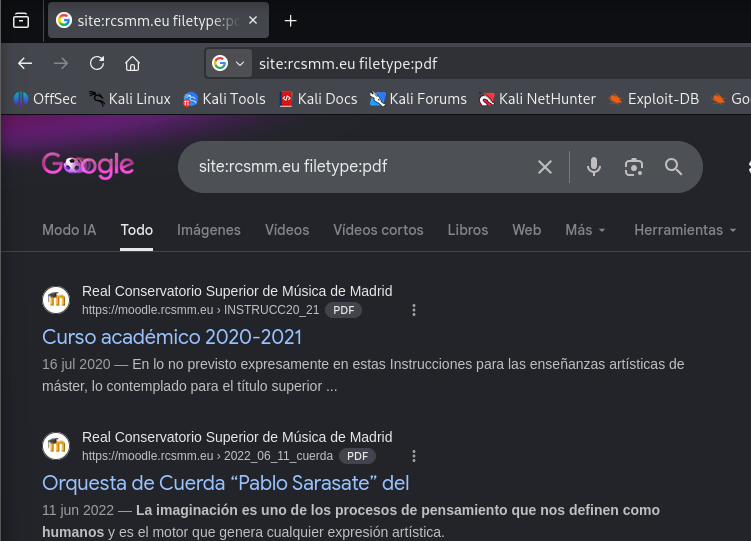
---

## Exhibit 2 — Wikipedia
```
https://en.wikipedia.org/wiki/Madrid_Royal_Conservatory
```
**Captura**: Entrada completa de Wikipedia.
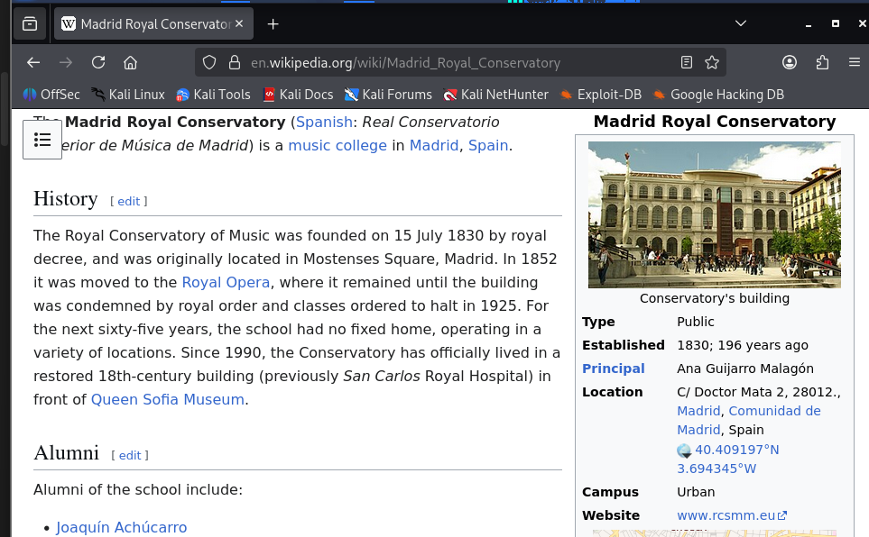
---

## Exhibit 3 — El Mundo (protesta Santa Cecilia)
```
https://www.elmundo.es/cultura/2025/11/26/69272c5fe4d4d89f458b4585.html
```
**Captura**: Titular y entradilla.

---

EXHIBIT 4, borrar

---

## Exhibit 5 — Twitter/X @RCSMM_oficial
```
https://x.com/RCSMM_oficial
```
**Captura**: Perfil completo (avatar, banner, bio, follower count).

---

## Exhibit 6 BORRAR

---

## Exhibit 7 — YouTube RCSMM
```
https://www.youtube.com/channel/UCBGKPm5YfetqA73juM7jVBg
```
**Captura**: Canal oficial (about page con enlaces).
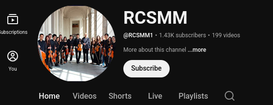
---

## Exhibit 8 — BORRAR
```
https://www.facebook.com/RealConservatorioSuperiordeMusicadeMadrid/
```
**Captura**: Página principal.

---

## Exhibit 9 — NIF en aviso legal BORRAR
```
https://rcsmm.eu/aviso-legal
```
**Captura**: Sección donde aparece NIF Q2868055A. #OPENCODE NO APARECE EN ESA PÁGINA, APARECE EN https://www.einforma.com/informacion-empresa/real-conservatorio-superior-musica-madrid-mec
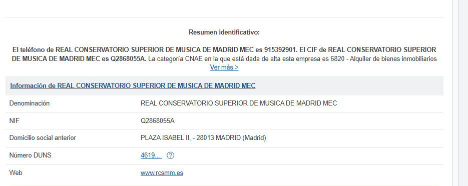

---

## Exhibit 10 — Política de privacidad BORRAR, NO ES NECESARIO PARA OSINT
```
https://rcsmm.eu/politica-privacidad
```
**Captura**: Página completa.

---

## Exhibit 11 — Precios FAQ
```
https://rcsmm.eu/preguntas-frecuentes
```
**Captura**: Tabla de precios (216,10 €/crédito, 49 € prueba acceso).
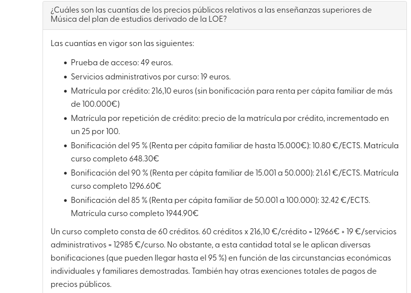
---

## Exhibit 12 — Portal de Transparencia
```
https://rcsmm.eu/portal-transparencia
```
**Captura**: Mensaje "En construcción".

---

## Exhibit 13 — Metadatos PDF (pdfinfo)
```bash
curl -s -k -o /tmp/23.pdf "https://rcsmm.eu/sites/default/files/2023-11/23.pdf"
pdfinfo /tmp/23.pdf
```
**Captura**: Salida mostrando Author (Patricia Arbolí), Creator (Microsoft Word 2019), fechas.
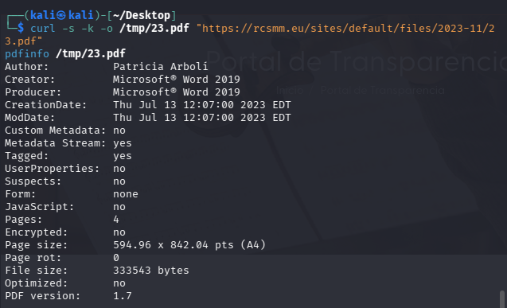
---

## Exhibit 14 — DNS básico (A, NS, SOA)
```bash
dig rcsmm.eu A +short
dig rcsmm.eu NS +short
dig rcsmm.eu SOA
```
**Captura**: IP 62.97.84.197, ns1-4.servytec.es, SOA serial 2026031201.
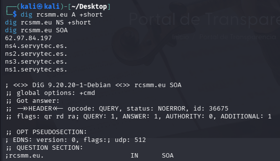
---

## Exhibit 15 — Subdominios
```bash
for s in moodle intranet webmail ftp; do dig $s.rcsmm.eu A +short; done
```
**Captura**: Los 4 devuelven 213.172.39.24.

---

## Exhibit 16 — PTR servidor web
```bash
dig -x 62.97.84.197 +short
```
**Captura**: `arvy.futurvia.net`
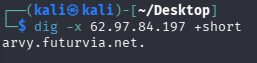
---

## Exhibit 17 — PTR servidor interno
```bash
dig -x 213.172.39.24 +short
```
**Captura**: `orfeo.servytec.es`
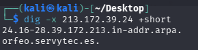
---

## Exhibit 18 — CAA (ausencia)
```bash
dig rcsmm.eu CAA +short
```
**Captura**: **Sin salida** (vacío) — confirma que no hay registro CAA.
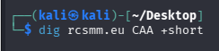
---

## Exhibit 19 — Subdominios por crt.sh
```bash
curl -s "https://crt.sh/?q=%25.rcsmm.eu&output=json" | jq -r '.[].name_value | split("\n") | .[]' | sort -u | sed 's/^\*\.//'
```
**Captura**: Listado completo de subdominios.
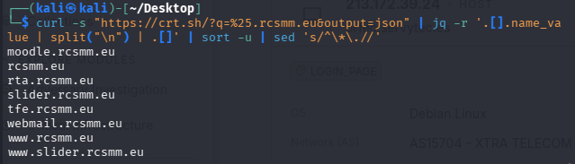
---

## Exhibit 20 — SNPanel en Censys/Shodan
Abrir navegador en:
```
https://search.censys.io/
```
Buscar `213.172.39.24` → puerto 12000/tcp.
**Captura**: Panel SNPanel detectado.
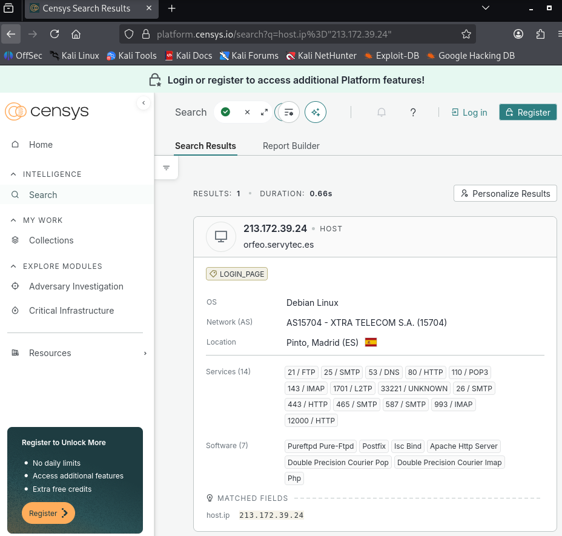
---

## Exhibit 21 — Detección de tecnologías (whatweb)
```bash
whatweb rcsmm.eu
whatweb moodle.rcsmm.eu
```
**Captura**: Salida mostrando Drupal 9, Apache, PHP, etc.

---

## Exhibit 22 — Cabeceras rcsmm.eu (X-Generator)
```bash
curl -sI https://rcsmm.eu | grep -i "x-generator\|server\|x-powered-by"
```
**Captura**: `X-Generator: Drupal 9 (https://www.drupal.org)`.

---

## Exhibit 23 — Cabeceras Moodle (PHP version)
```bash
curl -sI https://moodle.rcsmm.eu/login/index.php | grep -i "x-powered-by\|server"
```
**Captura**: `X-Powered-By: PHP/5.6.38-0+deb8u1`.

---

## Exhibit 24 — robots.txt
```bash
curl -s https://rcsmm.eu/robots.txt
```
**Captura**: Archivo completo.

---

## Exhibit 25 — Register 403
```bash
curl -sI https://rcsmm.eu/user/register
```
**Captura**: Respuesta `403 Forbidden`.

---

## Exhibit 26 — Certificado SSL/TLS
```bash
openssl s_client -connect rcsmm.eu:443 -servername rcsmm.eu 2>/dev/null | openssl x509 -text -noout 2>/dev/null | head -30
```
**Captura**: Emisor, validez, SANs.

---

## Exhibit 27 — Equipo directivo
```
https://rcsmm.eu/equipo-directivo
```
**Captura**: Organigrama con Consuelo de la Vega, etc.

---

## Exhibit 28 — Profesores Departamento de Cuerda
```
https://rcsmm.eu/departamento-cuerda
```
**Captura**: Listado de 25+ profesores con nombre y especialidad.

---

## Exhibit 29 — Extracción de nombres (terminal)
```bash
curl -s https://rcsmm.eu/departamento-cuerda | grep -oP '(?<=<h3 class="field-content">)[^<]+'
```
**Captura**: Nombres extraídos del HTML.

---

## Exhibit 30 — WebUntis horarios
```
https://rcsmm.webuntis.com/WebUntis/?school=RCSMM
```
**Captura**: Horario público con nombres de profesores, asignaturas, aulas.

---

## Exhibit 31 — Registros MX y TXT
```bash
dig rcsmm.eu MX +short
dig rcsmm.eu TXT +short
```
**Captura**: smtp, mail, imap, pop3 + SPF, MS verify.

---

## Exhibit 32 — SPF rcsmm.eu
```bash
dig rcsmm.eu TXT +short | grep "v=spf1"
```
**Captura**: `v=spf1 ip4:213.172.39.16/28 ... -all`

---

## Exhibit 33 — DMARC rcsmm.eu
```bash
dig _dmarc.rcsmm.eu TXT +short
```
**Captura**: `v=DMARC1; p=quarantine; rua=mailto:dmarc-analysis@rcsmm.eu; ...`

---

## Exhibit 34 — DMARC rcsmm.es
```bash
dig _dmarc.rcsmm.es TXT +short
```
**Captura**: Política DMARC del dominio secundario.

---

## Exhibit 35 — SPF rcsmm.es + MS verify
```bash
dig rcsmm.es TXT +short
```
**Captura**: `v=spf1 include:spf.protection.outlook.com -all` + `MS=ms87766292`.

---

## Exhibit 36 — DKIM (_domainkey)
```bash
dig _domainkey.rcsmm.eu TXT +short
dig selector1._domainkey.rcsmm.eu TXT +short
dig selector2._domainkey.rcsmm.eu TXT +short
```
**Captura**: Posibles selectores DKIM.

---

## Exhibit 37 — Emails extraídos del HTML
```bash
curl -s https://rcsmm.eu | grep -oP '[a-zA-Z0-9._%+-]+@rcsmm\.(eu|es)'
```
**Captura**: Listado de emails corporativos.

---

## Exhibit 38 — Biblioteca email
```
https://rcsmm.eu/informacion
```
**Captura**: Sección donde aparece `biblioteca@rcsmm.eu`.

---

## Exhibit 39 — Cabeceras HTTP de seguridad
```bash
curl -sI https://rcsmm.eu
curl -sI https://moodle.rcsmm.eu/login/index.php
```
**Captura**: HSTS, X-Frame-Options: SAMEORIGIN, X-Content-Type-Options: nosniff.

---

## Exhibit 40 — Tabla de medios
Abrir el informe `OSINT.md` en Obsidian, sección §2.2 "Otras apariciones en medios".
**Captura**: La tabla completa con los 13 medios.
